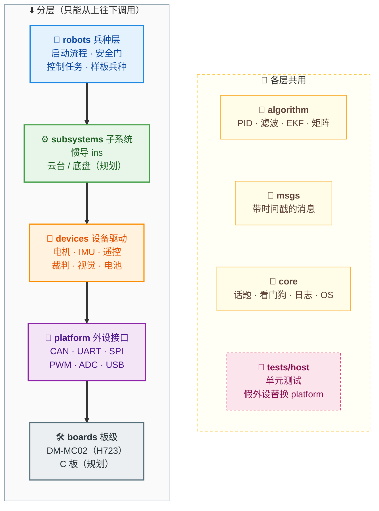

# COD RoboCore

COD 战队的 RoboMaster 电控通用模板：用普通 C11 写成，分层清楚，可以在电脑上测试，并内置失效安全机制。
一套代码覆盖多个兵种，支持两种主控：达妙 DM-MC02（STM32H723）和大疆 C 板（STM32F407）。

> **当前状态（2026-09-30）：** COD-H7-Template 的功能已按新架构移植完（裁判系统解析等官方协议文档），编译 0 警告、
> 电脑侧单元测试全部通过；正在 DM-MC02 上逐项验证（进度见 `docs/VERIFICATION_TODO.md`）。大疆 C 板（F407）后端尚未开始。

## 设计原则

- **明了易懂**：结构体 + 函数，不用宏生成代码，不用函数指针表模拟多态，新队员能顺着目录读懂。
- **分层单向依赖**：robots → subsystems → devices → platform，算法层（algorithm）是纯计算，可以在 PC 上测试。
- **只写必要的安全机制**：安全门只分“全车停”和“机构停”，每个机构有自己规定的安全动作，而不是简单地“输出 0”；同一个故障只在一处处理。
- **静态内存**：初始化之后不再分配内存。
- **单一时间基准**：所有时间戳、超时判断都读同一个时钟。

## 模板特色

**能在电脑上测试**
- 硬件相关的代码只在 `platform/` 一层；其余各层是普通 C，电脑上用假 CAN / SPI / PWM / 时钟替换硬件，
  电机协议、遥控解析、姿态解算、安全门等都有单元测试（Unity，30 个测试程序）。
- 平台抽象就是“同名函数、链接时选实现”，没有函数指针表，调试时可以一路跳进具体实现。

**只写必要、但一定写对的安全机制**
- 安全门只有两级：**全车停**（遥控丢失 200 ms、急停、未解锁、IMU 未就绪）和**机构停**（本机构的设备离线）。
- 停机不是简单地“输出 0”：每个电机在配置里规定自己的停机动作（DJI 零力矩 / 失能，达妙阻尼），在发送出口统一改写。
- 上电默认安全状态，必须按规定的拨杆顺序才解锁；回到安全状态后要重新拨杆。
- 设备“在线”只由**收到合法数据**决定（校验通过才喂狗），离线判断在读取时按时间戳当场计算。

**一个时钟、带时间戳的数据**
- 全工程只有一个时间基准 `rm_time_now_us()`：DWT 周期计数扩展成 64 位微秒，不回绕。
- 模块之间用话题（topic）传数据：发布时连同时间戳一起写入，读取时可以要求“不超过多少毫秒”，过期就当作没有数据。

**统一的设备接口**
- 电机接口用输出轴的国际单位（rad、rad/s、N·m）；DJI（M3508、M2006、GM6020）和达妙（MIT 模式、CAN FD）用同一套接口。
- 板上资源按用途命名（`SPI_DEV_IMU_ACCEL`、`PWM_IMU_HEATER`、`ADC_BATTERY`），换板子只改映射表。

**姿态解算**
- BMI088 + 四元数 EKF，用实测的更新间隔积分；芯片安装方向用旋转矩阵配置。
- 上电静止标定陀螺零偏（按标准差判断是否静止），运行中静止时在线修正航向零偏，抵消升温带来的漂移。
- IMU 恒温加热闭环。

**面向 STM32H7 的细节**
- DMA 缓冲区放在不经过缓存的专用内存段（`.dma_buf`），避免 Cortex-M7 的缓存一致性问题。
- CAN FD 只在“全 FD 总线”上使用；FreeRTOS 由 CubeMX 生成，其余任务由框架静态创建，重新生成 CubeMX 代码有核对清单。

**可追溯**
- 每个设计决定都记在 ADR 表里（`docs/ARCHITECTURE.md`），与旧模板的每处不同都写明原因和验证层级。
- 严格区分“编译通过”“电脑测试通过”“上板验证”“台架实测”，未上板的结论不写成事实。

## 文档

| 文档 | 内容 |
| --- | --- |
| `docs/ARCHITECTURE.md` | 架构设计：分层、核心机制、运行时契约、决策记录（ADR），以及**实施计划**和硬件、协议事实表 |
| `docs/CODING_STANDARD.md` | 编码规范：命名、格式、注释、错误处理、安全相关代码，“必须 / 应该 / 可以”三级 |
| `docs/DEV_ENVIRONMENT.md` | 开发环境搭建：WSL、工具链、Ozone 烧录调试、CLion，每步带验证状态 |
| `docs/CHANGES_FROM_COD_H7_TEMPLATE.md` | 与 COD-H7-Template 的差异：新旧对照、原因和验证层级 |
| `docs/VERIFICATION_TODO.md` | 待验证清单：代码已写好、需要上板或台架确认的项目，每项写明接线、操作和期望 |

## 文件结构

依赖方向从上到下：`robots` → `subsystems` → `devices` → `platform`；`algorithm`、`msgs`、`core` 可被各层使用，
`algorithm` 是纯计算。标“（规划）”的目录还没有代码。



左边是分层，粗箭头是调用方向，只能从上往下；右边的 algorithm、msgs、core 各层都可以使用。电脑上测试时，用 `tests/host/fakes/` 替换 platform 的实现。

```text
COD_RoboCore/
├── boards/                  每块板一个目录（CubeMX 生成代码，只改 USER CODE 区）
│   └── dm_mc02_h723/        达妙 DM-MC02：.ioc、链接脚本 dm_mc02.ld、启动文件、REGEN_CHECKLIST.md
├── platform/                外设接口：include/ 放声明，每种芯片一份实现，链接时选择
│   ├── include/platform/    can、uart、spi、pwm、adc、usb_cdc、time、status_led 的接口
│   ├── common/              与芯片无关的纯逻辑：环形缓冲、CAN 长度码、64 位计数扩展、WS2812 编码
│   ├── stm32h7/             H723 实现（FDCAN、循环 DMA 串口、DWT 时钟、.dma_buf 等）
│   └── stm32f4/             （规划）C 板实现
├── core/                    与业务无关的基础设施
│   ├── msg/                 带时间戳的话题
│   ├── watchdog/            设备在线判断
│   ├── log/                 RTT 日志（含 SEGGER RTT 源码）
│   ├── os/                  临界区、延时、静态任务创建
│   └── util/                CRC
├── algorithm/               纯计算，电脑上可测
│   ├── control/             PID、斜坡
│   ├── filter/              低通、卡尔曼
│   ├── attitude/            四元数 EKF、陀螺零偏估计
│   ├── math/                矩阵运算
│   └── power/               RLS（功率模型辨识）
├── msgs/                    消息类型与话题函数：imu_state、rc_state、vt_rc_state、kbm_state
├── devices/                 具体设备驱动
│   ├── motor/               统一电机接口、DJI、达妙、电机组发送
│   ├── imu/                 BMI088（含恒温加热）
│   ├── remote/              DR16 遥控器、VT13 图传链路
│   ├── referee/             裁判系统帧检查（协议解析等官方文档）
│   ├── vision/              视觉 USB 通信帧层
│   └── battery/  buzzer/    电池电压、蜂鸣器提示音
├── subsystems/              机构与功能子系统
│   ├── ins/                 惯性导航（标定、零偏在线修正、EKF、发布姿态）
│   └── gimbal/ chassis/ …   （规划）云台、底盘、发射、轮腿
├── robots/                  兵种层
│   ├── common/              启动流程 app_main、接收任务 comm_rx、控制任务、守护任务、安全门
│   └── _template/           样板兵种：config.h（参数、接线、停机动作）+ robot.c（组装与任务）
├── tests/host/              电脑侧单元测试（Unity）
│   └── fakes/               假 CAN / SPI / PWM / 时钟 / OS
├── cmake/                   交叉编译工具链、板级编译选项、警告设置
├── tools/                   （规划）辅助脚本：新建兵种、依赖检查、链接检查
├── docs/                    架构设计与实施计划、编码规范、开发环境、与旧模板的差异、待验证清单
└── CMakePresets.json        两个预设：host-tests（电脑测试）、h723-template-debug（MC02 固件）
```

各层目录（platform、core、algorithm……）都有自己的 `README.md`，说明这一层放什么、不放什么。

## 开发环境

| 工具 | 版本 |
| --- | --- |
| 系统 | Windows + WSL 2 + Ubuntu 24.04 |
| 交叉编译器 | Arm GNU Toolchain 15.2.Rel1（`arm-none-eabi-gcc` 15.2.1） |
| 构建 | CMake ≥ 3.25、Ninja |
| 代码检查 | clang-format 18、clang-tidy 18、cppcheck 2.13 |
| 测试 | gcc（主机）、Ruby 3.2（CMock） |
| 调试 | SEGGER J-Link + Ozone（Windows 端，烧录与实时变量）；CLion（编辑、构建、断点） |
| 板级配置 | STM32CubeMX |

电脑侧单元测试（WSL，仓库根目录）：

```bash
cmake --preset host-tests && cmake --build --preset host-tests && ctest --preset host-tests
```

DM-MC02 固件（WSL，仓库根目录；需要 `ARM_TOOLCHAIN_BIN` 或 PATH 里有 `arm-none-eabi-gcc`）：

```bash
cmake --preset h723-template-debug && cmake --build --preset h723-template-debug
```

输出 `build/h723-template-debug/COD_RoboCore.elf`。烧录、调试和 CLion 的用法见 `docs/DEV_ENVIRONMENT.md` 第 10、11 节。

## 仓库约定

- 所有文本文件为 **UTF-8 编码、LF 换行**，由 `.gitattributes` 和 `.editorconfig` 保证。
- 提交说明的格式是 `类型: 做了什么`，类型包括 `feat` 新功能、`fix` 修复、`docs` 文档、`build` 构建、`test` 测试、`chore` 杂项。
- 编译必须 **0 警告**。

## 参考与致谢

设计时参考了以下项目：

- [COD-H7-Template](https://github.com/GrassFanWang/COD-H7-Template)（COD，MIT）
- [COD_UniCFramework](https://github.com/fakeSkyy/COD_UniCFramework)（COD，MIT）
- [basic_framework](https://github.com/HNUYueLuRM/basic_framework)（湖南大学跃鹿战队，MIT）
- 其他开源项目的思路：taproot（GPL-3.0，只借鉴思路，未使用其代码）、StandardRobot++、RM2024-PowerModule 等

如果复制了 MIT 许可项目的代码，会在对应文件中保留原作者的版权声明。

## 许可证

待定。
