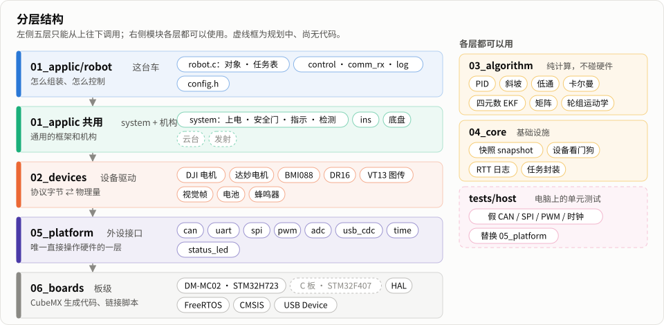
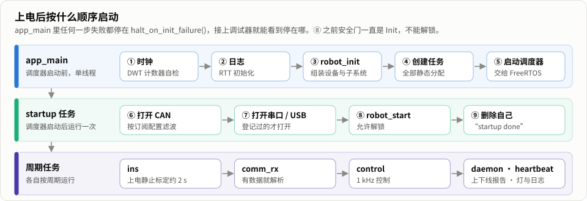
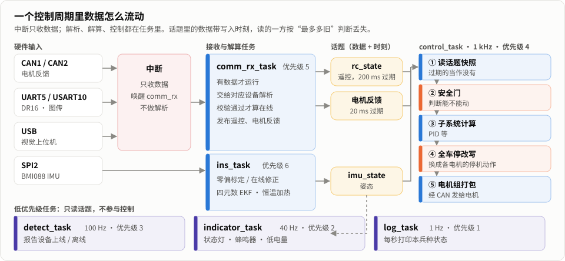
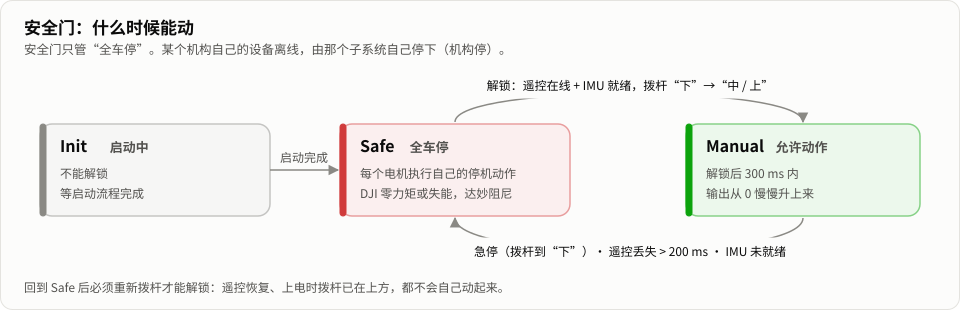

# COD RoboCore

COD 战队的 RoboMaster 电控通用模板：用普通 C11 写成，分层清楚，可以在电脑上测试，并内置失效安全机制。
一套代码覆盖多个兵种，支持两种主控：达妙 DM-MC02（STM32H723）和大疆 C 板（STM32F407）。

> **当前状态（2026-09-30）：** COD-H7-Template 的功能已按新架构移植完（裁判系统解析等官方协议文档），编译 0 警告、
> 电脑侧单元测试全部通过；正在 DM-MC02 上逐项验证（进度见 `docs/VERIFICATION_TODO.md`）。大疆 C 板（F407）后端尚未开始。

## 设计原则

- **明了易懂**：结构体 + 函数，不用宏生成代码，不用函数指针表模拟多态，新队员能顺着目录读懂。
- **分层单向依赖**：app → devices → platform，算法层（algorithm）是纯计算，可以在 PC 上测试。
- **只写必要的安全机制**：安全门只分“全车停”和“机构停”，每个机构有自己规定的安全动作，而不是简单地“输出 0”；同一个故障只在一处处理。
- **静态内存**：初始化之后不再分配内存。
- **单一时间基准**：所有时间戳、超时判断都读同一个时钟。

## 模板特色

**能在电脑上测试**
- 硬件相关的代码只在 `05_platform/` 一层；其余各层是普通 C，电脑上用假 CAN / SPI / PWM / 时钟替换硬件，
  电机协议、遥控解析、姿态解算、安全门等都有单元测试（Unity，30 个测试程序）。
- 平台抽象就是“同名函数、链接时选实现”，没有函数指针表，调试时可以一路跳进具体实现。

**只写必要、但一定写对的安全机制**
- 安全门只有两级：**全车停**（遥控丢失 200 ms、急停、未解锁、IMU 未就绪）和**机构停**（本机构的设备离线）。
- 停机不是简单地“输出 0”：每个电机在配置里规定自己的停机动作（DJI 零力矩 / 失能，达妙阻尼），在发送出口统一改写。
- 上电默认安全状态，必须按规定的拨杆顺序才解锁；回到安全状态后要重新拨杆。
- 设备“在线”只由**收到合法数据**决定（校验通过才喂狗），离线判断在读取时按时间戳当场计算。

**一个时钟、带时间戳的数据**
- 全工程只有一个时间基准 `rm_time_now_us()`：DWT 周期计数扩展成 64 位微秒，不回绕。
- 模块之间用话题（topic）传数据：发布时连同时间戳一起写入，读取时可以要求“不超过多少毫秒”，过期就当作没有数据。

**统一的设备接口**
- 电机接口用输出轴的国际单位（rad、rad/s、N·m）；DJI（M3508、M2006、GM6020）和达妙（MIT 模式、CAN FD）用同一套接口。
- 板上资源按用途命名（`SPI_DEV_IMU_ACCEL`、`PWM_IMU_HEATER`、`ADC_BATTERY`），换板子只改映射表。

**姿态解算**
- BMI088 + 四元数 EKF，用实测的更新间隔积分；芯片安装方向用旋转矩阵配置。
- 上电静止标定陀螺零偏（按标准差判断是否静止），运行中静止时在线修正航向零偏，抵消升温带来的漂移。
- IMU 恒温加热闭环。

**面向 STM32H7 的细节**
- DMA 缓冲区放在不经过缓存的专用内存段（`.dma_buf`），避免 Cortex-M7 的缓存一致性问题。
- CAN FD 只在“全 FD 总线”上使用；FreeRTOS 由 CubeMX 生成，其余任务由框架静态创建，重新生成 CubeMX 代码有核对清单。

**可追溯**
- 每个设计决定都记在 ADR 表里（`docs/ARCHITECTURE.md`），与旧模板的每处不同都写明原因和验证层级。
- 严格区分“编译通过”“电脑测试通过”“上板验证”“台架实测”，未上板的结论不写成事实。

## 已支持的功能

验证状态：✅ 已在 DM-MC02 上验证　🧪 编译 + 电脑单元测试通过、还没上板　📝 规划中。每一项的上板步骤和结果见 `docs/VERIFICATION_TODO.md`。

| 类别 | 功能 | 状态 | 说明 |
| --- | --- | --- | --- |
| 外设接口 | CAN / CAN FD（FDCAN1–3） | ✅ | 收 M3508 反馈、拔线离线与恢复已验证；FD 总线待接达妙电机 |
| | SPI（BMI088） | ✅ | |
| | PWM：IMU 加热 · 蜂鸣器 | ✅ · 🧪 | 加热闭环已稳在约 40 °C；蜂鸣器待听 |
| | ADC：电池电压 | ✅ | 读数正常；分压比 11 待万用表核对 |
| | CAN bus-off 自动恢复 | 🧪 | detect 检测到后重启控制器，待 V44 |
| | 串口（循环 DMA） | 🧪 | 等接 DR16 / 图传 |
| | USB 虚拟串口 | 🧪 | |
| | 64 位微秒时钟 · RTT 日志 · 状态灯 | ✅ | 时钟跨过多次 32 位回绕仍连续 |
| 电机 | DJI M3508 / M2006 / GM6020 | ✅ 反馈 · 🧪 控制 | 让电机转起来的验证要先把电机固定在台架上 |
| | 达妙（MIT 模式，CAN FD） | 🧪 | |
| 传感与遥控 | BMI088 + 四元数 EKF + 零偏在线修正 | ✅ | 热态静止航向约 0.006 °/s；冷启动待测 |
| | DR16 遥控器 · VT13 图传链路 · 图传键鼠 | 🧪 | |
| 通信 | 视觉 USB 帧层（0x5A） | 🧪 | 消息内容等视觉组协议 |
| | 裁判系统 | 🧪 帧检查 · 📝 解析 | 解析等官方 V2.0.0 文档 |
| 安全 | 安全门（全车停）、每个电机的停机动作 | 🧪 | 上板只看过“一直安全停机”；急停、遥控丢失的停机时间要台架实测 |
| 算法 | PID · 斜坡 · 低通 · 卡尔曼 · 矩阵 | 🧪 | EKF 用到的部分已随 IMU 上板 |
| | RLS（功率模型辨识） | 🧪 | 暂未接入 |
| 子系统 | 云台 · 底盘（含功率控制） · 发射 · 轮腿 | 📝 | 见下方路线图 |
| 主控 | 大疆 C 板（STM32F407） | 📝 | |

## 文档

| 文档 | 内容 |
| --- | --- |
| `docs/ARCHITECTURE.md` | 架构设计：分层、核心机制、运行时契约、决策记录（ADR），以及**实施计划**和硬件、协议事实表 |
| `docs/CODING_STANDARD.md` | 编码规范：命名、格式、注释、错误处理、安全相关代码，“必须 / 应该 / 可以”三级 |
| `docs/DEV_ENVIRONMENT.md` | 开发环境搭建：WSL、工具链、Ozone 烧录调试、CLion，每步带验证状态；推送到 GitHub 和 Gitee |
| `docs/CHANGES_FROM_COD_H7_TEMPLATE.md` | 与 COD-H7-Template 的差异：新旧对照、原因和验证层级 |
| `docs/VERIFICATION_TODO.md` | 待验证清单：代码已写好、需要上板或台架确认的项目，每项写明接线、操作和期望 |

## 文件结构

目录前的编号就是从上到下的层次（照 COD_UniCFramework 的写法），依赖只能从编号小的指向编号大的：
`01_applic` → `02_devices` → `05_platform`；`03_algorithm`、`04_core` 可被各层使用，`03_algorithm` 是纯计算。
代码里 include 也带编号，如 `#include "05_platform/can/can.h"`。标“（规划）”的目录还没有代码。和老模板 COD-H7-Template 的对应：
`Core/` → `06_boards/`，`BSP/` → `05_platform/`，`Components/Algorithm、Controller` → `03_algorithm/`，
`Components/Device` → `02_devices/`，`Application/` → `01_applic/`（详见 `docs/CALL_FLOW.md`）。



```text
COD_RoboCore/
├── 01_applic/                  业务（≈ 老模板 Application/）：机构 + 兵种
│   ├── system/              各兵种共用：app_main.c（上电顺序）、安全门、indicator（灯 / 蜂鸣器 / 电池）、detect（上线 / 离线）、comm_rx_common.c
│   ├── chassis/             机构：底盘（全向轮 / 麦轮 / 舵轮）
│   ├── ins/                 机构：惯性导航（标定、零偏在线修正、EKF、发布姿态）和 1 kHz 的 ins_task
│   ├── gimbal/ shoot/ …     （规划）云台、发射、轮腿
│   └── infantry/            兵种：步兵（第一版只有底盘）
│                            每个兵种目录（文件名带兵种前缀）：<兵种>_config.h、<兵种>_robot.h、<兵种>_robot.c（对象 + robot_init + 任务表）、control / comm_rx / log 三个任务
├── 02_devices/              具体设备驱动（≈ 老模板 Components/Device）
│   ├── motor/               统一电机接口、DJI、达妙、电机组发送
│   ├── imu/                 BMI088（含恒温加热）
│   ├── remote/              DR16 遥控器、VT13 图传链路
│   ├── referee/             裁判系统帧检查（协议解析等官方文档）
│   ├── vision/              视觉 USB 通信帧层
│   └── battery/  buzzer/    电池电压、蜂鸣器提示音
├── 03_algorithm/            纯计算，电脑上可测（≈ 老模板 Components/Algorithm、Controller）
│   ├── control/             PID、斜坡
│   ├── filter/              低通、卡尔曼
│   ├── attitude/            四元数 EKF、陀螺零偏估计
│   ├── kinematics/          全向轮、麦轮、舵轮运动学
│   ├── math/                矩阵运算
│   └── power/               RLS（功率模型辨识）
├── 04_core/                 与业务无关的基础设施
│   ├── msg/                 带时间戳的话题，以及各条消息：imu_state、rc_state、vt_rc_state、kbm_state
│   ├── watchdog/            设备在线判断
│   ├── log/                 RTT 日志（含 SEGGER RTT 源码）
│   ├── os/                  临界区、延时、静态任务创建
│   └── util/                CRC
├── 05_platform/             外设接口（≈ 老模板 BSP/）：一个外设一个目录，接口 + 芯片实现 + 辅助代码
│   ├── can/                 can.h、can_stm32h7.c（FDCAN）、can_dlc、can_rx_ring
│   ├── uart/  usb_cdc/      串口（DMA 循环接收）、USB 虚拟串口
│   ├── time/  status_led/   DWT 时钟、WS2812 状态灯
│   ├── spi/  pwm/  adc/
│   └── stm32h7/             H7 各外设共用的 DMA 缓冲段（.dma_buf）；F407 以后在每个外设目录加 *_stm32f4.c
├── 06_boards/               每块板一个目录（CubeMX 生成代码，只改 USER CODE 区）
│   └── dm_mc02_h723/        达妙 DM-MC02：.ioc、链接脚本 dm_mc02.ld、启动文件、REGEN_CHECKLIST.md
├── tests/host/              电脑侧单元测试（Unity）
│   └── fakes/               假 CAN / SPI / PWM / 时钟 / OS
├── cmake/                   交叉编译工具链、板级编译选项、警告设置
├── tools/                   gen_readme_diagrams.py（生成本页的图）；（规划）新建兵种、依赖检查
├── docs/                    架构设计与实施计划、编码规范、开发环境、与旧模板的差异、待验证清单；images/ 放本页的图
└── CMakePresets.json        两个预设：host-tests（电脑测试）、h723-infantry-debug（步兵固件）
```

各层目录（platform、core、algorithm……）都有自己的 `README.md`，说明这一层放什么、不放什么。

## 运行时怎么工作



### 任务

| 任务 | 周期 | 优先级 | 做什么 |
| --- | --- | --- | --- |
| `ins_task` | 1 kHz | 6（最高） | 读 BMI088，零偏标定与在线修正，四元数 EKF 算姿态，IMU 恒温加热，发布 `imu_state` |
| `comm_rx_task` | 有数据就运行 | 5 | 中断收到 CAN 帧 / 串口字节 / USB 数据后被唤醒，交给对应设备解析；CAN bus-off 恢复 |
| `control_task` | 1 kHz | 4 | 读输入 → 安全门 → 各机构计算 → 全车停改写 → 发电机指令（下图 ①–⑤） |
| `detect_task` | 100 Hz | 3 | 报告设备上线 / 离线（只报告，不参与安全判断） |
| `indicator_task` | 40 Hz | 2 | 状态灯、蜂鸣器、低电量检查 |
| `log_task` | 1 Hz | 1 | 通过 RTT 打印本兵种的状态 |

中断只收数据并唤醒 `comm_rx_task`，所有协议解析都在任务里做；1 kHz 的任务里不打日志。



判断“丢失 / 离线”在读取时当场做（按写入时刻算数据有多旧），不需要另外的定时器。



## 快速开始

**需要的工具**（安装步骤和验证记录见 `docs/DEV_ENVIRONMENT.md`）：

| 工具 | 版本 |
| --- | --- |
| 系统 | Windows + WSL 2 + Ubuntu 24.04 |
| 交叉编译器 | Arm GNU Toolchain 15.2.Rel1（`arm-none-eabi-gcc` 15.2.1） |
| 构建 | CMake ≥ 3.25、Ninja |
| 测试 | gcc + Unity（电脑侧），外设用手写的假实现替换 |
| 代码格式 | clang-format 18（已启用）；clang-tidy、cppcheck（规划） |
| 烧录与调试 | SEGGER J-Link + Ozone（烧录、RTT 日志、实时看变量）；CLion（编辑、构建、断点） |
| 板级配置 | STM32CubeMX 6.18（改完按 `06_boards/dm_mc02_h723/REGEN_CHECKLIST.md` 核对） |

**1. 电脑上跑单元测试**（WSL，仓库根目录）：

```bash
cmake --preset host-tests && cmake --build --preset host-tests && ctest --preset host-tests
```

**2. 编译 DM-MC02 固件**（WSL，仓库根目录；`~/tools/arm-gnu-toolchain-*` 下的编译器会被自动找到）：

```bash
cmake --preset h723-infantry-debug && cmake --build --preset h723-infantry-debug
```

输出 `build/h723-infantry-debug/COD_RoboCore.elf`，编译必须 0 警告。

**3. 烧录并看日志**：Ozone 打开这个 ELF → **Download & Reset** → F5 运行 → **View → Terminal** 看 RTT 日志。
上电后约 2 s 内不要动板子（陀螺零偏标定）。看到 `startup done`、每秒一行 `alive N, mode safe` 就是跑起来了。

> 习惯 Keil 的可以直接用 Keil 编译、烧录、调试：打开 `06_boards/dm_mc02_h723/MDK-ARM/dm_mc02.uvprojx`（Keil 自己的编译器 AC6，和 CMake 编同一组文件，见 `06_boards/dm_mc02_h723/README.md`“Keil”）。

> 目前请用 Ozone 烧录：经 J-Link GDB 服务器（CLion）烧录会显示成功但实际没写入，原因还在查，见 `docs/DEV_ENVIRONMENT.md` 11.2 节。

## 新建一个兵种

1. 复制 `01_applic/infantry/` 为 `01_applic/<兵种名>/`，把里面文件名的前缀 `infantry_` 和 include 里的文件名改成 `<兵种名>_`；在 `CMakePresets.json` 里照 `h723-infantry-debug` 加一个预设。
2. 改 `<兵种>_config.h`：PID 参数、解锁用哪个拨杆、IMU 安装方向、电池参数等固定参数。
3. 改 `<兵种>_robot.c`：`robot_init()` 里初始化设备和机构、任务表 `robot_tasks[]`；`<兵种>_robot.h` 同步声明新增的对象和任务。电机 ID、总线等参数改 `<兵种>_config.h`。
4. 改 `<兵种>_control_task.c`：每个控制周期做什么（读输入 → 安全门 → 子系统 → 发送，四步写在循环里）。`<兵种>_log_task.c` 改打印内容。
   各任务的调用关系见 `docs/CALL_FLOW.md`。
5. 编译时选这个兵种：`cmake --preset h723-<兵种名>-debug`。

分层规则、命名和安全相关代码的写法见 `docs/CODING_STANDARD.md`。

## 注意事项

- **固件会给电机发指令。** 未解锁时持续发零电流，解锁后按遥控转动。接电机前先把电机固定在台架上、输出轴不带负载、断电开关放在手边；只看反馈时手扶即可，让电机转起来时不行。
- **不要随手暂停正在控制电机的程序。** 调试器暂停后 CAN 指令停发，电调怎么反应还没有实测。
- **未上板的功能不要直接上车。** 以上表的验证状态为准，“🧪”只代表电脑测试通过。

## 路线图

| 阶段 | 内容 | 状态 |
| --- | --- | --- |
| 0 骨架 | 目录、构建、CubeMX 工程、时钟、日志、单元测试 | ✅ 完成并上板 |
| 旧模板移植 | COD-H7-Template 的电机、遥控、IMU、图传、视觉、电池等全部按新架构重写 | 🧪 代码完成（裁判系统等文档），上板验证进行中 |
| 1 最小完整链路 | 一台电机 + 遥控 + 安全停机，停机时间台架实测；硬件看门狗、故障记录、指令层 | 进行中 |
| 2 C 板移植 | 每个外设目录加 `*_stm32f4.c`，跑同一条最小链路 | 📝 |
| 3 设备层补全 | 电机停发后的行为实测、分类发送队列 | 📝 |
| 4 姿态 + 云台 | 云台控制、`GimbalState` | 📝 |
| 5 步兵整车 | 底盘（功率控制）、发射（热量、卡弹）、裁判系统、键鼠、UI、自瞄通信 | 📝 |
| 6 参数存储 | Flash 双区保存标定值 | 📝 |
| 7–9 | 轮腿、多板 / 哨兵、工程 | 📝 |

每个阶段的清单和验收标准见 `docs/ARCHITECTURE.md` 的“实施计划”。

## 仓库约定

- 所有文本文件为 **UTF-8 编码、LF 换行**，由 `.gitattributes` 和 `.editorconfig` 保证。
- 提交说明的格式是 `类型: 做了什么`，类型包括 `feat` 新功能、`fix` 修复、`docs` 文档、`build` 构建、`test` 测试、`chore` 杂项。
- 编译必须 **0 警告**。推送到 GitHub 后，`.github/workflows/ci.yml` 自动做格式检查、电脑侧单元测试和固件编译。

## 参考与致谢

设计时参考了以下项目：

- [COD-H7-Template](https://github.com/GrassFanWang/COD-H7-Template)（COD，MIT）
- [COD_UniCFramework](https://github.com/fakeSkyy/COD_UniCFramework)（COD，MIT）
- [basic_framework](https://github.com/HNUYueLuRM/basic_framework)（湖南大学跃鹿战队，MIT）
- 其他开源项目的思路：taproot（GPL-3.0，只借鉴思路，未使用其代码）、StandardRobot++、RM2024-PowerModule 等

如果复制了 MIT 许可项目的代码，会在对应文件中保留原作者的版权声明。

## 许可证

待定。
