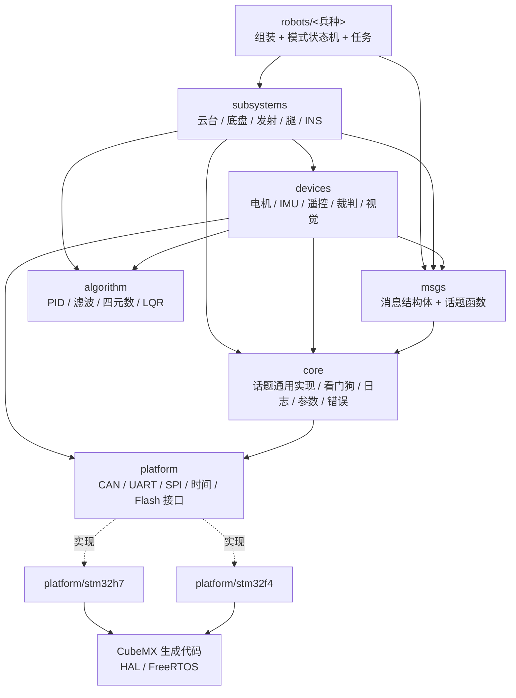
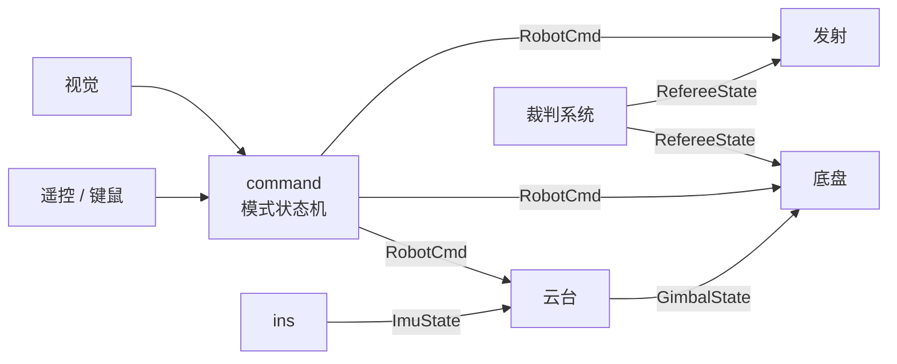
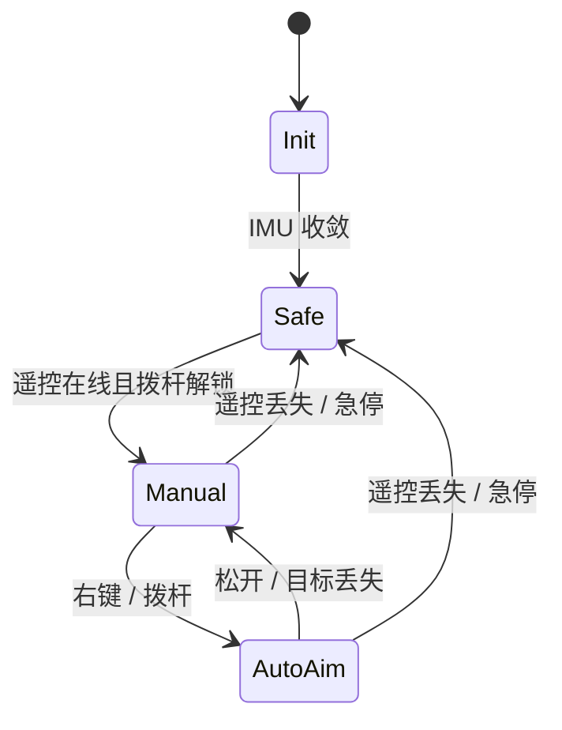

# COD RoboCore 架构设计

2026-09-24 起草

> **2026-09-28**：原《RoboMaster 电控新模板架构设计》与《RoboMaster 电控新模板实施计划》合并为本文并移入仓库 `docs/`；实施计划是本文“实施计划”一章，原“落地路线图”由它取代；原“C 编码规范要点”已全部并入 `docs/CODING_STANDARD.md`。
>
> **2026-09-27 修订**（ADR 0026–0028，用户确认）：安全机制精简为“全车停 / 机构停”两类，删除冗余检查；补充 USB CDC、ADC、电池电压、
> PWM 执行器、蜂鸣器，达妙电机统一类型，标定改用遥控器组合键；系统时钟定为 550 MHz。
>
> **2026-09-25 修订**：依据 `reference/` 中的项目，以及 UniC 在同一块 DM-MC02 上的实测记录，逐节修订。
> 主要改动：
> - 确定模板从零新写，Unity 测试，Keil 推迟（ADR 0017–0019）；RTOS 接入方式改为待定；
> - 补充单一时间基准、DMA 缓冲区、H7 Flash ECC、CubeMX 重新生成风险；
> - 补全 DJI 帧 ID 表和 ID 冲突检查，补充达妙参数一致性要求；
> - 新增 CAN 总线负载预算，写明 CAN FD 不能与经典 CAN 节点共用总线；
> - 新增“功率控制”一节；
> - 多板从“哨兵专用”推广为通用机制；
> - 补充裁判系统断电（阵亡/复活）处理，以及视觉通信的时间戳要求；
> - 新增附录 A“硬件与协议事实表”，每条都注明来源和验证层级；附录 B 为参考资料对照。
>
> **2026-09-25 第二次修订**：
> - 把 COD-H7-Template 提升为与 UniC 同级的首要参考并逐文件阅读，新增附录 A.7（板级资源分配与迁移注意）；
> - 修正“达妙都是经典 CAN”的错误说法（H7 模板在 FDCAN2 上用 FD 驱动 DM8009）；
> - 写明 FDCAN 分频参数取决于时钟树；
> - 补充 BDMA 只能访问 SRAM4；
> - 记录用户告知的“MC02 收发器支持 FD”；
> - 给出 FreeRTOS 接入方式的推荐（ADR 0025，已确认）；
> - 写明 0021 和 0022 的理由；
> - 兵种范围扩大为“通用控制”，纳入工程机器人和重装机器人（重装的规则细节待提供）。
>
> **2026-09-25 第三次修订**（细读湖南大学 basic\_framework）：
> - 裁判系统协议更新为 2026 赛季的 v2.0.0（多个命令长度有变化）；
> - 新增输入源标准化（`OperatorInput`、`KeyTracker`）、“发射机构”一节（热量控制、卡弹检测、拨弹模式）；
> - 视觉通信字段补全；UI 分静态和动态两层；
> - 各任务自测执行时间；模块文档规范；通用帧解析 `frame_codec`；
> - CAN 终端电阻规则（附录 A.8）。
>
> 验证层级用语：**实测**（在板子或台架上测过）、**编译/主机测试**、**引用**（出自参考代码或厂商资料，未在本项目验证）、**推算**（计算得出）、**待验证**。

## 目标与约束

一套代码覆盖全部兵种和两种主控：新建兵种 = 用 `tools/new_robot.py` 复制模板目录 + 改 `config.h` + 在 `robot.c` 里勾选子系统；换主控只换平台目录，在资源和算力满足该兵种要求时业务代码不动，不满足的组合在 CMake 配置阶段直接报错。模板的首要要求是**明了易懂**：新队员能顺着目录和注释读懂，代码是普通 C：结构体 + 函数。

| 项目 | 决定 |
| --- | --- |
| 语言 | C11 为主（结构体 + 函数，禁止运行时 `malloc`）；C++17 只用于少数通过 C 接口接入的可选模块；PC 测试也用 C（Unity，ADR 0018） |
| 构建 | CMake + arm-none-eabi-gcc；Keil MDK（AC6）工程推迟到整体稳定后再加（ADR 0019） |
| RTOS | FreeRTOS，**由 CubeMX 生成内核和移植层**（与 COD-H7-Template 和其他学校一致，ADR 0025）；任务、队列全部由框架用原生 API 静态创建，上层只调用 `core/os` 的封装，不直接调用 `osXxx` 或 `xTaskXxx` |
| 主控 | 达妙 DM-MC02（STM32H723）、大疆 C 板（STM32F407）；**同一台机器人可以混用**（例如底盘用 MC02、云台用 C 板） |
| 兵种 | **通用控制**：步兵、英雄、轮腿、哨兵（双云台、多板）、工程（机械臂、自定义控制器），以及**重装机器人**（用户 2026-09-25 要求纳入，规则细节待提供，见“未决”）。新机构以子系统的形式加入，不修改已有子系统 |
| 交付 | 本文只定架构，代码之后按路线图写 |

### 必须满足的硬性要求

- **分层单向依赖**：上层可以用下层，下层绝不 include 上层。
- **应用之间不互相 include**：云台、底盘、发射之间只通过话题交换数据。
- **芯片无关**：platform/ 以外的代码不出现 `stm32h7xx_hal.h`、`HAL_`、寄存器名。
- **静态内存**：初始化之后不再分配内存；全局变量只写常量初值，硬件初始化在显式 `xxx_init()` 里（见运行时契约）。
- **可在 PC 上测试**：算法、控制器、协议解析都能用 gcc 在电脑上跑单元测试。
- **单一时间基准**：所有时间戳、超时判断、看门狗都读同一个 `rm_time_now_us()`。不允许一处用 DWT、另一处用 RTOS tick。
  UniC 在这块板子上出过事故：两个时钟的起点相差 2238 ms（实测），一颗正常的 IMU 被永久判为离线，而主机测试全部通过。
- **静默失败要变成响亮的失败**：凡是“配错了也能编译、运行时什么都不做”的地方（DMA 缓冲区放错内存、CubeMX
  重新生成丢了代码、模块没被链接进固件），都要加编译期检查、链接期检查或启动自检。
- **安全兜底**：离线、NaN、未收敛、遥控丢失时按安全门分级处理（每个机构执行自己规定的安全动作：零力矩、阻尼、失能或受控减速）。
- **延续现有规范**：命名、单位后缀、注释要求沿用 CODING\_STANDARD.md，C11 细则在“编码规范”一节补充。

## 其他战队怎么做

主流开源框架都收敛到同一套思路：硬件抽象 → 模块/设备 → 应用三层，应用间用发布-订阅解耦，兵种差异集中在一个配置文件或构建参数里。

| 框架 | 语言 / RTOS | 分层 | 模块间通信 | 构建 | 本模板借鉴 |
| --- | --- | --- | --- | --- | --- |
| [湖大跃鹿 basic\_framework](https://github.com/HNUYueLuRM/basic_framework/blob/master/README.md) | C / FreeRTOS | bsp → module → app | 消息中心 pub-sub；守护线程监控离线 | Makefile、CMake、Keil | `XXXRegister(config)` 注册实例；`robot_def.h` 切换兵种；daemon |
| [Meta-Embedded-NG](https://github.com/Meta-Team/Meta-Embedded-NG) | C / FreeRTOS，达妙 H723 | bsp → module → application | 消息中心，应用之间不互相 include | Makefile，`ROBOT=sentry` 分别输出 | 兵种作为构建参数；与我们同一块板 |
| [NCST Horizon](https://github.com/NCST-Horizon-RM/Horizon_Control_Framework) | C / FreeRTOS，F4 + H7 | Common（硬件无关）+ Boards/每块板 | pub-sub，设备数据由“持有者”独占 | CMake Presets（板×兵种×Debug） | 多主控共用上层；Presets 组合 |
| [UIC UICRM-Embedded](https://github.com/UIC-RoboMaster/UICRM-Embedded) | C/C++ / FreeRTOS，F1/F4/H7 | base → platform → drivers/algorithm → components → programs | 组件组合 | CMake + clang-format，CI 拦截格式 | platform 层隔离 HAL/RTOS；格式与构建 CI；examples 目录 |
| [Meta-Embedded（旧版）](https://github.com/Meta-Team/Meta-Embedded) | C++ / ChibiOS | interface → scheduler → logic | 线程间传递 | CMake | 单元测试覆盖 AHRS、电机、底盘 |
| [大疆 RoboRTS-Firmware](https://github.com/RoboMaster/RoboRTS-Firmware/blob/icra2021/doc/en/readme.md) | C / FreeRTOS | driver → bsp → components → application | 观察者模式 | Keil + CMake | 硬实时任务最高优先级，非关键功能走软件定时器 |
| [中科大 RoboWalker 培训](https://github.com/yssickjgd/robowalker_train) | C/C++ | 驱动 → 算法 → 设备 → 机器人 | — | Keil | 电机等设备做成 C++ 类 |

上表是原作者的调研，这些仓库不在本地 `reference/` 中，2026-09-25 未复核。下表是本地 `reference/` 中实际读过的项目：

| 项目（`reference/` 路径） | 语言 / 平台 | 读到的要点 | 本模板怎么用 |
| --- | --- | --- | --- |
| COD\_UniCFramework（`bases/`） | C11，H723 + F407，上游 FreeRTOS | 01–06 分层、ops 表平台层、Unity/CMock 主机测试、质量门禁（依赖方向、第三方代码校验和、体积预算）、模糊测试；`docs/ai-memory/` 记有 DM-MC02 实测事实 | 硬件事实、测试与 CI 做法直接借鉴（附录 A）；平台抽象不用 ops 表（ADR 0017） |
| COD-H7-Template（`bases/`，**与 UniC 同为首要参考**） | C，H723，Keil + CubeMX，FreeRTOS V10.3.1 | 四元数 EKF、BMI088 与加热恒温、DJI 与达妙（FD）电机、DR16、裁判系统 v1.8.0、图传链路、USB CDC MiniPC；DMA 缓冲区放在 `.AXI_SRAM` 段并用 MPU 设为不可缓存；另有 ThreadX 分支 | 板级资源分配（附录 A.7）、FreeRTOS 接入方式（ADR 0025）、协议解析和 EKF 的迁移来源；EKF 依赖 `arm_math` 并在运行时用 `pvPortMalloc` 分配内存，迁移时要改成静态分配 |
| basic\_framework（湖南大学跃鹿，`frameworks/`，2026-09-25 细读） | C，F407，CubeMX FreeRTOS，VSCode + Ozone | bsp → module → app 三层；app 按机械结构划分（云台、发射、底盘、夹爪、抬升、机械臂），外加一个 cmd 应用负责遥控、视觉、裁判系统到控制命令的转换；单板/双板用 `robot_def.h` 的宏切换，双板时应用间数据改走 `can_comm`；各任务自己用 DWT 测执行时间，超时打日志；daemon 用“父指针 + 离线回调”；DJI 帧分组与 **ID 冲突检查**；CAN 发送改为中断驱动的环形队列（满了丢最旧的）；**裁判系统协议已更新到 v2.0.0（2026 赛季长度变化）** 并封装图传链路；支持富斯遥控器（SBUS）；`standard_cmd` 把各种输入源统一成标准命令；`unicomm` 计划统一各种帧格式的解析；每个模块都配一份说明文档和使用示例 | 采纳：输入源标准化、通用帧解析、按机械结构划分子系统、各任务自测耗时、模块文档规范、裁判系统 v2.0.0、CAN 终端电阻规则、ID 冲突检查；不采纳：字符串话题、PID 放在电机模块里、用条件编译切换单板/双板（本模板由 BoardLink 让话题跨板透明，这也是 basic\_framework 文档里写的下一步计划） |
| taproot（`frameworks/`） | C++，modm | Command/Subsystem 调度器、`SafeDisconnectFunction`（遥控断开时统一停机）、遥控帧间超时重同步 | 统一停机思路对应本文的安全门；帧重同步用于 DR16 解析 |
| StandardRobot++（`frameworks/`） | C，C 板，Keil | 底盘、云台、发射、机械臂类型可配置；达妙“**设置零点前先失能**”；与 ROS 2 上位机的串口协议 | 达妙注意事项写进设备层；上位机协议格式参考 |
| XRobot / LibXR（`frameworks/`） | C++，代码生成 | 模块仓库、构造参数配置、生成主函数 | 不采用：生成的代码不利于新队员阅读 |
| UIML（`frameworks/`） | C，FreeRTOS | 软总线（话题、广播、远程函数）、YAML 式配置启用模块 | 不采用运行时配置和字符串软总线；“换车只改配置”的目标一致 |
| rpl（`libraries/`） | C++20 | 与裁判系统同格式的帧（SOF + CRC8 + CRC16）；DMA 直接写入 BipBuffer；分段 CRC；连接健康检测 | 主语言是 C11，不直接引入；帧格式、“CRC 失败的数据不进业务内存”等原则采纳 |
| standard\_robot\_pp\_ros2（`integrations/`） | C++，ROS 2 | 上下位机帧：`0x5A` + len + id + CRC8 头，CRC16 尾，每包带 `time_stamp` | VisionLink 帧格式和时间戳要求的参考 |
| RM2024-PowerModule（`hardware/`） | C++ | 电机功率模型 P = τω + k₁\|ω\| + k₂τ² + k₃/n，RLS 在线辨识，按误差分配功率，能量环 | “功率控制”一节的依据 |
| 24\_Wolf\_4Wheel\_Infantry（`robots/`） | C，FreeRTOS，Keil | **步兵也分底盘板和云台板**；舵轮、功率控制、UI | 多板推广到所有兵种 |
| SPR（`robots/`） | C，MC02 + C 板 | 平衡步兵：**底盘 MC02、云台 C 板混用**；LQR 增益由 MATLAB 按腿长拟合后导出为 C；离地检测 | 轮腿与混板设计的参考 |
| TaurusArm（`robots/`） | C + MATLAB | 七自由度机械臂正、逆运动学，重力补偿 | 若纳入工程机器人，算法层的参考 |

**不采用的做法**

- 字符串名字的话题（basic\_framework 用字符串匹配订阅，UIML 的软总线也一样）：拼错名字不报错。本模板每个话题是**一对类型明确的函数**（`robot_cmd_publish()` / `robot_cmd_read()`），参数类型由编译器检查。
- 运行时 `malloc` 注册实例：改为静态分配的结构体。
- 平台层用 ops 函数表 + 不透明上下文（UniC）：灵活，但多一层间接，不利于新队员阅读；改为同名函数、链接时选择实现（ADR 0017）。
- 代码生成框架（XRobot）和 C++20 模板库（rpl）：性能好，但与“普通 C、新队员能直接读懂”的首要要求冲突。
- 线程库换成 ChibiOS：CubeMX 不支持，迁移成本高，继续用 FreeRTOS。

## 分层架构与依赖规则

分 6 层，依赖只能向下。算法层不依赖任何硬件和 RTOS，所以能在 PC 上测试；芯片差异全部关在 platform 层。



实线是“可以调用”，虚线是“由哪个目录实现”；编译时只链接当前主控的那一份 platform。

| 层 | 职责 | 可以 include | 禁止 |
| --- | --- | --- | --- |
| robots | 选模块、填参数、模式状态机、创建任务 | 所有下层 | 写控制算法、直接碰外设 |
| subsystems | 一个机构的完整闭环（云台、底盘、发射、腿、INS） | devices、algorithm、core | include 其他 subsystem；只能走话题 |
| devices | 一个外部设备的协议和状态（在线、原始值 → SI 单位） | platform 接口、algorithm、core | HAL、具体芯片头文件 |
| algorithm | 纯计算，输入输出全走参数 | 标准库、CMSIS-DSP（可选） | RTOS、HAL、全局变量 |
| core | 消息中心、看门狗、日志、参数存储、OS 封装 | platform 接口、FreeRTOS | 任何具体设备 |
| platform | 外设驱动的抽象接口 + 每种芯片一份实现 | HAL（仅实现目录） | 任何上层 |
| msgs | 消息结构体、枚举、话题类型，以及认领 / 发布 / 读取函数（不含话题实例） | `<stdint.h>`、core/msg、msgs 内部 | 控制逻辑、algorithm、HAL；只被 devices / subsystems / robots 引用 |

依赖规则靠两道检查：① CMake 每层一个库目标，并只把本层的 `include/` 目录导出给允许使用它的上层，可以挡住大部分越层 include，但挡不住相对路径和同层互相引用；② `tools/check_deps.py` 扫描所有 `#include`，对照上表检查方向，包括“子系统之间不互相 include”，在 CI 里运行。

## 目录结构

按层分顶层目录；CubeMX 生成的代码关在 `boards/<板子>/` 里，与手写代码完全分开。所有源文件统一 **UTF-8**，Keil 设为 UTF-8，不再用 GBK。

```text
rm-template/
├── CMakeLists.txt
├── CMakePresets.json            # 板子 × 兵种 × Debug/Release，例：h723-infantry-debug
├── cmake/
│   ├── toolchain-arm-gcc.cmake  # arm-none-eabi-gcc
│   ├── board-dm_mc02.cmake      # 芯片型号、FPU、链接脚本
│   ├── board-dji_c.cmake
│   └── warnings.cmake           # -Wall -Wextra -Werror -Wdouble-promotion 等
├── boards/                      # 每块板一个目录，只有这里允许出现 CubeMX 代码
│   ├── dm_mc02_h723/
│   │   ├── dm_mc02.ioc
│   │   ├── Core/ Drivers/ Middlewares/ USB_DEVICE/   # 生成代码，不手改
│   │   ├── dm_mc02.ld                                # 自己的链接脚本（由 CubeMX 的 .ld 复制而来，加 DMA 段等），生成器改不到
│   │   ├── board.h / board.c    # 板级资源表、中断优先级表、board_init()/board_start()
│   │   ├── REGEN_CHECKLIST.md   # 每次 CubeMX 重新生成后的检查清单（见“关键点”）
│   │   └── mdk/dm_mc02.uvprojx  # Keil 工程（ADR 0019：暂不建立）
│   └── dji_c_f407/              # 同上
├── platform/
│   ├── include/platform/        # 接口：can uart spi gpio pwm adc usb_cdc time flash iwdg（spi、pwm 按用途命名，ADR 0033）
│   ├── common/                  # 各芯片共用的纯计算（如 DWT 64 位扩展），PC 可测
│   ├── stm32h7/                 # FDCAN、H7 的 DMA/Cache 处理
│   ├── stm32f4/                 # bxCAN
│   └── host/                    # PC 上的假实现，供测试和仿真
├── core/
│   ├── os/                      # 任务创建、临界区（静态分配）
│   ├── msg/                     # topic（话题通用实现）event_queue spsc_ring
│   ├── watchdog/                # 设备在线检测、任务心跳、喂 IWDG
│   ├── error/                   # RM_ASSERT、RM_CHECK、ErrorCode、HardFault 记录
│   ├── log/                     # SEGGER RTT 日志
│   ├── param/                   # Flash 双区参数
│   └── util/                    # crc ring_buffer math time frame_codec（裁判/图传/视觉/板间/电容共用的帧解析）
├── algorithm/                   # 纯计算，PC 可测；个别可选 C++ 实现也放这里，对外只有 .h
│   ├── control/                 # pid ramp lqr feedforward
│   ├── filter/                  # lpf kalman
│   ├── math/                    # matrix（小矩阵运算，ADR 0029）
│   ├── attitude/                # quaternion quat_ekf gimbal_angles
│   ├── kinematics/              # mecanum omni steer leg_vmc
│   ├── power/                   # 电机功率模型、RLS 参数辨识、功率分配（纯计算）
│   └── ballistic/
├── devices/
│   ├── motor/                   # motor.h（统一接口）dji_motor dm_motor motor_group
│   ├── imu/                     # bmi088
│   ├── remote/                  # dr16 vt_link
│   ├── referee/
│   ├── vision/                  # 与上位机通信
│   ├── supercap/
│   ├── battery/                 # 电池电压（ADC）
│   ├── actuator/                # PWM 执行器：舵机、气泵、电磁阀
│   ├── buzzer/                  # 蜂鸣器提示音
│   └── board_link/              # 板间 CAN 通信
├── msgs/                        # 消息类型 + 操作函数：robot_cmd imu_state gimbal_state …（实例在 robot.c）
├── subsystems/
│   ├── ins/  gimbal/  chassis/  shooter/  leg/     # 功率控制属于 chassis / leg 内部，见“功率控制”一节
├── robots/
│   ├── common/                  # app_main()、模式状态机、安全门
│   ├── _template/               # new_robot.py 复制的样板
│   ├── infantry/                # config.h robot.c debug.c
│   ├── hero/
│   ├── wheel_leg/
│   ├── sentry_gimbal/           # 多板机器人：每块板一个目录，共用一份 board_link_table.c
│   └── sentry_chassis/          # 步兵若分云台板和底盘板，同样拆成 infantry_gimbal/ + infantry_chassis/
├── tests/
│   ├── host/                    # PC 单元测试（Unity，C 语言），含多线程压力测试
│   ├── target/                  # 板上自测固件（话题并发、看门狗）
│   ├── hil/                     # USB-CAN 回放与故障注入脚本
│   └── data/                    # 录制的 IMU / CAN / 裁判数据
├── tools/                       # new_robot.py check_forbidden.py check_deps.py check_linked.py vofa 配置 Ozone 工程模板（check_keil_sync.py 在 ADR 0019 之后加）
├── docs/
│   ├── ARCHITECTURE.md（本文）  CODING_STANDARD.md  DEV_ENVIRONMENT.md
│   ├── CHANGES_FROM_COD_H7_TEMPLATE.md  VERIFICATION_TODO.md  conventions.md  budget.md
│   └── adr/                     # 决策记录，每个决策一个文件
├── .github/workflows/ci.yml
├── .clang-format  .clang-tidy  .editorconfig
└── README.md
```

**关键点**

- **一个固件目标 = robots/ 下一个目录。** 新建兵种运行 `tools/new_robot.py <名字>`：从 `robots/_template/` 复制目录、加 CMake 预设，并打印剩余手工步骤清单（改 `config.h`、`robot.c`、`debug.c`）。
- **一块板 = boards/ 下一个目录 + platform/ 下一份实现。** 资源和算力够用时，上层代码在 H723 和 F407 之间原样复用；每个目录在 config.h 里声明需要的能力（CAN 路数、CAN FD、控制频率），CMake 与板子能力比对，不支持的组合在构建时报错。
- **多板是通用机制，不只属于哨兵**：步兵常分云台板和底盘板（24\_Wolf），平衡步兵用 MC02 底盘 + C 板云台（SPR），哨兵是双云台加底盘。每块板一个 robots/ 目录，可以是不同的主控，共用 devices/board\_link 和同一份跨板话题表。
- **CubeMX 重新生成只会改写 boards/<板子>/ 下的文件**，但**它会悄悄删掉它认为不属于用户的代码**。UniC 在同一块板上出过这些事故：
  - `USER CODE BEGIN 2` 被清空，框架入口不再被调用，固件能编译能链接但什么都不做；
  - `TIM2_IRQHandler`、`SPI2_IRQHandler` 和 15 个 DMA 中断被生成成空函数；
  - `SysTick_Handler` 在 H7 重新生成后整个消失；
  - 链接脚本里自定义的段被删掉；
  - `.ioc` 缺少键时，SPI Data Size 默认变成 4 bit。

  对策：
  - 框架入口和必须存在的中断处理函数尽量放在框架侧；
  - 必须放在生成文件里的，只写在 USER CODE 区内；
  - 链接脚本用自己的一份（`boards/<板子>/dm_mc02.ld`），CubeMX 生成的那份不参与构建，自定义段不会被删；
  - 每块板维护 `REGEN_CHECKLIST.md`，每次 Generate Code 后逐条核对，并用 `grep -cE '^\s*HAL_[A-Za-z_]*_IRQHandler\s*\(' stm32xxxx_it.c` 核对中断转发的数量。
- **固件入口**（按 ADR 0025，由 CubeMX 生成 RTOS）：
  - 在 CubeMX 里删掉默认任务（`defaultTask`），不在 CubeMX 里定义任何任务或队列；
  - `freertos.c` 的 `MX_FREERTOS_Init()` 在 USER CODE 区里只调用一行 `app_main();`；
  - `main()` 在 `MX_FREERTOS_Init()` 之后调用 `osKernelStart()`，这一步由生成的代码完成；
  - `REGEN_CHECKLIST.md` 核对这一行调用还在、没有冒出新的 CubeMX 任务、HAL 时基仍然用 TIM（不是 SysTick），以及 TIM 中断处理函数不是空的。

## 核心机制

六个机制决定了这个模板好不好用：平台抽象让换板尽量不改业务，话题让模块互不依赖，看门狗和安全门负责兜底，参数存储让标定结果不丢，日志和计时支撑调试。

### 1. 平台抽象：同名函数，链接时选实现

platform/include 里只放函数声明（`can_send()`、`rm_time_now_us()`……），每种芯片一份 .c 实现同一组函数，CMake 只编译当前主控那一份；PC 测试编译 platform/host 的假实现。没有虚函数、没有函数指针表，调用就是普通函数调用，调试时可以直接跳进去看。

```c
// platform/include/platform/can.h
typedef enum { CAN_BUS_1, CAN_BUS_2, CAN_BUS_3, CAN_BUS_COUNT } CanBusId;
typedef struct { uint32_t id; uint8_t len; uint8_t data[64]; bool is_fd; } CanFrame;
typedef void (*CanRxHandler)(const CanFrame *frame, void *ctx);

bool can_send(CanBusId bus, const CanFrame *frame);                            // 非阻塞，进发送队列
bool can_subscribe(CanBusId bus, uint32_t id, CanRxHandler handler, void *ctx); // 按 ID 分发接收
bool can_subscribe_range(CanBusId bus, uint32_t first_id, uint32_t last_id,     // 一段连续 ID，一个回调
                         CanRxHandler handler, void *ctx);
// 实现：platform/stm32h7/can.c、platform/stm32f4/can.c、platform/host/can.c，三选一编译
```

- 中断里只做“收帧 → 放进环形缓冲”，分发回调在 comm\_rx 任务里执行，不在中断里跑业务。
- **接收过滤按“精确 ID 或精确范围”实现，不用会多收的掩码。** 例如 `0x201..0x204` 不是按 2 的幂对齐的区间，能覆盖它的最窄掩码是 `0x200..0x207`，会把本机发出的 `0x200` 控制帧和 GM6020 的反馈也收进来（UniC `can-range-claim-not-mask`）。
  - H7 的 FDCAN 有范围滤波器，一段 ID 只占 1 个滤波元件；
  - F4 的 bxCAN 没有，只能把一段 ID 展开成逐个 ID 的滤波，**两块芯片的滤波容量含义不同**，规划 F407 时不能按 H7 的余量算。
  - 滤波条目不够时，`can_subscribe*()` 在初始化阶段返回 false，不允许静默丢帧。
- **DMA 缓冲区的规则**（细节全部在 `platform/stm32h7/` 里）：
  - H7 的 DMA1/DMA2 访问不到 DTCM，传输的结果是“什么都没收到”，不会报错（UniC 实测）；
  - 所有 DMA 缓冲区用 `RM_DMA_BUF` 宏放进 AXI SRAM 的专用段；
  - 用 MPU 把这个段设为不可缓存，就**不需要做 Cache 维护**，比到处写 clean/invalidate 更容易看懂，也不容易漏；
  - 段写在自己的链接脚本里，放在 AXI SRAM（RAM_D1），MPU 区域覆盖整个 RAM_D1，所以不再另加地址检查（2026-09-28，按 ADR 0026 不写重复检查）。
  - F407 的 CCM 同样不能被 DMA 访问，规则相同。
  - **D3 域的外设（SPI6、LPUART1、I2C4、ADC3 等）由 BDMA 服务，BDMA 只能访问 SRAM4（`0x38000000`）**。这些外设的 DMA 缓冲区要用另一个宏 `RM_BDMA_BUF` 放进 SRAM4 段。COD-H7-Template 的分散加载文件里已经有 `.SRAM4` 段，并且初始化了 BDMA 和 ADC3。
  - 为什么选“不可缓存”而不是 Cache 维护，详见 ADR 0021。

### 2. 消息中心：每个话题一对函数

```c
// msgs/robot_cmd.h —— 消息类型 + 操作函数；话题实例不在这里
typedef struct {
    float yaw_target_rad;    ///< 目标航向，W 系，逆时针为正
    float pitch_target_rad;  ///< 目标仰角，抬头为正
    float yaw_ff_rad_s;      ///< 航向角速度前馈
    float pitch_ff_rad_s;    ///< 仰角角速度前馈
    GimbalMode mode;
} GimbalCmd;

typedef struct {             ///< command 任务每轮决策只发布这一个
    uint32_t   sequence;     ///< 每轮加 1
    RobotMode  mode;
    GimbalCmd  gimbal;
    ChassisCmd chassis;
    ShootCmd   shoot;
} RobotCmd;

typedef struct { Topic base; RobotCmd data; } RobotCmdTopic;   // 一份话题实例；类型不同的话题不能混传

bool robot_cmd_claim(RobotCmdTopic *t, const char *owner);                 // 初始化时认领发布权
void robot_cmd_publish(RobotCmdTopic *t, const RobotCmd *cmd);
bool robot_cmd_read(const RobotCmdTopic *t, RobotCmd *out, uint32_t max_age_ms);  // 超时或从未发布返回 false

// 使用：control 任务周期开头
if (!robot_cmd_read(&robot_cmd_topic, &inputs.cmd, 20)) { inputs.cmd_valid = false; }
```

话题怎么定义、怎么传给子系统、能在什么上下文调用，见“运行时契约”第 2 小节。

- **最新值语义**：控制量只关心最新一帧，不用队列，不会积压。
- **类型明确**：每种消息一组普通函数，第一个参数是话题实例指针，参数类型由编译器检查；不用字符串名字，也不用 `void *` 通用接口。这是和 basic\_framework 最大的区别。
- **线程安全**：函数内部在临界区里拷贝数据和时间戳（消息 ≤ 256 字节），调用方不用自己加锁；只能在任务里调用，中断里禁止。
- **带时间戳**：每次发布记录 64 位微秒时间，读取方判断数据是否过期，过期就走安全门。
- **事件**（按键单击、UI 刷新）另用 `event_queue`，定长，满了丢新事件并计数；急停、解锁这类不能丢的信号作为状态放在话题里，不走事件队列。

### 3. 看门狗（在线检测）

每个设备结构体里有一个 `Watchdog`：**收到一帧合法数据**（校验通过、字段在有效范围内）才 `watchdog_feed()`，喂的是 `rm_time_now_us()` 的时间戳。

**在线与否在读取时判断，不等守护任务来标记。** `watchdog_is_online(wd, now_us)` 用“现在 − 最后喂狗时间 < 超时”当场计算。control 任务每个周期读快照时自己算，所以检测延迟就是超时本身。如果等 100 Hz 的守护任务去标记离线，最坏还要再多 10 ms。

core/watchdog 的守护任务以 100 Hz 扫描，只负责**报告**：执行离线回调、在 RTT 打日志、驱动 LED 或蜂鸣器。

```c
static Watchdog yaw_motor_wd = { .name = "yaw_motor", .timeout_ms = 20, .on_offline = yaw_motor_on_offline };
```

- 喂狗和判断都读 `rm_time_now_us()` 这一个 64 位时钟，不会出现 UniC 那种“两个时钟起点不同”的问题（`two-clocks-watchdog-bug`），所以不另设“时钟错误”检查（ADR 0026）。
- 需要被监测的设备必须显式登记；`robot_init()` 结束时打印一次“本固件认为车上有哪些设备”的清单，这是排查“某设备没接上”时第一个要看的东西。

子系统每个周期先查自己依赖的设备是否在线，有一个离线就执行本机构规定的安全动作（不是笼统地“输出 0”，见“运行时契约”第 5 小节）。

### 4. 安全门

`robots/common/safety_gate` 只管“整车能不能动”：急停、遥控丢失、未解锁、IMU 未就绪时**全车停**，每个机构执行自己的安全动作、PID 清积分。某个机构自己依赖的设备离线（电机离线、裁判系统切断该机构电源），由这个子系统自己执行安全动作（**机构停**），不经过安全门。裁判离线降功率、视觉离线回手动这类“限制而不停”的处理是各模块的功能逻辑，不算安全机制。细则见“运行时契约”第 5 小节（ADR 0026）。

### 5. 参数：编译期配置 + Flash 标定值

| 类别 | 放哪里 | 例子 | 改动方式 |
| --- | --- | --- | --- |
| 兵种结构参数 | `robots/<兵种>/config.h`，const 结构体 | 电机 ID、减速比、PID 参数、限位、轮距 | 改代码、重新编译 |
| 标定值 | `core/param`，存 Flash（版本号 + CRC） | 云台零点、IMU 安装偏差、陀螺零偏初值 | 上电自动标定，或用遥控器组合键触发，掉电保存；调试时也可在 Ozone 里改（第一版不做串口命令行，ADR 0027） |
| 调试量 | 带 `volatile` 的 `g_debug` 结构体 | 测试模式、临时目标 | Ozone / Keil Watch 在线修改 |

### 6. 日志与调试

- **日志**：`RM_LOG_W("yaw offline")`，走 SEGGER RTT，不占串口，分 E/W/I/D 四级，Release 构建去掉 D 级。
  - 级别在预处理阶段过滤：被去掉的级别连格式串和参数求值一起消失。
  - RTT 自带的格式化函数**不支持 `%f`**，而且会错位吃掉后面的参数；浮点数要先放大成整数，并在日志里写明倍率（UniC 实测）。
  - 1 kHz 的路径上不打日志：打日志本身就会造成掉周期。
  - RTT 控制块在运行时初始化，J-Link/Ozone 要在固件跑起来之后才能连上 RTT。
- **波形**：保留 VOFA JustFloat 输出，通道定义集中在 `robots/<兵种>/debug.c`。
- **计时**：`rm_time_now_us()` 基于 DWT 周期计数器，所有积分、微分都用实测 dt，不再假定固定 1 ms。
  - 这是全工程**唯一**的时间来源（见硬性要求）。RTOS tick 只用于任务延时，不用于判断数据新旧。
  - DWT 计数器是 32 位的，在 H723 的 550 MHz 下约 7.8 s 回绕一次。扩展成 64 位时，必须保证每个回绕周期内至少更新一次（例如在 tick 钩子里更新）；读取时用“读两次比较”或临界区，防止读到一半被打断。
  - 使用前要打开 `DEMCR.TRCENA`。Cortex-M7 上 DWT 可能需要先写 `LAR` 解锁，以 `rm_time_init()` 启动后自检“计数器确实在增长”为准（待验证）。

## 设备层与算法层接口

设备层对上只暴露 **SI 单位、输出轴、已经处理好方向** 的数据；减速比、方向、编码器零点、原始值换算都封装在设备内部。这样子系统不关心接的是 M3508、GM6020 还是达妙电机。

### 电机：统一接口 + 各品牌实现

```c
// devices/motor/motor.h
typedef struct {                // 一份完整快照：所有字段来自同一帧
    float    angle_rad;         // 输出轴多圈角度，相对零点（见下方说明）
    float    single_angle_rad;  // 编码器单圈角度 [-π, π)，标定零点时用
    uint16_t raw_encoder;       // 原始编码器值，仅用于标定和调试
    float    speed_rad_s;       // 输出轴角速度
    float    torque_nm;         // 输出轴力矩
    bool     torque_is_estimate;// true：由电流 × 力矩常数估算，只可参考
    float    temperature_c;
    uint8_t  error_code;        // 驱动器上报的错误码，0 = 正常
    bool     online;            // 反馈在线（收帧未超时）
    uint64_t stamp_us;          // 收到这帧的时间
} MotorFeedback;

typedef struct {                // 这种型号支持什么，由 motor.c 按型号给出
    bool torque_command;        // 能否按力矩下指令（GM6020 电压模式：否）
    bool torque_feedback_exact; // 反馈力矩是否可信
    bool needs_enable;          // 是否需要使能帧（达妙：是）
} MotorCaps;

typedef enum { MOTOR_M3508, MOTOR_M2006, MOTOR_GM6020, MOTOR_DM } MotorType;  // 达妙各型号（DM4310、DM8009…）共用 MOTOR_DM，差异在配置里
typedef enum { SAFE_ACTION_ZERO_TORQUE, SAFE_ACTION_DAMP, SAFE_ACTION_DISABLE } SafeAction;

/* 配置：本车固定参数，写成 robot.c / config.h 里的 const 对象，运行中不变 */
typedef struct {
    MotorType type;
    CanBusId  can_bus;
    uint8_t   id;
    int8_t    direction;        // +1 / -1：使输出轴正方向符合坐标系约定
    float     gear_ratio;       // 转子 : 输出轴，直驱填 1
    SafeAction stop_action;     // 全车停时发送出口改写成的动作（运行时契约第 5 节）
} MotorConfig;

/* 运行状态：只由 devices/motor/ 内部读写，其他文件不要直接访问 */
typedef struct {
    const MotorConfig *cfg;     // motor_init() 时关联
    MotorFeedback fb;
    Watchdog  wd;
    union {                     // 品牌私有状态，按 type 只用其中一个
        DjiMotorState dji;      // 转子圈数、上一帧编码器值……
        DmMotorState  dm;       // 使能状态、操作命令队列……
    } brand;
} Motor;

bool      motor_init(Motor *m, const MotorConfig *cfg);           // 两阶段初始化的第二阶段
MotorCaps motor_caps(const Motor *m);
bool      motor_supports_torque(const Motor *m);                 // 子系统在 xxx_init() 里检查
RM_NODISCARD bool motor_read_feedback(const Motor *m, MotorFeedback *out);  // 临界区内拷贝完整快照；离线返回 false
void      motor_set_torque(Motor *m, float torque_nm);               // @pre 已在 init 时确认支持力矩指令；只写槽位
void motor_apply_safe_action(Motor *m, SafeAction action);        // 本周期执行安全动作，覆盖 motor_set_torque
void motor_request_enable(Motor *m);                              // 只由安全门调用；进按顺序执行的操作队列
void motor_request_disable(Motor *m);
void motor_request_clear_error(Motor *m);
```

**配置和运行状态分开存放。** 改车的参数只看 `MotorConfig`，反馈数据不会和配置混在一起：

```c
/* robot.c */
static const MotorConfig yaw_config = { .type = MOTOR_GM6020, .can_bus = CAN_BUS_1, .id = 1, .direction = -1, .gear_ratio = 1.0f };
static Motor yaw_motor;                 // 运行中变化的数据

/* robot_init() 里 */
if (!motor_init(&yaw_motor, &yaw_config)) { return false; }
```

`const` 对象适合存参数；要作为文件作用域数组长度的数值（如电机个数）必须用宏或枚举常量，C11 里 `const` 变量不能当数组长度。

`motor.c` 按 `type` 用 `switch` 分派到 `dji_motor.c` / `dm_motor.c`。**品牌分支只出现在 `devices/motor/` 内部**：云台、底盘、发射只调用 `motor_xxx()`，不判断接的是 DJI 还是达妙；否则每个子系统各写一套 `switch`，统一接口就没有意义了。品牌独有的功能（`dm_motor_set_mit()`、`gm6020_set_voltage()`）是唯一例外，只在确实需要该能力的子系统里调用。

```c
// devices/motor/motor.c —— 全工程唯一按品牌分支的地方
void motor_set_torque(Motor *m, float torque_nm)
{
    switch (m->type)
    {
        case MOTOR_M3508:
        case MOTOR_M2006:
        case MOTOR_GM6020:
            dji_motor_set_torque(m, torque_nm);
            break;
        case MOTOR_DM:
            dm_motor_set_torque(m, torque_nm);
            break;
    }
}
```

**闭环只有一个主人。** 电机驱动里做 PID、云台里又做一套，就说不清到底谁在控制速度。第一版规定：

| 层 | 负责 | 不做 |
| --- | --- | --- |
| 电机设备层 | 收发协议、单位换算、反馈快照、设备状态 | 任何 PID |
| 算法层 | PID、滤波等纯计算 | 决定怎么连接 |
| 子系统层 | 决定位置环、速度环、前馈怎么连接，持有 PID 状态 | 解析协议 |
| 电机内部控制器 | 按电机模式执行内置控制（如达妙 MIT） | —— 必须在子系统接口里写明 |

```c
// subsystems/gimbal/gimbal.c —— 串级关系写在子系统里，一眼看得出谁在控制
speed_ref_rad_s = pid_step(&self->yaw_angle_pid, yaw_err_rad, dt_s) + yaw_ff_rad_s;
torque_nm       = pid_step(&self->yaw_speed_pid, speed_ref_rad_s - fb.speed_rad_s, dt_s);
motor_set_torque(self->yaw_motor, torque_nm);
```

达妙 MIT 模式自带位置 / 速度反馈（Kp、Kd）。用 MIT 时必须在子系统注释里写明分工，例如“主控做角度环，驱动器只用 Kd 做阻尼”或“Kp = Kd = 0，纯力矩模式”；不能因为统一接口方便就把实际控制方式藏起来。

- **不返回指针，只拷贝快照。** 反馈由 comm\_rx 任务写、control 任务读，直接读 `m->fb` 可能读到“角度是新帧、速度是旧帧”。`motor_read_feedback()` 在临界区里一次拷贝整个结构体，在线标志、错误码、时间戳也在里面，不单独读。`volatile` 不能代替这种同步。
- **力矩是能力，不是默认。** M3508 / M2006 的力矩是由电流估算的（`torque_is_estimate = true`）；GM6020 用电压模式时没有力矩指令，用专门的 `gm6020_set_voltage()`。子系统在 `xxx_init()` 里检查 `motor_caps()`，不满足就 `RM_ASSERT`。
- **使能不自动发生。** 电机离线后重新上线，设备层只报告“恢复”；清错、使能只在解锁状态下由所属子系统请求。

**多圈角度和零点。** 设备内部用 `int32_t` 记转子圈数，每次输出时才换算成 `float`，不会因为 float 累加丢精度；圈数在比赛时长内不会溢出。直驱电机（GM6020）和反馈输出轴位置的电机（达妙，以型号手册为准）编码器就是输出轴绝对位置，零点来自 Flash 参数；带减速箱的电机（M3508、M2006）上电位置未知，`angle_rad` 以上电位置为 0，需要绝对位置的机构（如轮腿关节）上电后执行限位归零。

| 实现 | 说明 |
| --- | --- |
| `dji_motor.c` | 型号 M3508 / M2006 / GM6020 各有一行常量参数：减速比、力矩常数、原始值量程。同一帧的 4 个电机由 `motor_group` 打包发送，避免手写字节序和帧 ID。控制帧与反馈 ID 的完整对照见附录 A.2 |
| `dm_motor.c` | 达妙电机，支持 MIT、位置速度、速度三种模式；使能、清错、保存零点命令封装好。**不按型号分类型**：DM4310、DM8009（COD-H7-Template 实际使用）等都是 `MOTOR_DM`，型号差异由 `MotorConfig` 里的 `P_MAX / V_MAX / T_MAX` 和减速比体现（ADR 0027）。瓴控、小米等其他品牌等实际用到时再加 |

**DJI 电机的 ID 冲突在初始化时拒绝。** GM6020 的反馈 ID 是 `0x204 + id`，M3508/M2006 的反馈 ID 是 `0x200 + id`：同一路 CAN 上，GM6020 的 1–4 号和 M3508/M2006 的 5–8 号反馈 ID 相同。控制帧也有共用：`0x1FF` 同时承载 C6x0 的 5–8 号和 GM6020 电压模式的 1–4 号。

`motor_init()` 按“总线 + 反馈 ID”和“总线 + 控制帧槽位”查重，冲突就返回 false，`robot_init()` 失败并在日志里写出冲突的两个电机。basic\_framework 在注册时做同样的检查。这类配置错误表现为“两个电机的反馈互相覆盖”，上电后很难查。

**达妙电机的三条硬性要求**（引用 basic\_framework、StandardRobot++，未在本项目实测）：

1. MIT 帧里的位置、速度、力矩是按 `P_MAX / V_MAX / T_MAX` 线性映射成整数的。**这三个值必须与驱动器里用上位机配置的值完全一致**，否则单位换算整体错位，而且不会报错。这三个值写在 `MotorConfig` 里，启动日志中打印出来。
2. 设置零点前必须先失能。
3. 反馈帧第一个字节的低 4 位是 ID、高 4 位是状态码（`0x8` 过压 … `0xD` 通信丢失 … `0xE` 过载，见附录 A.3）。因此 CAN ID 大于 `0x0F` 时，状态位解析不可靠。状态码映射为 `MotorFeedback.error_code`，非 0 时所属机构执行“机构停”。

特有能力用专门的函数提供：`dm_motor_set_mit()`（达妙 MIT 的 Kp/Kd）、`gm6020_set_voltage()`（6020 电压模式），子系统需要时直接调用。力矩指令是否可用、力矩反馈是否可信，看 `motor_caps()`，不假设所有电机都一样。

### 其他设备

| 设备 | 输出（发布到话题或供子系统读取） | 备注 |
| --- | --- | --- |
| `Bmi088` | 陀螺 rad/s、加速度 m/s²、温度 °C | 恒温控制在设备内部完成。加速度计和陀螺仪是两个芯片共用一条 SPI，片选必须由总线驱动统一仲裁（见运行时契约第 1 节）；加速度计读数需要一个 dummy 字节，陀螺仪不需要，两者读法不同，混用会导致“陀螺正常、加速度错一个字节”。陀螺零偏标定用**标准差**判断是否静止，不用峰峰值（UniC 实测：峰峰值会随采样数增大，导致标定一直失败而没人发现）；标定失败必须上报，不能静默沿用 0 |
| `Dr16` / `FlySkySbus` | `RcState`（摇杆 -1\~1、拨杆、键鼠） | 遥控器是可替换的设备：DJI DR16、富斯 SBUS（basic\_framework 已支持）等，都输出同一个 `RcState`。DR16 约 14 ms 一帧，离线 100 ms 即判丢失；帧同步靠串口空闲中断或帧间隔；摇杆和拨杆超出协议范围的帧整帧丢弃、不喂狗（附录 A.4） |
| `VtLink`（图传链路） | 键鼠（`0x0304`）、自定义控制器数据（`0x0302`）、发往自定义控制器的数据（`0x0309`） | 走图传模块的串口，帧格式与裁判系统相同（SOF + CRC8 + CRC16）。键鼠可以来自 DR16 或图传，二者由 command 任务仲裁（COD-H7-Template 已实现，附录 A.5） |
| `Referee` | `RefereeState`（功率上限、缓冲能量、热量、血量、比赛阶段、各电源输出开关） | CRC8/CRC16 校验在设备内；按命令码查表解析，**长度字段与该版本协议规定的长度不符的帧丢弃**。协议版本写成常量，每赛季对照新版协议更新：**2026 赛季为 v2.0.0**，多个命令长度有变化（附录 A.5）。COD-H7-Template 还是 v1.8.0，不能直接照搬它的长度表，否则功率、热量等数据帧会被整帧丢弃。解析器做模糊测试 |
| `VisionLink` | `VisionCmd`（目标角度、角速度、开火建议、目标状态（无目标 / 收敛中 / 可开火）、目标类型，以及**这组数据对应的时刻**）；下行发送敌方颜色、工作模式（自瞄 / 小能量机关 / 大能量机关）、弹速和带时间戳的姿态 | 默认走 MC02 的 USB 虚拟串口（USB CDC，COD-H7-Template 的做法），普通串口备用（ADR 0027）。下位机定期发送带时间戳的姿态，上位机回传的目标注明对应哪个时刻的姿态；下位机保留最近约 100 ms 的姿态历史，用于对齐时刻（见运行时契约第 2 节）。字段参考 basic\_framework 的 `master_process.h` |
| `SuperCap` | 电容电压或剩余能量、裁判系统输入功率、底盘功率、在线状态；接收目标充放电功率 | 协议取决于电容控制板（basic\_framework 的例子：CAN 上报电容电压、输入功率、底盘功率），设备层只暴露上面这组统一接口 |
| `BoardLink` | 板间传递指定话题 | 所有多板机器人通用；话题内容按编码表映射到 CAN 帧（运行时契约第 8 节） |
| `Battery` | 电池电压 V | ADC 采样，MC02 上分压比 11（COD-H7-Template，附录 A.7，待实测核对）；第一版只用来提示低电量（日志 + 蜂鸣器），不参与安全门 |
| `PwmActuator` | 无（接收目标角度或占空比） | 舵机（弹舱盖、工程机构）、气泵、电磁阀；基于 platform 的 pwm / gpio 接口，按设备配置换算角度到脉宽 |
| `Buzzer` | 无（接收提示请求） | 用“几声长、几声短”表示状态，与状态灯闪烁码一一对应；同一时刻只响优先级最高的一种提示 |

### 算法层（纯计算，全部 PC 可测）

| 模块 | 要点 |
| --- | --- |
| `Pid` | 参数用带字段名的 `PidParam`；（以下为目标写法，2026-09-28 暂保持旧行为，见 ADR 0029）显式传入 dt；可选“微分作用在测量值上”避免目标跳变尖峰；积分限幅按输出单位；不检查 NaN（外部数据已在设备层入口检查过一次，ADR 0026），`pid_reset()` 清状态 |
| `Quat` | 乘法、共轭、归一化、twist、旋转向量；约定 \[w,x,y,z\]、Hamilton、Body→World |
| `QuatEkf` | 状态 \[q, bx, by\]，输出归一化，静态矩阵内存，卡方检验按公式实现（修正旧代码的实现错误）。旧代码的矩阵运算依赖 CMSIS-DSP 的 `arm_mat_*`，并用 `pvPortMalloc` 分配内存：迁移时改为调用方提供静态存储；矩阵运算用本层的 `algorithm/math/matrix`，卡尔曼的五个步骤用 `algorithm/filter/kalman` 的公开函数组合（ADR 0029） |
| `GimbalAngles` | 从 q 算炮管航向、仰角及其严格导数（来自《四元数云台控制实现说明》方案 C） |
| `BodyTilt` | 轮腿机体俯仰角及其严格导数；旧公式 atan2(u\_y, u\_z) 是旧坐标系下的，在 FLU 下重新推导并测试后才迁移 |
| `Lqr`、`Vmc` | 轮腿；增益表按腿长拟合 |
| `Mecanum`、`Omni`、`Steer` | 底盘运动学正解、逆解 |
| `Ballistic` | 弹道补偿 |
| `Lpf1`、`Lpf2`、`Ramp` | 滤波、斜坡 |
| `PowerModel`、`Rls`、`PowerAllocate` | 电机功率模型、参数在线辨识、功率分配与力矩上限求解（见“功率控制”） |
| `KeyTracker` | 按键和拨杆的按下 / 单击 / 长按 / 边沿判断，供输入标准化使用 |
| `HeatEstimator`、`JamDetector` | 发射机构的本地热量估算和卡弹判断（见“发射机构”） |
| `ArmKinematics`、`GravityComp` | 机械臂正逆运动学和重力补偿，仅在纳入工程机器人时加入（参考 TaurusArm） |

**单位约定（已定）**：不引入强类型单位类，统一用**变量名后缀 + 注释**。公开接口（结构体成员、函数参数、消息字段、配置常量）中的物理量必须以单位结尾（`_rad`、`_rad_s`、`_nm`、`_a`、`_rpm`、`_ms`），或在注释里写明单位；函数内部短暂使用、单位一眼可见的临时变量可以不带（范围细则见 `docs/CODING_STANDARD.md` 4.1）。结构体成员和函数参数的注释写清单位与坐标系，例如 `float yaw_err_rad; ///< 炮管航向误差，世界系，逆时针为正`。换算只在设备层做一次（如 rpm 转 rad/s），换算函数名写明方向：`rpm_to_rad_s()`。这样代码一眼能看懂。完整后缀表和坐标系约定见“约定表”一节。

## 应用层：任务、模式与多兵种

所有子系统的闭环放在同一个 1 kHz 控制任务里按固定顺序执行；其他任务只负责采集、命令和守护。这样子系统之间的计算顺序是确定的。但输入仍来自其他任务（ins、comm\_rx、command），仍有跨任务问题，靠三条规则解决：

1. **周期开始统一取输入。** control 任务每个周期第一步读全部输入快照（电机反馈、`ImuState`、`RobotCmd`……），本周期所有计算只用这份快照。
2. **命令一次发布。** command 任务把云台、底盘、发射命令和模式打成一个带 `sequence` 的 `RobotCmd` 发布。分开发布时，优先级更高的 control 可能在两次发布之间运行，把两轮决策混在一起。
3. **通信任务有限时。** comm\_rx 每次唤醒最多处理固定数量的帧，总线上持续来帧也不能一直占着 CPU（见“运行时契约”第 4 小节）。

### 任务划分

| 任务 | 频率 | 优先级 | 内容 |
| --- | --- | --- | --- |
| `ins` | 1 kHz（陀螺仪数据就绪中断触发） | 最高 | 读 BMI088 → EKF → 发布 `ImuState` |
| `comm_rx` | 事件驱动 | 高 | CAN / 串口收帧分发给各设备（喂看门狗、解析反馈） |
| `control` | 1 kHz（`rm_task_delay_until`） | 高 | 安全门 → 云台 → 底盘 / 腿（含功率控制） → 发射 → 电机组打包进 CAN 发送队列 |
| `command` | 500 Hz | 中 | 遥控 / 键鼠 / 视觉 → 模式状态机 → 发布一个 `RobotCmd`（带 sequence） |
| `daemon` | 100 Hz | 低 | 看门狗检查、LED、蜂鸣器、参数落盘 |
| `ui` | 10–30 Hz | 最低 | 裁判系统客户端 UI、VOFA 波形。UI 分静态和动态两层：初始化时画静态元素，之后只在数据变化时刷新动态元素（basic\_framework 的做法）；另外建议定期整体重画，以防操作手客户端重连后界面丢失（通用做法，未在本项目验证）；发送速率受规则规定的带宽上限约束 |

CAN 发送由中断驱动的发送队列完成，不单独开任务；控制任务周期末尾 `motor_group_flush_all()` 一次入队，延迟最小。每个任务的栈大小、执行时间预算和看门狗见“运行时契约”第 4 小节。

- **读 BMI088 用阻塞 SPI 就够了。** 一次读 17 字节，线上约 18 µs，占 1 kHz 周期的 1.8%（UniC 按 SPI2 速率计算，并与参考实现逐项对比过）。改成 DMA 要多写回调和状态机，缓冲区还要放进 AXI SRAM，为 1.8% 不值得。所以第一版用阻塞读取，SPI 超时设为毫秒级，**绝不能**用 HAL 例程里常见的 1000 ms。
- **陀螺仪和加速度计的数据就绪中断是两个独立引脚，输出速率也不同**：由陀螺仪中断唤醒 ins 任务，同时读取加速度计的最新值。
- 表中“优先级”是**相对高低**。映射到 FreeRTOS 的数字时，**数字越大优先级越高**，与表中的排名方向相反；映射表只写在 `robot_create_tasks()` 一处。

### 数据流（以步兵为例）



箭头上是话题名。底盘需要云台的相对角（跟随、小陀螺），也是通过 `GimbalState` 话题拿到的，而不是直接访问云台的变量。

### 功率控制

底盘功率超过裁判系统上限会扣血，所以功率控制是底盘的必备功能，不是可选优化。本节依据 `reference/hardware/RM2024-PowerModule`（该队已在步兵和英雄上使用，本项目未实测）。

**归属。**
- 功率控制是底盘（或轮腿）**内部**的一步：在速度环算出各轮力矩之后、提交给电机组之前，按功率上限压缩力矩。
- 计算部分放在 `algorithm/power/`，是纯函数，可以在 PC 上测试。
- 超级电容设备由底盘子系统持有（资源归属规则）。
- 不单独设 power 子系统：否则底盘和它要互相调用，违反“子系统之间只走话题”。

**三步。**

1. **功率模型**：单个电机的功率 Pᵢ = τᵢωᵢ + k₁|ωᵢ| + k₂τᵢ² + k₃/n。τ 和 ω 是输出轴的力矩和转速，取自设备层的 SI 单位反馈。
   - k₁、k₂ 用 RLS（递归最小二乘）在线辨识：以裁判系统或超级电容反馈的实测底盘功率作为观测值，只在反馈有效时更新；
   - k₃ 是静态损耗，失能全部底盘电机后对实测功率取平均得到；
   - 辨识结果是标定值，可以存进 Flash 参数。
2. **功率分配与力矩上限**：先用模型预测本周期指令的总功率 P\_cmd。
   - 如果 P\_cmd ≤ P\_max，不做处理；
   - 否则把 P\_max 分给各轮：转速误差大时按误差比例分配，误差小时按原指令功率等比分配，两者之间按置信度线性过渡（避免在坡上抖动）；
   - 然后对每个轮子解 k₂τ² + ωτ + (k₁|ω| + k₃/n − Pᵢ) = 0，取与原指令同号的根；判别式小于 0 时取 −ω/(2k₂)。
   - **不能简单地把所有轮子乘同一个系数**：那样会破坏运动学解算，车会走不直。
3. **能量环**：P\_max 不直接等于裁判系统的上限，而是由“缓冲能量或电容剩余能量”闭环调整。能量高于目标就放宽，低于目标就收紧；下限保留一个最小功率。
   - 电容在线时以电容能量为准，否则用裁判系统的缓冲能量；
   - 裁判系统离线时，按规则允许的最低功率上限运行（底盘自己的功能逻辑，不经过安全门）。

**测试**：模型求解、分配和 RLS 收敛都能在 PC 上用录制数据测试；最终效果只能上车验证，并记入 `docs/budget.md`。

### 发射机构

参考 basic\_framework 的 `shoot` 应用和 `Shoot_Ctrl_Cmd_s`，`ShootCmd` 至少包含：
- 摩擦轮开关、目标弹速；
- 拨弹模式：停止、单发、三连发、连发、反转（退弹）；
- 射频；
- 弹舱盖开关。

发射子系统自己负责下面三件事。

- **热量控制**：裁判系统的热量数据有频率和延迟限制，所以发射子系统在本地估算热量：检测到一发弹丸（拨盘转过一格，或者摩擦轮转速骤降），就累加这一发的热量，并按冷却速率衰减；再用裁判系统的数据校正。剩余热量不够一发时，禁止拨弹。
- **卡弹检测**：拨弹电机的电流持续偏大、转速却接近 0，超过设定时间就判为卡弹，自动反转一小段后再恢复。反复卡弹就停止拨弹、记错误码，等操作手处理。basic\_framework 把这一项列为待办。
- **单发、三连发**按拨盘角度闭环，走到位就停；连发按射频做速度闭环。

具体阈值是标定值，写在 `config.h` 里。

### 模式状态机



- **Init**：等待启动自检、EKF 收敛、电机上线；电机不使能。
- **Safe**：全车停，各电机保持自己的 `stop_action`，PID 清零；进入 Manual 时把目标设为当前姿态，防止猛冲。
- **断言失败**不在图中：记录到 `.noinit` 后直接复位，复位后电机不会自动使能（运行时契约第 3 节，ADR 0026）。
- 底盘跟随、小陀螺、开火模式是 Manual / AutoAim 下的子状态，由 `RobotCmd` 里的 `chassis.mode`、`shoot.mode` 字段表达。
- 状态机写成表驱动（状态 × 事件 → 新状态 + 进入动作），可在 PC 上单元测试。
- **急停**的具体来源（遥控器哪个拨杆位置、是否另有物理开关）写在每个兵种的 `config.h` 里，统一映射成 `RcState` 里的一个电平信号，不用边沿事件。

**输入源先标准化，再进状态机**（借鉴 basic\_framework 的 `standard_cmd`）。操作输入可能来自：
- DR16 或富斯遥控器；
- 图传链路的键鼠（`0x0304`）；
- 自定义控制器（`0x0302`）、自定义客户端（`0x0311`）；
- 视觉。

command 任务第一步把它们统一成一个 `OperatorInput`（摇杆、拨杆、键鼠，以及**按键的按下 / 单击 / 长按**），后面的模式状态机和命令计算只看 `OperatorInput`。
- 按键的边沿和长按由 `algorithm/` 里的 `KeyTracker` 判断（纯函数，可在 PC 上测试）。basic\_framework 在应用里直接用按键计数取模来切换模式，不同兵种各写一遍，这里改为复用。
- 多个来源同时有输入时，由这一步按 `config.h` 里的优先级仲裁，例如“遥控器拨杆优先于键鼠”。

**裁判系统断电（阵亡、罚下、复活）。** 裁判系统的电源管理模块会分别切断云台、底盘、发射机构的电源。此时主控仍在运行，而电机已经掉电：
- 对应电机离线，DJI 电调掉电；达妙驱动器重新上电后处于失能状态；
- 如果 PID 还在积分，恢复供电的瞬间会猛冲。

所以对应子系统要读 `RefereeState` 里自己那一路电源开关：断电时执行“机构停”，清空积分，目标对齐当前姿态；恢复供电后，按“进入 Manual”的斜坡重新开始。达妙电机需要重新请求使能。

### 多兵种、多板

| 场景 | 做法 |
| --- | --- |
| 选兵种 | CMake 预设 `-DROBOT=infantry` 只编译 `robots/infantry/`（Keil 的做法见 ADR 0019 之后的“Keil”一节） |
| 选主控 | `-DBOARD=dm_mc02` 选 `boards/` 和 `platform/` 的实现；上层代码不出现板子宏 |
| 兵种差异 | 全部写进 `robots/<兵种>/config.h`（电机、ID、参数）、robot.c（组装哪些子系统）、debug.c；子系统代码对所有兵种相同，新兵种用 tools/new\_robot.py 从模板生成 |
| 轮腿 | 用 `leg` 子系统替换 `chassis`，读同一个 `RobotCmd` 里的 chassis 部分；平衡控制（LQR）在控制任务内运行。LQR 增益按腿长拟合成多项式，在 MATLAB 里离线生成系数表（SPR 的做法），系数表作为 `config.h` 常量，拟合脚本放在 `tools/`。离地检测、跳跃、上台阶是 `leg` 的子状态，每个都要定义自己的安全动作 |
| 多板（任意兵种） | 每块板一个 robots/ 目录，两块板可以是不同主控；BoardLink 按表把指定话题映射到 CAN 帧（话题、帧 ID、发送周期），另一块板收到后原样发布。对子系统来说，话题来自本板还是另一块板没有区别。一个 CMake 预设可以同时构建一台车的全部板子 |

## 运行时契约

前面几节讲的是“有哪些模块”；这一节讲“模块之间怎么保证不出事”：什么时候初始化、谁能在什么上下文调用什么、出错怎么办、超时怎么办。写代码时遇到这些问题，按这里的规则做，不靠个人经验。

### 1. 启动顺序与初始化

**两阶段初始化。** C 的全局变量在 `main()` 之前只会被清零或填入常量初值，不执行任何代码，所以没有 C++ 那种“全局构造顺序不确定”的问题。但 HAL、时钟、FreeRTOS 的初始化有先后，硬件相关的事必须在显式调用的函数里按固定顺序做：

| 阶段 | 在哪里 | 做什么 | 不许做什么 |
| --- | --- | --- | --- |
| 静态初始化 | 编译期 | 全局变量只写常量初值，例如 `static const MotorConfig yaw_config = { .type = MOTOR_GM6020, .id = 1 };`；运行状态 `static Motor yaw_motor;` 清零即可 | 依赖运行时结果的初值；可选 C++ 模块里带硬件副作用的全局对象 |
| `xxx_init()` | `app_main()`，调度器启动前 | 配置外设寄存器、校验参数、登记看门狗，失败返回 `false` | 开中断、启动 DMA 接收 |
| `xxx_start()` | startup 任务，调度器已运行 | 打开接收中断和 DMA、设备自检 | **使能电机**——使能只在操作手解锁后发生 |

**`app_main()` 的固定顺序。** CubeMX 生成的 `main()` 依次完成 MPU 配置、开启 Cache、`HAL_Init`、时钟配置和各个 `MX_xxx_Init`，然后调用 `MX_FREERTOS_Init()`，由它调用 `app_main()`；`app_main()` 返回后，生成的代码调用 `osKernelStart()`（见“目录结构 · 关键点”）。

```c
// robots/common/app_main.c —— 顺序写死，不按兵种改
void app_main(void)                   // 调度器启动前，不开任何接收中断
{
    rm_time_init();                   // 1. DWT 计时
    rm_log_init();                    // 2. RTT 日志
    rm_fault_report_last_reset();     // 3. 读复位原因和上次 HardFault 记录
    RM_ASSERT(board_init());          // 4. 平台层：配置 CAN 滤波、SPI、UART（不开接收）
    rm_param_load();                  // 5. 读 Flash 标定值，失败用默认值并记日志
    RM_ASSERT(robot_init());          // 6. 设备 → 子系统 → 安全门
    robot_create_tasks();             // 7. 静态创建其余全部队列和任务（startup 任务由 CubeMX 创建，见 ADR 0025 说明）
}                                     // 8. 返回后由 CubeMX 生成的 main() 调用 osKernelStart()

// 调度器启动后第一个运行（CubeMX 以最高优先级静态创建，这里覆盖它生成的弱定义）：
// 此时所有任务、队列、通知目标都已存在
void startup_task(void *argument)
{
    (void)argument;
    board_start();                    // 9. 打开 CAN/UART 接收、DMA、IMU 数据就绪中断
    robot_self_check(500);            // 10. 等设备上线、IMU 开始出数，最多 500 ms，结果和“设备清单”记日志
    rm_iwdg_start();                  // 11. 启动硬件看门狗
    safety_gate_set_system_ready();   // 12. 从此才允许解锁；电机在解锁后才请求使能
    rm_task_delete_self();            // 完成后删除自己（core/os 封装 vTaskDelete；静态栈不回收，只是不再运行）
}
```

- `RM_ASSERT(expr)` 在任何构建配置下**都会执行 `expr`**，Release 构建只改变失败时的处理方式。所以把 `board_init()` 这样有副作用的调用写在断言里是安全的。
- **耗时的初始化（如 IMU 陀螺零偏标定，约 2 s）放在调度器启动之前时，要注意它对超时判断的影响。** 这段时间里 DWT 已经在计时，而 RTOS tick 还没开始。本模板只用一个时钟，不会出现 UniC 那样两个时钟相差一个固定值的问题；但所有“从上电开始算”的超时，都要把这段时间算进去。

**全局变量规则。**

- 全局变量一律加 `static`，只在定义它的 .c 里直接访问，其他文件通过函数访问；只写常量初值。
- 可选 C++ 模块不允许定义带副作用的全局对象（代码审查把关；map 文件检查推迟到真有 C++ 模块时再加，ADR 0026）。
- 任务栈、队列、定时器全部用静态分配（`xTaskCreateStatic` 等），框架代码不调用任何动态创建函数；`malloc` / `free` 在链接期打桩报错。CubeMX 的 CMSIS_V2 强制 `configSUPPORT_DYNAMIC_ALLOCATION = 1`（数据库规则 “Both allocations required with current CMSIS-RTOS V2 files”），所以 FreeRTOS 堆仍然存在，但压到 1 KB 且不被使用（2026-09-28）。

**资源归属：每个硬件资源和对象只有一个管理者。** 同一路 CAN 被云台和底盘共同使用，不代表两个子系统各自初始化一次 CAN。

| 对象 | 谁创建、初始化 | 谁使用 |
| --- | --- | --- |
| CAN、SPI、UART | `board.c` | 设备驱动 |
| 电机、IMU、遥控对象 | `robot.c` 定义配置、组装并调用 `xxx_init()` | 对应子系统或采集任务 |
| 话题实例 | `robot.c` | 认领它的发布者、注释里列出的读取者 |
| PID 等算法状态 | 所属子系统（放在子系统结构体里） | 该子系统 |
| 任务 | `robot_create_tasks()` | control 任务按固定顺序调用各子系统 |

**共用 SPI 总线由总线驱动串行化。** 多个设备共用一条 SPI（如 BMI088 的加速度计和陀螺仪）时，每次传输都通过 `spi_transfer(bus, device, ...)` 提交，由 platform 层排队，一次只启动一个 DMA；设备驱动不直接拉片选、不自己启动 DMA。

**占用总线的时间要覆盖整个事务，而不只是一次传输。** 一个事务如果由“先写地址、再读数据”两次传输组成，片选拉低的整段时间都必须独占总线。否则另一个设备可能插在两次传输之间，两个片选同时为低，两个芯片同时驱动 MISO，读到的数据是错的，而且不会有任何报错（UniC 在 BMI088 上遇到过）。所以“拉片选”和“占用总线”必须是同一个操作：`spi_select()` 取得总线并返回 `bool`，`spi_deselect()` 释放。

### 2. 消息层与话题的并发规则

**msgs/ 是纯消息层。**

- **msgs/ 只定义类型和操作函数，不定义话题实例。** 每种消息一对 .h / .c：.h 里是消息结构体、`XxxTopic` 类型和 `xxx_claim()` / `xxx_publish()` / `xxx_read()` 声明，.c 里是这些函数（内部用 core/msg 的通用实现）。
- 只能 include `<stdint.h>`、`<stdbool.h>`、core/msg 和 msgs/ 内部；不放控制逻辑，不依赖 algorithm、HAL。
- devices、subsystems、robots 可以 include msgs；core、algorithm、platform 不引用 msgs。
- 每个消息结构体用 `_Static_assert(sizeof(RobotCmd) <= 256, "...")` 限制大小。

**话题实例在 `robot.c` 里分配，有几份由兵种决定。** 消息类型全队共用，但“具体哪个云台的状态”是一份独立的话题实例。双云台哨兵就分配 `front_gimbal_state` 和 `rear_gimbal_state` 两份，子系统在 `xxx_init()` 时拿到并保存自己要用的话题指针。这就是普通 C 的“结构体 + 指针”：PC 测试可以同时创建两个云台模块，各用各的话题；子系统也不会被绑死在某一个全局通道上。

```c
// subsystems/gimbal/gimbal.h
typedef struct {
    Motor            *yaw_motor;    // 由 robot.c 在初始化时指定
    Motor            *pitch_motor;
    GimbalStateTopic *state_out;    // 本云台发布的话题实例
    Pid               yaw_angle_pid, yaw_speed_pid;      // 算法状态归本子系统所有
    Pid               pitch_angle_pid, pitch_speed_pid;
} Gimbal;

bool gimbal_init(Gimbal *self, Motor *yaw, Motor *pitch, GimbalStateTopic *state_out);
void gimbal_step(Gimbal *self, const ControlInput *in, float dt_s);  // in->stop_all 见运行时契约第 5 节

// subsystems/gimbal/gimbal.c
bool gimbal_init(Gimbal *self, Motor *yaw, Motor *pitch, GimbalStateTopic *state_out)
{
    self->yaw_motor = yaw;  self->pitch_motor = pitch;  self->state_out = state_out;
    if (!motor_supports_torque(yaw) || !motor_supports_torque(pitch)) {
        return false;                                  // 配置不匹配：初始化时就拒绝，不等解锁后每毫秒才发现
    }
    return gimbal_state_claim(state_out, "gimbal");   // 已被别的模块认领则返回 false
}

// robots/sentry_gimbal/robot.c —— 话题实例和“谁发布、谁读取”集中写在这里
static GimbalStateTopic front_gimbal_state;   // 发布：front_gimbal   读取：command、board_link
static GimbalStateTopic rear_gimbal_state;    // 发布：rear_gimbal    读取：command

bool robot_init(void)
{
    if (!motor_init(&front_yaw, &front_yaw_config) || /* ... 其余电机 ... */ false) { return false; }
    if (!gimbal_init(&front_gimbal, &front_yaw, &front_pitch, &front_gimbal_state)) { return false; }
    if (!gimbal_init(&rear_gimbal,  &rear_yaw,  &rear_pitch,  &rear_gimbal_state))  { return false; }
    /* ... */
    return true;                      // 任何一步失败：app_main 记录原因，系统保持不可解锁
}
```

**一个话题实例只有一个发布者：初始化时认领，而不是“谁先发布算谁的”。**

- 发布方在自己的 `xxx_init()` 里调用 `xxx_claim(topic, "模块名")`。同一个实例被认领第二次就返回 `false`，`robot_init()` 里 `RM_ASSERT`——上电就报错，和两个模块是否在同一个任务里无关。
- `robot.c` 里每个话题实例旁边用注释写明“发布：谁 / 读取：谁”，和 `docs/conventions.md` 的话题表一致，审查时对照。
- 需要多个来源时（例如遥控和视觉都想控制云台），由 command 任务仲裁后发布一个 `RobotCmd`。

**子系统不自己读输入。** control 任务在周期开头把话题和电机反馈读成一份 `ControlInput` 快照（其中包括本周期是否全车停 `stop_all`），按顺序传给各子系统的 `xxx_step()`；同一周期内不再重新读。这样每个子系统看到的是同一时刻的世界。

**并发与中断契约。**

| 操作 | 任务中 | RTOS 管理的中断 | 高于 RTOS 的中断 | 实现 |
| --- | --- | --- | --- | --- |
| `xxx_publish()` / `xxx_read()` | 可以 | 禁止 | 禁止 | 任务临界区内拷贝数据和时间戳 |
| `event_queue_push()` | 可以 | `event_queue_push_from_isr()` | 禁止 | 任务版用任务临界区，ISR 版用 ISR 临界区 |
| `event_queue_pop()` | 可以 | 禁止 | 禁止 | 任务临界区 |
| `spsc_ring_push()` | —— | 可以 | 可以 | 无锁：只有一个生产者写 head、一个消费者写 tail |
| 任务通知 | —— | `vTaskNotifyGiveFromISR()` | 禁止 | —— |

- **中断优先级分两档。** “RTOS 管理的中断”指优先级数值 ≥ `configMAX_SYSCALL_INTERRUPT_PRIORITY` 的中断（不比它更紧急），只有它们能调用 `...FromISR` 接口。更紧急的中断不调用任何 RTOS 接口，只能写 `spsc_ring`。每个中断属于哪一档，写在 `boards/<板子>/board.h` 的中断优先级表里。
- **临界区分两套封装。** 任务里用 `rm_critical_enter()` / `rm_critical_exit()`（内部是 `taskENTER_CRITICAL` / `taskEXIT_CRITICAL`）；ISR 里用 `rm_isr_critical_enter()` / `rm_isr_critical_exit(mask)`（内部是 `taskENTER_CRITICAL_FROM_ISR`，返回当前屏蔽状态，退出时原样恢复）。两者不能混用。拷贝 256 字节在 F407 上小于 2 µs。不用序列锁：单核上高优先级读者打断低优先级写者时会自旋死锁。
- **环形缓冲只允许单生产者、单消费者。** 生产者只写 head、消费者只写 tail，更新索引前加内存屏障。两个中断要往同一处送数据，就用两个环形缓冲。
- **中断里只做两件事**：把数据放进环形缓冲，或者通知任务。话题由被通知的任务发布（例如 IMU 中断只唤醒 ins 任务）。
- **时间戳**是 `uint64_t` 微秒（DWT 计数加软件扩展到 64 位，不会回绕），和数据在同一个临界区里写入和读出，读到的数据和它的时间一定对得上。所有时间戳都来自 `rm_time_now_us()`，这一个时钟。
- **跨设备的时刻对齐**（视觉）：上位机和下位机的时钟不同步，所以不比较两边的绝对时间。
  - 下位机每次发送姿态时附上本机时间戳；
  - 上位机回传目标时，原样带回“它用的是哪一帧姿态”的时间戳；
  - 下位机在姿态历史环形缓冲（约 100 ms）里找到那一时刻的姿态来补偿。找不到（太旧或太新）就当作这帧数据过期。
  - 上位机协议的帧格式参考 `standard_robot_pp_ros2`：`0x5A` + 长度 + ID + CRC8 帧头、CRC16 帧尾，每包带 `time_stamp`。
- **所有跨任务共享的状态**（电机反馈、在线标志、看门狗时间戳、错误计数）都按上面的规则整体拷贝，`volatile` 不能代替同步。
- H7 的 DMA 缓冲区不当话题用，只在 platform 层内部使用（见核心机制第 1 节）。
- **串口接收统一用“DMA 循环接收 + 空闲中断”**：
  - DMA 把数据写进 AXI SRAM 里的环形缓冲；空闲中断或 DMA 半满、全满中断只通知 comm\_rx 任务；
  - 帧同步、CRC 校验、解析都在任务里做；
  - CRC 失败的数据不写进任何业务结构体（rpl 的做法）。
  - DR16、裁判系统、图传、视觉串口都用这一套。

**EventQueue 满了怎么办。** 丢弃新事件、计数、记 `RM_CHECK` 警告。急停、遥控丢失、解锁这些“不能丢”的信号**不走事件队列**，而是作为状态（电平）放在话题里，每个周期重新读，不存在“丢事件”的问题。事件队列只用于按键单击、UI 刷新这类丢了也不危险的边沿事件。

### 3. 错误处理

C 没有异常，文中所有“报错”都指下面三种之一，没有第四种写法。

| 工具 | 用在 | Debug 构建 | Release 构建 |
| --- | --- | --- | --- |
| `RM_ASSERT(cond)` | 不该发生的编程错误：初始化失败、数组越界、在中断里调用话题函数 | `__BKPT` 停在出错行 | 记录到 `.noinit` 后直接复位（ADR 0026） |
| `RM_CHECK(cond, ErrorCode)` | 运行中可能发生、能恢复的问题：外部数据非法、队列满、CRC 错、EKF 发散 | 记录错误码、返回 `cond` | 同左 |
| 返回值 `bool` | 函数告诉调用方“没做成”：`can_send()`、`xxx_read()`、`xxx_init()` | 调用方必须处理（函数声明加 `RM_NODISCARD`，即 `__attribute__((warn_unused_result))`，忽略返回值会编译报警） | 同左 |

```c
// algorithm 层：纯计算，不打日志、不调用错误宏，只返回状态
AlgoStatus quat_ekf_update(QuatEkf *ekf, const ImuSample *sample, float dt_s);  // 发散时返回 ALGO_DIVERGED

// subsystems 层：记录错误、决定怎么处理
if (!RM_CHECK(quat_ekf_update(&self->ekf, &sample, dt_s) == ALGO_OK, ERR_EKF_DIVERGED)) {
    quat_ekf_reset(&self->ekf);
}

// NaN 只在外部数据进入系统的地方检查一次（例如视觉帧里的浮点数），PID 等内部计算不再重复检查
```

- 错误记录在 `core/log` 的错误表里：每个错误码一个计数、最近一次的时间戳，并在 RTT 打一行日志（同一错误每秒最多打一次，防止刷屏）。调试时在 Ozone 里看这张表就知道哪里出过问题。
- 可选 C++ 模块同样禁用异常，不使用会抛异常的标准库接口（`std::optional::value()`、`std::vector::at` 等）。
- HardFault、栈溢出、`RM_ASSERT`：把 PC、LR、任务名、故障寄存器（CFSR/HFSR/MMFAR/BFAR）写进一块不被清零的 RAM（`.noinit` 段），然后复位；下次上电 `app_main()` 第 3 步把它打印出来。
  - 冷启动后 `.noinit` 里是随机内容，所以记录要带 magic 和 CRC，校验通过才打印。
  - H7 的 SRAM 带 ECC，冷启动后读取从未写过的区域可能触发 ECC 错误，需要上板验证后决定 `.noinit` 放在哪块 RAM（待验证）。
- **把可配置的故障异常打开。** MemManage、BusFault、UsageFault 在复位后默认是关闭的，不打开就全部升级成 HardFault，无法分辨具体原因；除零陷阱（`CCR.DIV_0_TRP`）也要打开。这一步放在调度器启动前（UniC 实测修正过）。
- **调试时先确认调试器本身是好的**：复位暂停后，PC 应该在 `Reset_Handler`，并且 CFSR/HFSR 为 0；读 RTT 时，`WrOff > RdOff` 才说明固件确实输出过内容（UniC `verify-the-debugger-first`）。

**错误码表（按层分段，节选）**

| 范围 | 层 | 例子 | 级别 | 处理 |
| --- | --- | --- | --- | --- |
| 0x01xx | platform | `ERR_CAN_TX_QUEUE_FULL`、`ERR_CAN_BUS_OFF`、`ERR_FLASH_WRITE_FAIL` | 计数 | 队列满丢帧；总线关闭按第 6 小节恢复 |
| 0x02xx | core | `ERR_EVENT_QUEUE_FULL`、`ERR_PARAM_CRC_FAIL`、`ERR_CONTROL_OVERRUN` | 计数 | 参数错用默认值；超时只做调试统计 |
| 0x03xx | devices | `ERR_MOTOR_OFFLINE`、`ERR_MOTOR_ERROR`、`ERR_IMU_NOT_READY`、`ERR_BAD_FRAME` | 机构停 / 全车停 | IMU 未就绪全车停；电机问题所属机构停；非法帧（CRC、长度、NaN）丢弃并计数 |
| 0x04xx | algorithm | `ERR_EKF_DIVERGED` | 计数 | 算法只返回状态码；调用它的子系统记录错误、重置 |
| 0x05xx | subsystems / robots | `ERR_TOPIC_STALE`、`ERR_INVALID_MODE_TRANSITION` | 机构停 | 该子系统执行安全动作 |
| 0xFFxx | 全局 | `ERR_ASSERT_FAILED`、`ERR_HARD_FAULT`、`ERR_STACK_OVERFLOW` | 必须复位 | 记录到 `.noinit` 后复位 |

**可恢复与必须复位的分界：** 能靠“执行安全动作 + 重置状态”回到正常的都算可恢复；内存或程序流程已经不可信的（断言、HardFault、栈溢出）必须复位。

**每个 `false` 都对应明确的调用方动作。**

| 失败位置 | 调用方动作 |
| --- | --- |
| 必需设备 / 子系统初始化失败 | `robot_init()` 返回 false，记录原因；系统保持不可解锁 |
| 电机型号不支持力矩控制 | 属于配置不匹配，在 `xxx_init()` 里用 `motor_supports_torque()` 检查一次并拒绝；运行时不重复检查，`motor_set_torque()` 把它写成 `@pre`（`CODING_STANDARD.md` 第 2 节：边界检查一次） |
| 指令话题过期 | 本周期按对应机构的安全动作处理 |
| 电机反馈读取失败 | 不使用未初始化或不完整的反馈；该机构执行安全动作 |
| CAN 指令入队失败 | 丢帧并计数 `ERR_CAN_TX_QUEUE_FULL`；指令长期发不出去时，由电机反馈超时（机构停）和电调自身的通信超时兜底 |
| 话题重复认领 | `robot_init()` 失败，Debug 下 `RM_ASSERT` |

### 4. 实时预算与看门狗

下表是**初始预算**。实测值叫“观测到的最大执行时间”，填进 `docs/budget.md`；它不等于已经证明的最坏执行时间（WCET），所以预算要留余量，并在压力工况（满总线负载、频繁切模式）下测。

| 任务 | 周期 | 优先级（高→低） | 栈（字节） | 执行时间预算 H723 / F407 | CPU 上限 H723 / F407 | 软件看门狗 |
| --- | --- | --- | --- | --- | --- | --- |
| ins | 1 kHz（中断唤醒） | 1 | 2048 | 150 µs / 250 µs | 15% / 25% | 每周期心跳 |
| comm\_rx | 事件 | 2 | 2048 | 每帧 20 µs / 40 µs | 10% / 10% | — |
| control | 1 kHz | 3 | 4096 | 300 µs / 350 µs | 30% / 35% | 每周期心跳 |
| command | 500 Hz | 4 | 2048 | 100 µs / 100 µs | 5% / 5% | 每周期心跳 |
| daemon | 100 Hz | 5 | 2048 | 200 µs / 400 µs | 2% / 4% | 喂硬件看门狗 |
| ui | 10–30 Hz | 6 | 2048 | — | 2% / 2% | — |

- comm\_rx 比 control 高，保证控制任务读到最新反馈；为了不把 control 拖死，**comm\_rx 每次唤醒最多处理 32 帧或 100 µs**，还有积压就阻塞到下一个 tick 再处理，并计数积压次数；环形缓冲溢出单独计数。
- CPU 上限合计 H723 约 64%、F407 约 81%。F407 余量小，轮腿这类重计算兵种在 F407 上要实测后决定是否降频或不支持。

**control 定时统计（只用于调试，不联动安全门，ADR 0026）。** 只测函数入口到出口不够：计算只用了 300 µs，但晚启动 800 µs，一样会错过期限。每个周期用 DWT 记录三个量的最大值和超时次数：

| 量 | 定义 |
| --- | --- |
| 启动延迟 | 实际开始时刻 − 计划开始时刻 |
| 执行时间 | 开始到 `motor_group_flush_all()` 完成 |
| 提交时刻 | `motor_group_flush_all()` 完成时刻 − 计划开始时刻；超过 1 ms 计为一次掉周期 |

**其他周期任务也各自记录**最大执行时间和超时次数（basic\_framework 的做法）。全部放进一个调试结构体，在 Ozone 里看，实测值填进 `docs/budget.md`。任务真的卡死由硬件看门狗复位兜底，所以不再另设报警和安全联动。1 kHz 的任务自己不打日志。

**两级看门狗。**

1. 软件：关键任务（ins、control、command）每周期把自己的心跳计数加 1。
2. 硬件 IWDG：daemon 每 10 ms 检查一次，**只有所有关键任务的心跳都涨过**才喂 IWDG。超时设 100 ms。任何关键任务卡死、或 daemon 被饥饿，都会导致复位，而不是带着错误输出继续跑。
3. IWDG 在 `app_main()` 之后的 startup 任务里、设备自检完成后启动；调试时通过 `DBGMCU` 设置让断点暂停时 IWDG 也暂停。

**FreeRTOS 配置要求。**
- `configCHECK_FOR_STACK_OVERFLOW = 2`，钩子里调用致命错误处理；框架不做动态分配，不开 malloc 失败钩子。
- 栈余量在调试时用 Ozone 或 `uxTaskGetStackHighWaterMark` 查看，结果填进 `docs/budget.md`；运行时不做报警。
- 开启 `configRECORD_STACK_HIGH_ADDRESS`，这样 Ozone 的 FreeRTOS 窗口能显示栈的总大小。
- 调试构建开启 `configGENERATE_RUN_TIME_STATS`（计数源用 DWT），Ozone 就能显示各任务的 CPU 占用。
- 在 UniC 固件上实测：Ozone 的 `Stack Info` 列是暂停那一刻的剩余量，不是历史最小值；不开上面两项时，总大小和运行计数都显示 `N/A`。
- `configMAX_SYSCALL_INTERRUPT_PRIORITY` 与 SEGGER RTT 的 `SEGGER_RTT_MAX_INTERRUPT_PRIORITY` 必须相等，用 `_Static_assert` 保证。RTT 写缓冲时会屏蔽这一档中断。

### 5. 安全门：全车停与机构停

只写必要的安全机制：每一种故障只在一个地方处理（ADR 0026，取代 0008、修改 0015）。

| 类别 | 触发条件 | 谁处理 | 动作 | 恢复 |
| --- | --- | --- | --- | --- |
| **全车停** | 急停、遥控丢失、尚未解锁、IMU 未就绪 | 安全门 + 发送出口 | 每个电机改写为它配置的停机动作（见下表），各子系统清积分、目标对齐当前姿态；状态机到 Safe | 条件消失**并且**操作手重新解锁（拨杆拨下再拨上） |
| **机构停** | 本机构依赖的设备离线或报错（电机离线、达妙状态码、话题过期）、**裁判系统切断本机构电源** | 该子系统自己 | 本机构执行自己的安全动作；依赖它的机构同样停：云台停 → 发射停，摩擦轮停 → 拨弹停；底盘可以继续走 | 设备恢复后，按“进入 Manual”的方式重新开始；达妙电机重新请求使能 |

下面这些是**功能逻辑，不算安全机制**，由各模块自己处理，不经过安全门：裁判系统离线时按最低功率和热量上限运行（底盘、发射）；视觉离线时 AutoAim 回到 Manual（command）；超级电容离线时不用电容（底盘）；电机温度高时限流（子系统）；陀螺零偏未标定时打日志、亮灯提示。

断言失败、HardFault 不在此表：记录后直接复位（第 3 节）。

**恢复时不猛冲：** 进入 Manual 时目标设为当前姿态，输出限幅在 300 ms 内从 0 斜坡升到正常值。机构停恢复时同样处理。

**安全动作：“输出 0”不等于安全。** 云台 Pitch 失去力矩会因重力下落，轮腿力矩清零会倒下，达妙 MIT 模式只清前馈力矩而 `Kp`/`Kd` 不为 0 时仍在出力，CAN 断线时写入的 0 电机根本收不到。所以模板里不写“输出 0”，只写下面四种明确的动作：

| 动作 | 含义 | DJI 电调（C620 / GM6020） | 达妙 MIT |
| --- | --- | --- | --- |
| 零力矩 | 不主动出力，机构自由 | 发 0 电流 / 0 电压 | Kp = 0、Kd = 0、力矩 = 0（三项都清） |
| 阻尼 | 只产生阻碍运动的力，让机构慢慢停下 | 主控按速度反馈算 −k·ω（反馈必须在线） | Kp = 0、Kd = 阻尼值、力矩 = 0（驱动器自己闭环，不依赖主控） |
| 失能 | 驱动器不输出 | 发 0 后停止发送 | 发失能帧 |
| 受控动作 | 按规定轨迹减速或蹲下后再转为阻尼 | 主控闭环 | 主控闭环 |

每个机构选哪一种，写在子系统代码里；全车停时每个电机改写成的动作，写在它的 `MotorConfig.stop_action` 里：

| 机构 | 全车停 | 机构停 | 必须确认的机械条件 |
| --- | --- | --- | --- |
| 云台 Yaw | 零力矩 | 零力矩 | —— |
| 云台 Pitch | 达妙：阻尼；DJI：零力矩。**不允许“保持”**，因为保持依赖的传感器可能正是故障源 | 阻尼 | 失去力矩后下落撞不撞限位；需不需要配重、缓冲 |
| 发射 | 拨弹零力矩；摩擦轮零力矩自由滑停（不反向制动） | 同左，并禁止新发射 | 滑停期间拨弹不能被带动 |
| 底盘 | 零驱动力 | 受控减速到 0（限制减速度） | —— |
| 轮腿 | 阻尼后失能（会慢慢坐下或倒下，阶段 7 台架确认） | IMU 可信时受控蹲下（限时）再阻尼 | 蹲下最长时间；倒地保护 |

**执行器停止时限（验收项）。** 主控看门狗只能保证主控复位，保证不了电机停。所以每种电机都要在台架上实测并记入 `docs/budget.md`：**主控停止发送（拔 CAN 线、调试器暂停、复位）后，驱动器还会按最后一条命令动作多久**。验收要求 ≤ 100 ms。
- 达妙驱动器有通信超时参数，状态码 `0xD` 表示通信丢失，按手册配置；
- DJI 电调的行为以实测为准，超过要求就必须在文档中写明风险和应对措施；
- 实测前，**用调试器暂停固件时不要接着会运动的电机**。

**全车停在发送出口统一执行。** 子系统照常计算；只要本周期需要全车停，发送前由出口把每个电机的指令改写成它的 `stop_action`。这样即使某个子系统漏判，也不会在全车停时发出运动指令。机构停只由子系统自己处理，出口不再检查第二遍。

```c
// robots/common/control_task.c
void control_step(void)
{
    ControlInput input;

    control_read_inputs(&input);                      // 1. 一次性读全部输入快照
    input.stop_all = safety_gate_should_stop(&input); // 2. 急停、遥控丢失、未解锁、IMU 未就绪

    motor_group_begin_cycle();                        // 3. 清空所有槽位
    gimbal_step(&gimbal, &input, dt_s);               // stop_all 时清积分、对齐目标；本机构设备离线时自己执行机构停
    chassis_step(&chassis, &input, dt_s);
    shooter_step(&shooter, &input, dt_s);

    if (input.stop_all)
    {
        motor_group_apply_stop_all();                 // 4. 全车停：每个电机改写为它的 stop_action
    }
    motor_group_flush_all();                          // 5. 打包入队
}
```

### 6. CAN 发送与电机组打包

**CAN 接口补充**（在核心机制第 1 条的基础上增加）：

```c
// platform/include/platform/can.h（补充）
typedef enum { CAN_STATE_OK, CAN_STATE_WARNING, CAN_STATE_PASSIVE, CAN_STATE_BUS_OFF } CanState;
typedef struct { bool fd; uint8_t max_len; } CanCaps;   // F407: {false, 8}; H723: {true, 64}

RM_NODISCARD bool can_send(CanBusId bus, const CanFrame *frame);  // 非阻塞；不支持的 FD 帧直接返回 false
CanState can_state(CanBusId bus);
uint8_t  can_tx_error_count(CanBusId bus);
uint8_t  can_rx_error_count(CanBusId bus);
void     can_recover(CanBusId bus);                               // 从 bus-off 恢复
CanCaps  can_caps(CanBusId bus);
```

**CAN FD 只能用在“所有节点都支持 FD”的总线上。** 经典 CAN 控制器会把 FD 帧当成错误帧并回应错误标志。
- DJI 电调只支持经典 CAN。
- 达妙驱动器有支持 FD 的型号：COD-H7-Template 在 FDCAN2 上用 FD + 速率切换（BRS）驱动 DM8009，数据段 5 Mbit/s（引用，本项目未实测）。
- MC02 的 CAN 收发器支持 FD（用户 2026-09-25 告知）。

所以规则是：
- `CanCaps.fd` 按“这路总线上实际接了什么”在 `board.h` 里按路配置，而不是按芯片是否支持；
- 一路总线上只要有一个经典节点，这路就只发经典帧；
- 典型分配是：一路 FD 总线专门接支持 FD 的达妙电机和板间通信，其余各路接 DJI 电机。

**波特率要算到精确值，并且和时钟树一起核对。** DJI 电机只支持 1 Mbit/s。正确的分频参数取决于 FDCAN 的内核时钟，COD 的两套工程里就有两种都正确的组合：

| 工程 | FDCAN 内核时钟 | 预分频 / TSeg1 / TSeg2 | 结果 |
| --- | --- | --- | --- |
| COD-H7-Template | PLL2，100 MHz | 5 / 14 / 5（20 tq） | 1 Mbit/s；FDCAN2 数据段预分频 1，即 5 Mbit/s |
| COD\_UniCFramework | PLL2Q，96 MHz | 6 / 11 / 4（16 tq），SJW 4，采样点 75% | 1 Mbit/s |

UniC 最早照搬了 5 / 14 / 5，但它的时钟是 96 MHz，结果实际只有 960 kbit/s（误差 4%，远超 CAN 容差）；`.ioc` 里的 `CalculateBaudRateNominal=960000` 本可以直接看出来。所以每块板的 `REGEN_CHECKLIST.md` 都要核对 `.ioc` 中每一路的 `CalculateBaudRateNominal` 是否为 `1000000`；FD 总线还要核对数据段速率。

**总线负载预算（推算）。** 1 Mbit/s 下，一帧 11 位 ID、8 字节数据的标准帧约 111 位，考虑最坏的位填充后约 135 位，所以每帧 0.11–0.135 ms，**每毫秒最多约 7 帧**。按这个预算：
- 每个 DJI 电机每毫秒反馈 1 帧，4 个电机的控制合成 1 帧；
- 4 个 M3508 加 1 个控制帧就是 5 帧/ms，负载约 55–68%；
- 同一路再加 2 个 GM6020（2 帧反馈 + 1 帧控制）就超过 90%；
- 达妙电机每发一帧指令回一帧反馈，每个电机约 2 帧/ms；
- 在 FD + BRS 总线上，仲裁段仍是 1 Mbit/s，数据段是 5 Mbit/s，一帧 8 字节的 FD 帧大约只占经典帧一半的时间（推算），同一路能挂更多达妙电机。这也是 COD-H7-Template 把 DM8009 放在 FD 总线上的原因。

规划原则：
- 每路 CAN 的设计负载不超过 70%，在 `config.h` 里声明每路挂哪些电机，构建时按上表估算，超过就报错；
- H723 有 3 路 FDCAN，F407 只有 2 路，同一个兵种在 F407 上可能需要降低反馈频率或减少电机，这是能力矩阵要检查的内容。

**发送队列满了怎么办。**

只有两条规则（ADR 0026）：

- **队列满了就丢帧并计数**（`ERR_CAN_TX_QUEUE_FULL`）。运动指令每个周期都会重新生成，丢一帧下个周期就补上；长期发不出去时，电机反馈超时会触发机构停，电调自身也有通信超时。不另设“发送链路故障”状态。
- **bus-off**：daemon 发现后记 `ERR_CAN_BUS_OFF`，每 100 ms 最多调用一次 `can_recover()`。

另外，达妙的操作命令（使能、清错、保存零点）按协议要求**按顺序发送**：每条等反馈确认或超时后再发下一条。这是协议正确性，不是安全措施。

**电机组打包。**

- 子系统在周期里调用 `motor_set_torque()` 或 `motor_apply_safe_action()`，只是写入电机组里的槽位。
- control 任务周期末尾统一调用一次 `motor_group_flush_all()`：按组打包、入队，然后清空所有槽位。
- 本周期没有被设置的槽位和离线电机的槽位，填该电机的零力矩指令（DJI 为 0 电流，达妙为 Kp = Kd = 力矩 = 0）。不“保持上一帧”：哪个子系统忘了输出，结果是零力矩，而不是一直重复旧指令。
- 达妙电机每台一帧，规则相同。离线后重新上线不自动使能：全车停期间不使能，解锁后由所属子系统重新请求使能。

### 7. 参数存储

**双区备份。** 占用两个 Flash 扇区 A / B，在链接脚本里留出来，地址写在 `boards/<板子>/board.h`。
- H723：最后两个 128 KB 扇区。
- F407：两个 16 KB 小扇区，但它们位于 Flash 开头的扇区 1–2，而中断向量表必须在扇区 0，所以链接脚本要把代码分成“扇区 0”和“扇区 4 之后”两段、中间留出参数区。另一种做法是用最后两个 128 KB 扇区：链接脚本更简单，但擦除更慢，也更占空间。在 F407 移植阶段决定。

每个扇区存一条记录：

```c
typedef struct {
    uint32_t magic;           // 固定值，识别“这是参数区”
    uint16_t layout_version;  // CalibParams 结构体版本，改结构就加 1
    uint16_t length;
    uint32_t sequence;        // 每写一次加 1，大的是新的
    uint32_t crc32;           // 覆盖数据部分
} ParamHeader;
```

**H7 的 Flash 有三个特殊点（来自 UniC 文档与芯片手册，未在本项目实测）。**
- **按 32 字节的 Flash 字写入**，每个字带 ECC，写过的字不能再次写入。所以记录要按 32 字节对齐、补齐，“最后写头”的头也要单独占一个 Flash 字。
- **写到一半掉电的 Flash 字，读取时会产生 ECC 双位错误并触发 BusFault**，不是返回一个错误值。读参数前要先检查 Flash 的 ECC 错误标志，或者在 BusFault 处理里识别“参数区地址”后恢复。只靠 CRC 挡不住这种情况。
- **单 bank 的 Flash 擦除时会卡住取指令**：擦除期间，CPU 从 Flash 取指令会被卡住，**整个系统停住**（所有任务、中断、CAN 收发都停）。擦一个 128 KB 扇区可能要数百毫秒到秒级。H723 和 F407 是否为单 bank、最大擦除时间是多少，以参考手册和数据手册为准（待确认）；本文按最坏情况设计。

- **读**：两个扇区都校验 magic、版本、CRC，取有效且 sequence 大的一个；都无效就用默认值，记 `ERR_PARAM_CRC_FAIL`，并把“必须标定”的参数标为未标定。
- **写**：擦除较旧的那个扇区 → 写数据 → 最后写头（头就是有效标志）→ 读回校验。中途掉电时另一个扇区仍是完整的旧版本。
- **什么时候写**：只在 Safe 状态、由 daemon 任务写，并且要接受“写入期间整机停顿”。
  - 擦除前把 IWDG 超时临时调长（IWDG 允许运行中改分频和重装值，按数据手册最大擦除时间留余量），写完恢复。
  - 多板机器人：写之前通过 BoardLink 告诉对方“本板即将停顿”，免得对方把心跳中断判为故障。
  - 比赛中不写参数。
- **版本迁移**：`layout_version` 不同就整体用默认值并要求重新标定；不写逐版本迁移代码，保持简单。

**参数表集中定义。** 全部标定参数是一个结构体 `CalibParams`，整块读写（用 `_Static_assert` 检查尺寸不超过扇区），没有手写偏移。

| 参数 | 默认值 | 必须标定 | 标定方式 | 未标定时 |
| --- | --- | --- | --- | --- |
| 云台 Yaw / Pitch 编码器零点 | 0 | 是 | 遥控器组合键：摆正后记录 | 云台机构停（零力矩 / 阻尼） |
| IMU 安装旋转（标称值） | —— | —— | 编译期 `config.h`，按机械图纸填写，不进 Flash | —— |
| IMU 安装偏差（小角度修正） | 0 | 否 | 水平静置**只能标 roll / pitch 偏差**；绕重力方向的 yaw 偏差需要已知朝向（如靠齐机械基准）另行标定 | 警告，继续运行 |
| 陀螺零偏初值 | 0 | 否 | 上电静止自动更新，和安装标定分开 | EKF 自己收敛 |
| 轮腿关节零点 | 0 | 是 | 限位归零后记录 | 腿部机构停 |
| PID、限幅、减速比 | —— | —— | 编译期 `config.h`，不进 Flash | —— |

### 8. 板间通信 BoardLink

两块板的时钟不同步，所以**不传绝对时间，只传“数据已经多老”**。

**帧格式。** 每个跨板消息占一个 CAN ID；帧内前 2 字节是帧头，其余是载荷。
- 默认用经典 CAN，载荷 6 字节。
- 只有**两端都是 H723（MC02 收发器支持 FD），并且这路总线上所有节点都支持 FD** 时，才用 CAN FD，载荷 62 字节（见第 6 节）。混用 C 板的机器人，板间通信只能用经典帧。
- 跨板消息占用的 ID 不能和这路总线上任何电机的控制或反馈 ID 冲突，初始化时检查。

| 字段 | 位数 | 说明 |
| --- | --- | --- |
| `seq` | 8 | 每条消息各自递增；发现丢帧（计数）和重复帧（丢弃） |
| `age_ms` | 8 | 数据在**入发送队列时**的年龄。0–254 是毫秒数；**255 = 年龄未知或已过期，接收方直接当作过期数据**，不当成 255 ms |

**接收方时间戳** = 本地收帧时间 − `age_ms`。这没有算上发送队列排队和总线仲裁的时间，所以不假设“延迟小于 1 ms”，而是靠两条规则保证有界：发送方的周期消息在队列里超过 2 个周期就丢弃（见第 6 小节）；订阅方的 `max_age_ms` 按“数据年龄 + 最大排队时间”设置。

**每条跨板消息必须有编码表**，写在 `robots/sentry_*/board_link_table.c`，两块板共用这一份文件：

| 内容 | 要求 |
| --- | --- |
| 字段 | 每个字段写明单位、比例、范围、字节序（统一小端）。例：`vx_m_s` → `int16_t`，0.001 m/s，±32.767 m/s |
| 超范围 | 饱和到范围边界并计数，不允许整数溢出回绕；NaN 编码为“无效”标志 |
| 多帧 | **第一版不支持多帧拼接。** 装不下的消息拆成几条各自完整、可独立使用的消息（例如 RobotCmd 只跨板传 mode + chassis 部分） |
| 重启 | 心跳里带 `boot_id`（每次上电随机生成）；变化就认为对方重启了，重置所有 `seq` 判断 |
| 兼容 | 心跳里带协议版本（编码表的哈希）；两端不一致就不使用对方任何数据，并报警 |

**心跳与安全状态。** 每块板 100 Hz 发一帧心跳，分开传三个状态，避免两块板因为“对方在 Safe”而互相锁死：

| 字段 | 含义 |
| --- | --- |
| `local_fault` | 本板是否处于全车停的故障（急停、IMU 未就绪等，附最近的错误码） |
| `arm_request` | 本板操作输入是否请求解锁（只有接遥控的那块板有效） |
| `armed` | 本板最终是否允许动作 |

一块板只有在“对方 `local_fault` = 否、心跳在线、有人 `arm_request`”时才把自己的 `armed` 置为是。对方处在 Safe 但没有故障，不算致命。心跳超过 50 ms 没收到，对方视为离线，依赖对方数据的子系统执行机构停。

## 约定表

单位和方向靠命名和注释保证，编译器不查，所以必须有一份集中、唯一的表。这一节就是那份表，仓库里对应 `docs/conventions.md`。

### 坐标系与符号

所有坐标系都是右手系，轴向统一为 **X 前、Y 左、Z 上**（FLU）。

| 坐标系 | 原点 | X / Y / Z | 说明 |
| --- | --- | --- | --- |
| W 世界系 | 姿态收敛时的位置 | X = 收敛时所属刚体 X 轴的水平朝向，Z = 竖直向上 | 航向零点每次上电不同，只用于相对控制 |
| C 底盘系 / 机体系 | 底盘几何中心 | X = 车头 | 底盘速度 `vx_m_s`、`vy_m_s`、`wz_rad_s`；轮腿的机体姿态也在此系 |
| G 云台系 | Yaw 与 Pitch 轴交点 | X = 炮管方向 | 随 Yaw、Pitch 转动 |
| S 传感器系 | IMU 芯片 | 按数据手册 | 只在设备层内部出现 |

**每个 IMU 属于一个刚体。** 云台 IMU 属于 G，底盘 / 轮腿机体 IMU 属于 C。设备层输出传感器测量，并用 `config.h` 里显式写出的安装旋转（“这个 IMU 装在哪个刚体上、怎么装的”）转到所属刚体的坐标系；算法接口的注释写清使用哪个坐标系。

| 量 | 正方向 | 公式或约定 |
| --- | --- | --- |
| 四元数 | \[w, x, y, z\]，Hamilton | `q_wg` 表示 G→W：v\_W = q ⊗ v\_G ⊗ q\* |
| yaw（航向） | 俯视逆时针为正 | ψ = atan2(f\_y, f\_x)，f = 炮管在 W 系的方向 |
| pitch（仰角） | **抬头为正** | θ = atan2(f\_z, √(f\_x²+f\_y²))。注意：绕 +Y（左）轴的右手旋转是低头，所以 q\_wg = q\_z(ψ) ⊗ q\_y(−θ) |
| roll | 右侧下沉为正 | 只用于显示 |
| 电机角度 | 与它驱动的关节角同向 | Yaw 电机逆时针为正、Pitch 电机抬头为正；安装方向相反就在 `MotorConfig.direction` 里填 −1 |

欧拉角只用于显示和调试；控制用四元数误差或炮管方向向量（见《四元数云台控制实现说明》）。旧工程的炮管是 IMU +Y，迁移时由安装旋转转到这套约定，算法代码里不再出现“炮管是 Y”的特殊处理。旧公式（`GimbalAngles`、`BodyTilt` 等）换到 FLU 后必须重新推导并用随机姿态测试验证，不能只改名字直接迁移。

### 单位后缀

| 后缀 | 单位 | 后缀 | 单位 |
| --- | --- | --- | --- |
| `_rad` | 弧度 | `_a` | 安培 |
| `_rad_s` | 弧度/秒 | `_v` | 伏特 |
| `_rad_s2` | 弧度/秒² | `_w` | 瓦特 |
| `_m` | 米 | `_j` | 焦耳（缓冲能量） |
| `_m_s` | 米/秒 | `_c` | 摄氏度 |
| `_m_s2` | 米/秒² | `_s` / `_ms` / `_us` | 秒 / 毫秒 / 微秒 |
| `_nm` | 牛·米 | `_hz` | 赫兹 |
| `_n` | 牛 | `_ratio` | 比例 0–1 |
| `_deg` | 角度（**只用于显示和配置输入**） | `_rpm` | 转/分（**只在设备层内部**） |
| `_raw` | 原始整数，未换算 | 无后缀 | 无量纲，注释里必须写明含义 |

公开接口的 Doxygen 注释必须写：`@param` 的单位和坐标系，以及这个函数能在什么上下文调用（任务 / 中断）。如果以后发现某类单位错误反复出现，再单独为那一类量加轻量包装，不推翻现在的决定。

### 话题表（步兵 + 哨兵跨板）

| 话题 | 类型 | 发布者（任务） | 订阅者 | 周期 | max\_age | 跨板 |
| --- | --- | --- | --- | --- | --- | --- |
| imu | `ImuState` | ins | gimbal、chassis / leg、command | 1 kHz | 5 ms | 否 |
| rc | `RcState` | Dr16（comm\_rx） | command | 约 70 Hz | 100 ms | 否 |
| vision\_cmd | `VisionCmd` | VisionLink（comm\_rx） | command | 100–200 Hz | 50 ms | 否 |
| referee | `RefereeState` | Referee（comm\_rx） | chassis、shooter、ui | 10 Hz | 500 ms | 哨兵：是 |
| robot\_cmd | `RobotCmd`（sequence + mode + gimbal + chassis + shoot） | command | control 任务里的全部子系统 | 500 Hz | 20 ms | 哨兵：只跨板传 mode 和 chassis 部分 |
| gimbal\_state | `GimbalState` | gimbal（control） | chassis、command、vision | 1 kHz | 5 ms | 哨兵：是 |

话题表维护在 `docs/conventions.md`，按**话题实例**列：双云台哨兵的 `gimbal_state` 是 `front_gimbal_state`、`rear_gimbal_state` 两行，各有自己的发布者和读取者。新增或修改话题时同步更新。

### 主控能力矩阵

| 项目 | DM-MC02（STM32H723） | 大疆 C 板（STM32F407） | 对模板的影响 |
| --- | --- | --- | --- |
| 内核 / 主频 | Cortex-M7，550 MHz | Cortex-M4，168 MHz | F407 实时预算更紧 |
| FPU | 单 + 双精度 | 仅单精度 | 全部用 `float`，开 `-Wdouble-promotion` |
| CAN | FDCAN × 3，支持 CAN FD；MC02 收发器支持 FD（用户告知） | bxCAN × 2，仅经典 CAN，CAN2 与 CAN1 共用滤波器 | `can_caps()` 按总线实际挂载配置；F407 拒绝 FD 帧 |
| CAN 接收过滤 | 有范围滤波，一段 ID 占 1 个元件；标准 ID 滤波元件数在 CubeMX 里配置（`StdFiltersNbr`） | 28 个滤波组由 CAN1/CAN2 共享，没有范围滤波，一段 ID 按个数占用 | 过滤容量按 F407 规划 |
| Cache | 有 I/D Cache（各 32 KB，实测识别） | 无（只有 ART 加速） | DMA 缓冲区放在 MPU 设为不可缓存的 AXI SRAM 段 |
| DMA 可访问内存 | DMA1/DMA2 不能访问 DTCM（UniC 实测为“静默不传输”） | CCM 不能被 DMA 访问 | 用 `RM_DMA_BUF` 放进自己链接脚本里的专用段 |
| Flash | 128 KB 等大扇区；按 32 字节 Flash 字写入，带 ECC | 16 / 64 / 128 KB 混合 | 参数区地址写在 board.h；H7 要处理 ECC 双位错误 |
| RAM | 约 564 KB（DTCM 128 KB + AXI SRAM 320 KB + 其余） | 192 KB（含 64 KB CCM） | 栈和静态变量按 F407 的量来预算 |
| 板载外设（MC02，UniC 核实） | WS2812 状态灯接 SPI6 MOSI（PA7）；蜂鸣器 PB15/TIM12\_CH2；IMU 加热片 PB1/TIM3\_CH4；BMI088 在 SPI2、片选 PC0/PC3（**仍是推断**） | 见 C 板手册 | 引脚事实以达妙官方的分外设例程为准（附录 A.1） |

## 构建、调试、测试与 CI

CMake 是唯一的“真相来源”：它同时生成板子固件和 PC 测试程序。Keil 工程在整体稳定后再加（ADR 0019），届时由脚本检查它和 CMake 的文件列表是否一致。

### CMake

- **每层一个库目标**：`rm_platform`、`rm_core`、`rm_algorithm`、`rm_msgs`（消息结构体 + 话题函数）、`rm_devices`、`rm_subsystems`，每个兵种一个可执行目标。只链接允许的下层，大部分写错方向的 include 找不到头文件，其余由 check\_deps.py 拦住。rm\_msgs 只有类型和函数，话题实例在兵种的 robot.c 里分配并以指针传给子系统，库之间没有未定义的外部符号。
- **预设矩阵**（CMakePresets.json）：h723-infantry-debug、h723-wheel\_leg-release、f407-sentry\_chassis-debug……再加一个 host-tests。
- **编译选项**：`project(... LANGUAGES C CXX)`，CXX 只用于 tests 和可选模块。C 文件 C11 + GNU 扩展（与 CubeMX 生成工程一致）；可选 C++ 模块 `-std=c++17 -fno-exceptions -fno-rtti -fno-threadsafe-statics`；共用 `-ffunction-sections -fdata-sections`；手写代码通过 `rm_target_warnings()` 统一开启 `-Wall -Wextra -Wshadow -Wundef -Wdouble-promotion -Wfloat-conversion -Wstrict-prototypes -Wmissing-prototypes -Werror`（`cmake/warnings.cmake`，2026-09-27 已实现），CubeMX 生成代码和第三方库不套用。
- **输出**：.elf .hex .bin .map，并打印 Flash / RAM / DTCM / AXI SRAM 占用。

### Keil（推迟，见 ADR 0019；以下为届时的方案）

- 每块板一个 `.uvprojx`，每个兵种一个 Target（预定义宏不同，文件组不同）；编译器用 AC6（armclang）、C 文件 `-std=c11`（可选 C++ 模块用 `-std=c++17`），源文件编码设为 UTF-8。
- `tools/check_keil_sync.py`：对比 CMake 源文件列表和 `.uvprojx`，CI 里运行，防止有人加了文件却只改了一边。

### PC 单元测试（`tests/`，Unity）

用 platform/host 的假实现，在电脑上编译 algorithm、core、msgs、devices 的协议解析部分，并开启 AddressSanitizer / UBSan。测试用 C 语言和 Unity 框架编写（ADR 0018）；需要模拟硬件函数时再引入 CMock。多线程压力测试用 POSIX 线程（pthread）实现：

| 测试对象 | 怎么测 |
| --- | --- |
| `Pid`、`Ramp`、滤波器 | 阶跃响应、限幅、`pid_reset()` |
| `Quat`、`QuatEkf` | 记录一段真实 IMU 数据做回归；归一化、静止零偏收敛 |
| `GimbalAngles`、`BodyTilt` | 随机姿态下与数值微分对比 |
| 底盘运动学 | 正解 ∘ 逆解 = 恒等 |
| 裁判 / 遥控 / 达妙协议 | 录制的真实帧，含 CRC 错误帧、截断帧 |
| 话题、看门狗 | 超时、过期判定；同一实例被认领两次时 `claim` 返回 false；两份实例互不干扰 |
| 模式状态机 | 状态 × 事件全表遍历 |
| 话题、event\_queue 并发 | host 上多线程压力测试 + ThreadSanitizer；板上再用 tests/target 自测固件验证（中断抢占只有板上测得出） |
| 参数存储 | host 假 Flash 模拟写到一半掉电、CRC 错、版本不匹配 |
| 安全门 | 逐条触发全车停、机构停的条件，检查受影响的机构和恢复斜坡 |

**覆盖率**：host 测试用 gcov 统计，algorithm 要求 ≥ 90%，core ≥ 80%，不达标 CI 报错。

**模糊测试（推迟到阶段 5 以后，ADR 0026）**：DR16、裁判系统、图传、视觉、BoardLink 这些协议解析器面对的是外部字节流，最适合用 libFuzzer 跑随机输入（UniC 已这样做）。第一版先用录制的真实帧和 CRC 错误帧、截断帧做单元测试。

**主机测试全绿也可能漏掉的三类问题**（UniC `host-tests-blind-spots`，每一类都实际发生过）：

1. **两处必须一致的东西，测试里接到了同一个假实现上。** 例如看门狗的“喂狗时间”和“判断时间”在测试里都来自同一个模拟时钟，于是“用了两个不同时钟”的缺陷不可能被测出来。凡是“两处必须一致”的性质，测试要让两处有机会不一致。
2. **写了用例但没注册，根本没运行。** 新增用例后，要确认 CTest 的总数确实变了，或者直接运行测试程序看输出。
3. **模块没有被链接进固件。** `--gc-sections` 会把没有调用者的函数整个丢掉，这种模块只在主机测试里运行过。新增接口必须接上真实的调用者，并用 `arm-none-eabi-nm` 确认它在 ELF 里；`tools/check_linked.py` 对照清单检查。

另外：断言要检查**行为**，而不是检查调用次数。例如 UniC 的一个用例只断言“滤波配置函数被调用了几次”，就发现不了范围滤波被错配成掩码。

**硬件在环（HIL，tests/hil/，推迟到阶段 5 以后，ADR 0026）**：电脑接 USB-CAN 适配器和一块主控，用 python-can 回放录制的电机反馈，并注入故障：遥控丢失、电机离线、bus-off、IMU 断线。脚本通过 RTT 日志和总线上的输出帧检查固件反应是否符合“全车停 / 机构停”的规定。在此之前，故障响应在台架上逐项手动验证。

### 调试工具

| 工具 | 用途 |
| --- | --- |
| J-Link + Ozone | 高速变量曲线、在线改参数、调 PID；FreeRTOS 任务窗口（用 `FreeRTOSPlugin_Cortex-M`，`_CM4`/`_CM7` 在 V3.50b 中已提示弃用）。WSL 里编译的 ELF 记录的是 Linux 源码路径，需要在 `.jdebug` 里用 `Project.AddPathSubstitute` 映射（本项目 2026-09-25 实测，步骤见 `docs/DEV_ENVIRONMENT.md`） |
| SEGGER RTT | 日志输出，不占串口 |
| SystemView | 任务调度和占用率；可选集成（COD-H7-Template 中有集成示例） |
| VOFA+ | 串口波形，不接调试器时使用 |
| VSCode + Cortex-Debug / CLion | 使用 CMake 工程的队员 |
| Keil 调试器 | ADR 0019 之后，给使用 Keil 的队员 |

**构建结果要问清楚“成功的是什么”**（UniC `build-type-is-cached`）。以下三种情况，构建脚本都会报告成功，但成功的对象不是你想要的：
- 模块能编译，但被 `--gc-sections` 丢掉了，不在固件里；
- 增量构建什么都没重新编译，所以“0 警告”没有意义；
- 构建目录第一次配置时的构建类型被缓存了下来，之后改 `BUILD_TYPE` 不生效。

所以构建脚本要：
- 打印实际的构建类型；
- 没有重新编译任何文件时，报告 “UP TO DATE” 而不是 “0 warnings”；
- 引用体积数据前，先确认它来自哪个构建配置。

### CI（每次提交自动运行）

1. clang-format 格式检查，不通过不让合并；
2. clang-tidy：命名规则（`readability-identifier-naming`）、`bugprone-*`、`clang-analyzer-*`；
3. `tools/check_forbidden.py`：扫出 `malloc` / `free`、没有 `static` 的全局变量、platform 和 boards 以外的 HAL 头文件，以及可选 C++ 模块里的 `throw`、`new` 和带副作用的全局对象；
4. 编译全部“板子 × 兵种”预设，**警告数必须为 0**（手写代码带 `-Werror`，有警告即编译失败）；
5. 运行 PC 单元测试并检查覆盖率；另外用 ASan、UBSan 各跑一遍；
6. 第三方代码（HAL、FreeRTOS、SEGGER RTT）按一份 SHA-256 清单逐文件校验，清单之外多出的文件同样算失败（UniC 的做法），防止有人悄悄改了第三方代码；
7. 固件体积、各内存区占用与基线比较，超出阈值报警；
8. 对比 Keil 文件列表（ADR 0019 之后）；
9. 上传固件和内存占用报告。

CI 使用的工具版本固定下来（Ubuntu 24.04 下的 clang-format/clang-tidy 18.1.3、cppcheck 2.13.0 等，与 UniC 相同），本地开发环境按 `docs/DEV_ENVIRONMENT.md` 搭建成相同版本，否则格式检查在本地和 CI 上结果不一致。

仓库在 GitHub 就用 GitHub Actions，在 Gitee 就用 Gitee Go，脚本内容相同。

## 编码规范、迁移与决策记录

### 编码规范

细则、正反例和“必须 / 应该 / 可以”的分级见 `docs/CODING_STANDARD.md`。原本节的要点表已全部并入该文件（2026-09-28）。

### 从现有代码迁移

- **把“搬代码”和“改行为”分开。** 每个模块按顺序迁移：① 搬到新目录，尽量保持原算法和协议行为；② 接上新的平台接口、配置和反馈读取方式；③ 跑原有测试和对照数据；④ 再单独修改安全逻辑、控制策略或算法。例如迁移 PID 时，不要同时改命名、积分方式、微分方式和输出限幅，否则输出变了很难定位是哪一步引起的。
- **直接复用（保留 C 实现，数学不动）**：四元数库、EKF 姿态解算、Gimbal\_Quat 的误差与角速度计算、PID、滤波。只补头文件注释和 PC 测试，用已有的 Python 对照数据验证整理前后输出一致。
  - ⚠️ **来源缺口（2026-09-25 核对）**：`reference/bases/COD-H7-Template` 的所有分支里，**都没有** `Gimbal_Quat.c`、`IMU_Control.c`、《四元数云台控制实现说明》和 Python 对照数据，只有 `Quaternion.c`（EKF）、`Kalman_Filter.c` 和 `Document/Quaternion.pdf`。迁移前要先找到这些文件，找不到就把它们从“直接复用”改为“新写”，并先写出对照测试。
  - 旧 EKF 用 `pvPortMalloc` 分配矩阵内存、依赖 `arm_math`，“数学不动”的同时，内存分配方式必须改（见算法层表）。
- **整理**：电机、遥控、IMU 驱动保留协议解析逻辑，整理成“配置 + 运行状态 + 函数”，接入 `motor_xxx()` 统一接口；驱动里原有的 PID 移到子系统。
- **重写**：任务划分（改为统一 control 任务 + 输入快照）、全局变量通信（改为话题实例）、CAN 发送（改为发送队列 + 电机组打包）。
- **新写**：安全门（含最终出口检查）、执行器安全动作、错误处理、IWDG、定时监测——按本文设计实现，优先验证故障处理。
- **丢弃**：模式号分支（改为状态机）、`osDelay` 周期（改为 `rm_task_delay_until()` 或定时器触发）。
- **第一批代码只覆盖一条完整路径**：板级初始化 → CAN 与遥控接收 → 一个电机反馈 → 一个控制环 → 安全动作 → 指令发送。跑通后再决定哪些公共接口要抽出来；暂时用不到的通用机制（参数 Flash、板间通信等）后续再补。

### 决策记录（ADR）

每个关键决定在 `docs/adr/` 下写一个文件：背景、选项、结论、原因。改决定时新增一个 ADR 注明替代哪一个，不改旧文件。

**已决策**

| 编号 | 决策 | 原因 |
| --- | --- | --- |
| 0001 | 单位用变量名后缀 + 注释，不引入强类型单位 | 模板要明了易懂；靠约定表 + 代码审查兜底 |
| 0002 | 源文件统一 UTF-8（无 BOM），Keil 设为 UTF-8 | gcc、clang-format、Git 默认 UTF-8；旧 GBK 文件迁移时一次性转换 |
| 0003 | ~~话题是类型化的 Topic，按引用注入子系统~~（已被 0013 替代） | —— |
| 0004 | 全部子系统闭环在同一个 1 kHz control 任务里 | 子系统之间的计算顺序确定；跨任务输入由 0010 处理 |
| 0005 | 错误处理只用 RM\_ASSERT / RM\_CHECK / bool 返回值 | C 没有异常，统一成这三种写法 |
| 0006 | 坐标系统一 FLU，炮管为云台系 +X，pitch 抬头为正 | 一套约定覆盖所有兵种；安装差异由安装旋转吸收 |
| 0007 | 临界区拷贝而不是序列锁；中断里不碰话题 | 简单，没有单核自旋死锁 |
| 0008 | ~~安全门分致命 / 降级 / 警告三级~~（已被 0026 替代） | —— |
| 0009 | 不写“输出 0”，每个机构定义自己的安全动作；执行器停止时限是验收项 | 零力矩、阻尼、失能不是一回事；主控看门狗保证不了电机停 |
| 0010 | 命令合并为一个带 sequence 的 RobotCmd；control 周期开头统一取输入快照 | 避免把两轮决策混在一起，所有子系统看到同一时刻的输入 |
| 0011 | 调度器启动后才开接收中断；开始接收和电机使能分开，使能只在解锁后发生 | 中断到来时通知目标和缓冲一定已存在；重新上线不会自己动起来 |
| 0012 | **主语言 C11**；C++17 只用于 PC 测试和通过 C 头文件接入的可选模块 | 队员大多熟悉 C；已验证的 C 代码（PID、滤波、四元数、EKF）直接复用，迁移成本最低 |
| 0013 | msgs/ 定义消息类型和操作函数（`xxx_claim()` / `xxx_publish()` / `xxx_read()`，第一个参数是话题实例指针）；话题实例在 robot.c 分配；发布者在初始化时认领 | 普通 C（结构体 + 指针）就能读懂；双云台、PC 测试可以有多份实例；重复认领上电即报错，不依赖任务身份 |
| 0014 | 配置（const XxxConfig）和运行状态（Xxx）分开；每个硬件资源和对象只有一个管理者 | 改参数只看配置；不会出现两个子系统各自初始化同一路 CAN、同时启动 SPI DMA |
| 0015 | 全车停在发送出口统一改写指令（按 0026 简化：出口只处理全车停，不再处理机构停和“安全动作”标记） | 防止全车停时某个子系统漏判而发出运动指令 |
| 0016 | 闭环只在子系统里；设备层不做 PID；电机内置控制（MIT）必须在子系统里写明分工 | 一眼看出谁在控制速度，不出现两套闭环打架 |
| 0017 | 模板从零新写，放在 `COD_RoboCore/`；COD\_UniCFramework 和 COD-H7-Template 只作参考，不整体复制；本文为架构规范（2026-09-25） | 由队伍自己掌握每一行代码；与 UniC 的差异（平台抽象、目录、命名）按本文执行 |
| 0018 | PC 测试用 Unity（C），取代 0012 中“C++17 用于 PC 测试”的部分（2026-09-25） | 测试和产品代码用同一种语言，队员不需要学 C++；UniC 已有成熟的 Unity/CMock 用法可以参考 |
| 0019 | 先只维护 CMake 构建；Keil 工程和 `check_keil_sync.py` 推迟到整体稳定后（2026-09-25） | 早期只维护一套构建，更容易定位问题；WSL 编译 + Ozone 调试已经实测可用 |
| 0020 | 全工程只有一个时间基准 `rm_time_now_us()`；在线判断在读取时按时间戳当场计算（0020–0025 由用户于 2026-09-25 确认） | UniC 两个时钟起点相差 2238 ms 的事故（实测） |
| 0021 | DMA 缓冲区一律用 `RM_DMA_BUF` 放进 AXI SRAM 专用段（BDMA 用 SRAM4 段）；用 MPU 设为不可缓存，而不是做 Cache 维护；段写在自己的链接脚本里，不交给 CubeMX（2026-09-28） | COD 的两套工程都这样做：COD-H7-Template 用 `.AXI_SRAM` 段并把 MPU 区域 0 设为不可缓存，UniC 用 `.dma_buf` 段；理由见下文 |
| 0022 | 功率控制是底盘/轮腿内部的一步，计算在 `algorithm/power/`，不设独立的 power 子系统 | 理由见下文 |
| 0023 | CAN FD 只用在所有节点都支持 FD 的总线上（例如 FD 型达妙电机 + 板间通信）；每路总线的设计负载 ≤ 70%，构建时估算 | 经典 CAN 节点会对 FD 帧报错；1 Mbit/s 下约 7 帧/ms（推算）；COD-H7-Template 的 FDCAN2 就是 FD 专用总线 |
| 0024 | 多板是通用机制：每块板一个 robots/ 目录，允许混用主控 | 24\_Wolf、SPR 的实际做法 |
| 0026 | **只写必要的安全机制**（用户 2026-09-27 确认）：安全门只分“全车停”（急停、遥控丢失、未解锁、IMU 未就绪，在发送出口统一执行）和“机构停”（本机构设备离线，由子系统自己执行）；删除警告级、每兵种安全表、200 ms 回差、“安全动作”标记、CAN 发送链路故障、控制超时联动安全态、预算和栈余量报警、PID 内部 NaN 检查、时钟错误检查、话题换任务发布检查；Release 下断言直接复位；模糊测试、HIL、`.init_array` 检查推迟到阶段 5 以后 | 每种故障只在一个地方处理；被删除的项目要么已由其他机制覆盖（电机离线检测、硬件看门狗、话题认领、单一时钟），要么是功能逻辑而非安全 |
| 0027 | 补充外设与设备（用户 2026-09-27 确认）：平台接口加 `adc`、`usb_cdc`；设备加 `Battery`（电池电压）、`PwmActuator`（舵机、气泵）、`Buzzer`；达妙电机统一为 `MOTOR_DM`，型号差异进配置；视觉默认走 USB CDC；标定用遥控器组合键 + Ozone，第一版不做串口命令行 | 对照 COD-H7-Template、basic\_framework、StandardRobot++、taproot 后发现的缺口；COD-H7-Template 实际用 DM8009、USB CDC 和 ADC 电池电压 |
| 0028 | H723 系统时钟 **550 MHz**（手册上限），不沿用 COD-H7-Template 的 640 MHz（用户 2026-09-27 确认）。PLL1 与总线分频照搬 UniC 实测配置（HSE 24 MHz ÷ 3 × 68.75，AHB ÷ 2 = 275 MHz，Flash 等待 3）；**FDCAN 保留 COD-H7-Template 的 PLL2 100 MHz 与 5 / 14 / 5 分频**（2026-09-27 更正：96 MHz 分不出 CAN FD 数据段 5 Mbit/s） | 640 MHz 超出手册，CubeMX 6.18.1 也判为无效值；UniC 已在同一块板上实测 550 MHz；100 MHz 能同时整除 1 Mbit/s 和 5 Mbit/s |
| 0025 | FreeRTOS 由 CubeMX 生成（内核版本随 CubeMX 固件包：COD-H7-Template 所用的旧包为 V10.3.1，本模板用的 CubeMX 6.18.1 + FW_H7 V1.13.0 为 V10.6.2）；CubeMX 里不定义任何任务；框架在 `app_main()` 中用 `xTaskCreateStatic` 等原生 API 静态创建全部任务；HAL 时基用 TIM | 理由见下文 |
| 0029 | 用户 2026-09-28 确认：① 卡尔曼等算法的矩阵运算用本层自写的 `algorithm/math/matrix`（加、减、乘、转置、列主元高斯-约当求逆），不引入 CMSIS-DSP；② PID 先保持 COD-H7-Template 的行为（不带 dt、微分作用在误差上），显式 dt 与“微分作用在测量值上”留到第 6 步控制任务能在台架上对比时，作为单独的“改行为”提交 | ① 矩阵最大 6×6，自写约 150 行即可在电脑上直接测试，不必为主机测试配置 CMSIS-DSP；求逆的舍入与旧工程有极小差异 ② 旧参数可直接使用，符合“搬代码与改行为分开” |
| 0030 | 用户 2026-09-28 确认：**遥控丢失超时 200 ms**（沿用 COD-H7-Template，不用计划中的 100 ms）；遥控是否丢失**只以 `rc_state` 话题的新旧判定**（`rc_state_read(…, RC_LOST_TIMEOUT_MS)` 失败即丢失），DR16 的 `Watchdog` 只用于上线 / 离线日志和设备清单；daemon 任务现在只做报告，IWDG 在阶段 1 加入 | 同一故障只在一处判定；只有合法帧才发布，话题时间戳就是最后一次合法帧。代价：从关遥控到判定丢失就要 200 ms，阶段 1 完成标准中“关遥控后 100 ms 内停下”一项按此放宽（见该清单） |
| 0031 | 用户 2026-09-28 确认：① 电机接口用**输出轴国际单位**（`motor_set_torque` 为 N·m，反馈为 rad、rad/s、N·m），第 6 步把旧 PID 参数按固定公式换算；② 电机反馈离线超时 **20 ms**（`MOTOR_OFFLINE_TIMEOUT_MS`）；③ GM6020 本步只有反馈，`torque_command = false`，电压 / 电流指令写云台时再加；④ DJI 电机的 `stop_action` 只支持零力矩（发 0）和失能（发 0 后停止发送），配成阻尼时 `motor_init()` 拒绝。实现与“电机：统一接口”草图的差异：电机组是 `MotorGroup` 实例（由 `robot.c` 持有，`motor_init` 时传入，便于测试和多组），没有 `begin_cycle`（`motor_group_flush()` 发送后清空槽位）；`motor_init` 多一个 `conflict` 输出参数，日志里写出冲突的两个电机 | ① 换型号 / 减速比不用改子系统，与达妙电机单位一致 ② 1 kHz 反馈下等于连续丢 20 帧，机构停及时 ③④ 只做有人用的功能 |
| 0032 | 用户 2026-09-28 确认：① 解锁 / 急停用**右拨杆 `sw[1]`**：拨到“下”= 急停（全车停），在 Safe 模式下先看到“下”再拨到“中”或“上”= 解锁，回到 Safe 后必须重新拨一次（兵种 `config.h` 的 `TEMPLATE_ARM_SWITCH`）；② 本步 control 任务**直接读 `rc_state`**，command 任务、`RobotCmd`、`OperatorInput` 等有第二种输入（键鼠、视觉）时再加。实现要点：安全门是 `SafetyGate` 实例（兵种持有），新增 `robot_start()`（startup 任务最后调用，允许解锁）和 `robot_control_step()`（control 任务每周期调用）两个兵种钩子；模式用 `switch` 实现（不是表驱动），同样可在电脑上逐项测试；comm_rx 优先级高于 control | 一根拨杆同时表达急停（电平）和解锁（边沿），遥控恢复、上电时拨杆在上方都不会自己动；少一个任务，本步验证更集中 |
| 0033 | 用户 2026-09-28 确认：① 板上资源在平台接口里**按用途命名**（`SPI_DEV_IMU_ACCEL`、`SPI_DEV_IMU_GYRO`、`PWM_IMU_HEATER`），平台实现里用一张表对应到 CubeMX 句柄和片选脚，设备驱动里没有引脚信息；UART、CAN 仍按芯片编号（路数少、各芯片编号方式相近）；② IMU 加热先照搬旧工程（只修负数输出变满占空比的 bug），再单独提交改为 UniC 在同款 MC02 上实测的参数；③ 陀螺零偏在第 8 步上电静止标定（标准差判据，失败上报并视为 IMU 未就绪），本步只提供 `bmi088_set_gyro_offset()` 和 `algorithm/attitude/gyro_bias`，零偏暂为 0。GPIO 接口推迟到第 8 步（陀螺数据就绪中断第一次用到），届时确认方案 | ① 换板只改平台表，驱动不动；片选由 SPI 层在占用总线时一起拉，满足运行时契约第 1 节 ② 搬代码与改行为分开，最终行为有实测依据 ③ 零偏每颗芯片不同，旧工程的常数属于另一块板 |

**0021 为什么把 DMA 缓冲区放在不走缓存的专用内存段。**

先说为什么要“专用段”：H723 上 `.bss` 和普通全局变量默认在 DTCM（COD-H7-Template 的分散加载文件和 UniC 的链接脚本都是这样），而 DMA1/DMA2 访问不到 DTCM。所以缓冲区必须明确放到 DMA 能访问的内存里；用专用段加链接期检查，放错时编译就失败，而不是运行时什么都收不到。

再说为什么要“不走缓存”：M7 有数据 Cache，CPU 读写的可能是 Cache 里的副本，而 DMA 直接读写 RAM，两边会看到不同的数据：
- 接收时，DMA 已经把新数据写进 RAM，CPU 却从 Cache 读到旧数据；
- 发送时，CPU 写的数据还在 Cache 里没写回，DMA 从 RAM 发出去的是旧数据。

有两种解决办法：

| 做法 | 要求 | 出错时的表现 |
| --- | --- | --- |
| **Cache 维护**：接收后调用 `SCB_InvalidateDCache_by_Addr`，发送前调用 `SCB_CleanDCache_by_Addr` | 每个驱动、每个收发点都要记得调用；缓冲区的起始地址和长度都必须按 32 字节 Cache 行对齐，否则一次作废操作会连带冲掉相邻变量里的新数据 | 偶发、与时序有关的数据错误，最难查 |
| **MPU 设为不可缓存** | 链接脚本加一个段，启动时配置一次 MPU | 硬件保证一致性，驱动里一行 Cache 代码都不用写 |

后者的代价是 CPU 访问这块内存时不经过 Cache，会慢一些。但通信缓冲区每次只有几十到几百字节，这点开销可以忽略；控制和姿态计算用的变量仍在 DTCM 或走 Cache 的内存里，速度不受影响。对“新队员能看懂、不容易漏”这个首要目标来说，不可缓存更合适。

**0022 为什么功率控制放在底盘内部，不单独设子系统。**

1. **数据在同一个周期里互相依赖。** 功率分配要用到本周期速度环刚算出的各轮力矩、各轮转速误差和实测转速，结果又要立刻用来压缩这些力矩。如果功率控制是单独的子系统，按“子系统之间只走话题”的规则，就要“底盘发布力矩 → 功率子系统读取并发布上限 → 底盘再读取”。这来回至少差一个周期：用上一周期的力矩算这一周期的上限，加速和急停时正好会超功率。
2. **轮电机只能有一个写入者。** 资源归属规则要求每个电机只有一个管理者。功率子系统如果直接改轮电机的指令，就会出现两个写入者，说不清最终指令是谁给的。
3. **不同底盘的功率约束不同。** 麦轮、全向轮、舵轮、轮腿的自由度和约束各不相同（RM2024-PowerModule 就为麦轮/全向、舵轮、轮腿各写了一套）。把功率控制放在各自的子系统里调用，比一个通用子系统里写满分支更清楚。
4. **复用靠算法层，不靠子系统。** 功率模型、RLS、功率分配都是 `algorithm/power/` 里的纯函数，底盘和轮腿各自调用同一份代码，没有重复，也能在 PC 上单独测试。

变慢的部分可以拆出去：能量环（按缓冲能量或电容能量调整 P\_max）依赖的是 10 Hz 级别的裁判系统和电容数据，它的输出 `PowerBudget` 也可以由别处算好后通过话题传给底盘。第一版为了简单，仍放在底盘里。

**0025 为什么由 CubeMX 生成 FreeRTOS。**

| 工程 | 接入方式 | 内核版本 |
| --- | --- | --- |
| COD-H7-Template | CubeMX 生成，CMSIS-RTOS v1 封装，任务静态创建 | V10.3.1 |
| basic\_framework、24\_Wolf（两块板）、SPR | CubeMX 生成，CMSIS-RTOS v1 封装 | V10.3.1 |
| StandardRobot++ | CubeMX 生成 | V10.0.1 |
| COD\_UniCFramework | `.ioc` 中关闭 FreeRTOS，上游内核原样放在第三方目录，移植层自己写 | V11.3.0 |

本地参考的 6 个工程里，5 个由 CubeMX 生成，包括 COD 自己的 H7 模板。推荐沿用这种方式，原因是：
- 队员熟悉；
- Keil 工程以后也好接；
- SysTick、PendSV、中断优先级这些容易接错的地方由 CubeMX 负责；
- V11 的新功能（如多核 SMP）本项目用不到。

同时吸取 UniC 记录的两个教训：
- **只保留一种创建任务的方式**：UniC 曾因为 CMSIS-RTOS 创建了任务，导致框架自己的任务层从未被链接进固件。所以 CubeMX 里不定义任何任务，框架也不调用 CMSIS 接口。
- **HAL 时基必须用 TIM**，而且每次重新生成后检查 TIM 中断处理函数不是空的：UniC 出过 TIM2 处理函数被生成成空函数、整块板不动的事故。

`core/os` 封装的是原生 FreeRTOS API，以后如果要换成上游内核，只改这一层和 `boards/`，上层不动。

**接口层用 CMSIS_V2**（2026-09-28 实测）：CubeMX 6.18.1 + FW_H7 V1.13.0 已不再提供 CMSIS_V1（选项为灰色；CubeMX 数据库 `FREERTOS-v8.0.0_Cube_Modes.xml` 中的规则写明 “CMSIS-RTOS V1 is no more supported on H7 (version 10.6.2)”），打开 COD-H7-Template 的 `.ioc` 迁移时 FreeRTOS 会被整个移除。框架不调用 CMSIS 接口，所以选 V2 不影响上层。

**CubeMX 只定义一个任务：启动任务**（2026-09-28 用户确认，修改 0025 的“CubeMX 里不定义任何任务”）。CMSIS_V2 下任务列表至少要保留一个任务，`defaultTask` 删不掉，所以把它改成框架的启动任务：名称 `startup`、入口 `startup_task`、静态分配（`startup_task_stack` / `startup_task_tcb`，512 字）、优先级 `osPriorityRealtime7`（最高，调度器启动后第一个运行）、代码生成选 **As weak**。CubeMX 只生成一个弱定义的空函数，真正的 `startup_task()` 在 `robots/common/` 里实现（见运行时契约第 1 节第 9–12 步），完成后删除自己。其余长期运行的任务仍全部由 `app_main()` 静态创建。

**未决**

- **重装机器人**（**暂缓**：规则尚未发布，用户 2026-09-25 决定先不处理）：用户要求纳入。2026-09-25 检索了公开的 RoboMaster 2026 规则资料，**没有找到这个兵种名称**，可能是 2027 赛季新规则中的兵种，或者是其他兵种的别称。需要用户提供规则原文（机构组成、发射口径、功率与重量限制、裁判系统模块）后，再确定它由哪些子系统组成，以及需要哪些新的安全动作。
- 工程机器人（机械臂、自定义控制器 `0x0302`）已纳入“通用控制”的范围：算法层增加机械臂运动学和重力补偿（参考 TaurusArm），设备层增加自定义控制器；排在步兵整车之后。
- GM6020 电流控制模式（`0x1FE` / `0x2FE`）是否被队里现有电调的固件支持；支持的话，GM6020 就有力矩指令能力，`MotorCaps` 要按固件版本配置。
- H7 带 ECC 的 RAM 冷启动时读取 `.noinit` 的行为（运行时契约第 3 节）。
- 自瞄通信：已决定默认走 USB CDC、串口备用（ADR 0027）；视觉组上位机确定后核对。
- RTOS 接入：**已决定**（ADR 0025，CubeMX 生成，2026-09-25）。两种方式的代价对比保留备查：
  - **CubeMX 生成**：配置在图形界面里，队员熟悉；但内核版本跟着 CubeMX 走（UniC 记录的是 V10.3.1），任务创建归 CMSIS-RTOS 管，`SysTick`、`PendSV` 等处理函数也由生成器管理，重新生成时会被改动。
  - **上游内核**：版本自己控制（UniC 用 V11.3.0），内核源码原样放进第三方目录并做校验和检查，`FreeRTOSConfig.h` 和钩子函数放在框架侧；但 SysTick、故障处理函数和中断优先级要自己接好，CubeMX 重新生成后还要删掉它生成的重复处理函数（这一步会以“重复定义”的链接错误提醒，不会被漏掉）。
- 轮腿在 F407 上能否保持 1 kHz，还是只支持 H723（等阶段 2 实测预算后定）。
- DJI 电调在主控停止发送后多久停止输出（阶段 3 实测）；如果超过 100 ms，需要额外措施。

## 实施计划

先做什么、做到什么程度算完成。2026-09-25 按“从零新写”重写（前一版建立在“以 COD\_UniCFramework 为底座演进”上，已作废，ADR 0017）；原为单独的《实施计划》，2026-09-28 并入本文。**清单的勾选状态就是当前进度。**

### 结论

- 在 `COD_RoboCore/` 中**从零新写**。COD-H7-Template 与 COD\_UniCFramework 是同级的首要参考，其他战队的项目作为补充参考。
- 已确认的决策：ADR 0001–0025，其中 0017–0025 是 2026-09-25 确认的。
- 先打通**一条完整、安全的最小链路**，再按兵种扩展。
- 下表的周数只是粗估，每个阶段结束后按实际速度校准。

### 已经具备的条件（不用再做）

| 条件 | 证据 |
| --- | --- |
| WSL 2 + Ubuntu 24.04、与 CI 版本一致的工具、arm-gcc 15.2.1 | `docs/DEV_ENVIRONMENT.md` 第 1–5 节，2026-09-24 实测 |
| Ozone V3.50b + J-Link 在 Windows 上连接 MC02、烧录、看 RTT、看 FreeRTOS 任务 | 同上，第 9 节，2026-09-25 实测 |
| 一个“已知正常”的对照固件：UniC `4220d9c` 在这块 MC02 上能跑，LED 绿色心跳 | 同上；新模板上板出问题时，先烧它来排除硬件问题 |
| 同一块板的资源分配、协议与坑 | 附录 A |

### 代码从哪里借鉴

从零新写不等于闭门造车。每个模块写之前，先看参考项目里对应的实现，**理解之后自己写**。

| 来源 | 许可证 | 可以怎么用 |
| --- | --- | --- |
| COD-H7-Template | MIT | `.ioc` 可以作为 CubeMX 配置的起点；算法和协议解析可以参考。复制代码时保留版权声明 |
| COD\_UniCFramework | MIT | 链接脚本段、构建脚本、测试与 CI 做法、实测参数可以参考。复制时保留版权声明 |
| basic\_framework | MIT | 同上 |
| taproot | GPL-3.0（`COPYING`） | 只借鉴思路，**不复制代码**：复制会让整个模板都受 GPL 约束 |
| RM2024-PowerModule、SPR 等 | 未声明许可证 | 只借鉴思路和公式，不复制代码 |
| 达妙官方例程（Gitee） | 未声明许可证 | 只读取引脚等事实 |

### 分阶段计划

| 阶段 | 粗估 | 做什么 | 验收标准 |
| --- | --- | --- | --- |
| **0 骨架** | 2–3 周 | 仓库、目录、CMake、CubeMX 板级工程、链接脚本、`platform/stm32h7` 的时间、GPIO、串口、CAN，以及 RTT 日志、Unity 主机测试、`REGEN_CHECKLIST.md`，清单见下一节 | 零警告编译；LED 心跳；RTT 打印；FDCAN 收到 DJI 电机的反馈帧（电机上电但不下发指令），证明波特率为 1 Mbit/s；主机测试能运行 |
| **1 最小完整链路（H723）** | 3–4 周 | 一台电机 + 遥控 + 安全停机，清单见下文 | 下方“第一版验收”四条全部通过，台架实测数据写进 `docs/budget.md` |
| **2 F407 最小移植** | 2 周 | `platform/stm32f4`，跑同一条最小链路 | 同样四条在 C 板上通过 |
| **3 设备层** | 2–3 周 | DJI 电机（3508/2006/6020）、达妙电机（MIT，含 FD 总线）、BMI088（含加热恒温）、电机组打包、分类发送队列、`frame_codec` | 每种电机实测停发后多久停转；每种安全动作都做台架验证；CAN 负载实测 |
| **4 姿态 + 云台** | 2–3 周 | EKF（改为静态内存）、云台误差计算（FLU 下重新推导）、`GimbalState` | 主机测试有对照数据；步兵云台上板跟随。`Gimbal_Quat.c` 等来源暂缓，到这一阶段再决定是找回还是新写 |
| **5 步兵整车** | 3–4 周 | 底盘（含功率控制）、发射（热量、卡弹）、裁判系统 v2.0.0、图传键鼠、输入标准化、UI、自瞄通信（带时间戳）、`RobotCmd` | 步兵可上场；遥控丢失、电机离线、拔 CAN 逐项台架验证通过；不超功率、不超热量；阵亡复活不猛冲 |
| **6 参数存储** | 1–2 周 | Flash 双区标定值，处理 H7 的 ECC | 写到一半掉电的测试通过 |
| **7 轮腿** | 4 周以上 | 腿部运动学、LQR/VMC（增益离线拟合）、离地检测、蹲下安全动作 | 台架平衡；各类故障下都不猛倒 |
| **8 多板 / 哨兵** | 2–3 周 | BoardLink（步兵双板也用）、双云台、导航接口 | 任一块板掉线、重启或写 Flash 停顿时，依赖它的机构都执行机构停，不互相锁死 |
| **9 工程** | 待排期 | 机械臂运动学、重力补偿、自定义控制器 | 另定 |
| **重装机器人** | 暂缓 | 规则尚未发布 | — |

阶段之间的依赖：0 → 1 → 3 是主线；2（F407）可以在 3 之后再做；4、5 依赖 3；7、8 依赖 5 里的底盘和命令链路。

**第一版验收（阶段 1、阶段 2 必须全部通过）：**

1. **反馈读取一致**：压力测试下，快照里不出现不同帧的字段混在一起。
2. **控制不被通信拖死**：CAN 满负载时，control 的启动延迟和提交时刻仍在阈值内。
3. **故障按时停下**：遥控丢失、急停、拔 CAN、主控复位，电机在规定时间内执行安全动作。
4. **恢复不猛冲**：故障解除并重新解锁后，输出按斜坡恢复，不出现突然运动。

### 阶段 0 清单（新模板骨架）

每一项对应一次或几次小提交，按顺序做。

**仓库与规范**
- [x] WSL 中设置 git 身份（`user.name`、`user.email`、`init.defaultBranch main`）（2026-09-25）
- [x] 在 `COD_RoboCore/` 中执行 `git init`，并设置 `core.filemode false`（2026-09-25）
- [x] 第一个提交 `0af8c5f`（2026-09-25）：`.gitattributes`（`* text=auto eol=lf`，强制 LF；`.bat/.cmd/.ps1` 用 CRLF；图片、ELF 等为二进制）+ `.gitignore`；`git ls-files --eol` 确认为 `i/lf w/lf`
- [x] 补充 `.editorconfig`、`README.md`、`docs/CODING_STANDARD.md`、`.clang-format`（提交 `04bc291`，2026-09-27；clang-format 18.1.3 解析通过）
  - 在终端里用 heredoc 写文件时，复制的内容行首可能带空格，导致结束标记 `EOF` 不被识别。做法是用 `sed 's/^[[:space:]]*//' > 文件 <<'EOF'`，粘贴内容后**手动输入** `EOF`；
  - 设计文档原先放在仓库外（2026-09-25 决定）；2026-09-28 合并后移入 `docs/`（本文、`DEV_ENVIRONMENT.md`）。
- [ ] `.clang-tidy`，命名规则按编码规范（snake\_case、类型 PascalCase）。**推迟到 CMake 骨架之后**（2026-09-27）：clang-tidy 需要 `compile_commands.json` 和实际代码才能验证
- [x] 按《架构设计》建立目录骨架（空目录放 `README.md`，说明这个目录放什么）。只建 10 个顶层目录，子目录等有代码时再建（提交 `0ebb6a6`，2026-09-27）

**板级工程（boards/dm\_mc02\_h723）**
- [x] 以 COD-H7-Template 的 `.ioc` 为起点复制一份（MIT，保留版权说明），在 CubeMX 里：（2026-09-28 完成，`c648b77`；CMSIS_V2、启动任务、550 MHz，差异见仓库 `docs/CHANGES_FROM_COD_H7_TEMPLATE.md`）
  - 工具链改为 **CMake**；
  - 删掉默认任务，不定义任何任务或队列（ADR 0025）；
  - 确认 HAL 时基是 TIM；
  - 核对 FDCAN1、FDCAN3 的 `CalculateBaudRateNominal=1000000`，FDCAN2 为 FD；
  - 核对 SPI 的 Data Size。
- [x] 链接脚本：`.bss` 放在 DTCM；增加 `.dma_buf`（AXI SRAM）；MPU 把 AXI SRAM 设为不可缓存（ADR 0021）。2026-09-28 完成：用自己的 `dm_mc02.ld`（CubeMX 改不到），不再需要 ASSERT；`.bdma_buf`（需另加 MPU 区域）等到有 BDMA 设备时加，`.noinit` 随阶段 1 故障记录一起加并上板验证 ECC
- [x] 写 `REGEN_CHECKLIST.md`，然后故意重新生成一次代码，按清单核对一遍（2026-09-28：实际重新生成两次，第一次就抓到 18 个空中断函数）

**构建**
- [x] 顶层 `CMakeLists.txt`、`cmake/toolchain-arm-gcc.cmake`、`cmake/board-dm_mc02.cmake`、`cmake/warnings.cmake`（2026-09-28 全部完成，`9d7d27e`）
- [x] `CMakePresets.json`：`h723-template-debug` 和 `host-tests`（2026-09-28 完成，`9d7d27e`）
- [ ] 构建脚本：打印实际的构建类型；警告数必须为 0；没有重新编译任何文件时报告 “UP TO DATE”

**最小平台与核心**
- [x] `platform/stm32h7/time.c`：DWT 扩展成 64 位的 `rm_time_now_us()`，启动后自检计数器确实在增长（ADR 0020）（2026-09-28 `ebb48ed`，上板：跨过第一次回绕连续）
- [x] `core/log`：SEGGER RTT，E/W/I/D 四级（2026-09-28，上板 RTT 输出正常）
- [x] 状态灯（WS2812 接 SPI6，发送方式按附录 A.1）（2026-09-28 上板：绿灯每拍闪两下）。`gpio.c` 等到有 GPIO 设备时再加
- [x] `core/os`：用原生 FreeRTOS API 静态创建任务，并实现 `rm_task_delay_until()`（2026-09-28，上板心跳周期 500 ms 无漂移）
- [x] `robots/_template/`：`app_main()` 创建一个心跳任务，由它驱动状态灯并通过 RTT 打印（2026-09-28 上板通过）
- [x] `platform/stm32h7/can.c` 最小版本：可以发送；可以按精确 ID 和精确范围订阅（2026-09-28 编译 + 主机测试：DLC 换算、接收环形缓冲；comm_rx 任务分发；心跳每秒打印 CAN1 反馈帧数。**上板待 V30**）
- [x] `platform/stm32h7/uart.c` 最小版本：DMA 循环接收 + 空闲中断，缓冲区放在 `.dma_buf` 段（2026-09-28 编译 + 主机测试：取数逻辑 `platform/common/dma_ring` 5 项；出错自动重启接收；心跳每秒打印 UART5 收到的字节数。**上板待 DR16**）

**测试与 CI**
- [x] `tests/host`：接入 Unity，第一个测试用 DWT 64 位扩展的回绕逻辑（`9369599`，2026-09-27；纯函数放在 `platform/common/cycle_extend`，time.c 上板时调用它）
- [ ] `tools/check_linked.py`：确认清单里的函数确实在 ELF 中
- [ ] CI（等仓库托管到 GitHub 或 Gitee 之后）：格式检查、两套构建、主机测试、第三方代码校验和

**阶段 0 完成的判据**：以上勾选完；上板看到 LED 心跳和 RTT 日志；接上一台 DJI 电机（只上电、不下发指令），能收到它的反馈帧；结果记入本章清单和 `docs/DEV_ENVIRONMENT.md`。

### 阶段 1 清单（一台电机 + 遥控 + 安全停机）

接线沿用 COD-H7-Template：M3508 接 FDCAN1，ID 1；DR16 接 UART5。

- [ ] `core/msg`：话题通用实现（临界区拷贝 + 时间戳 + 认领）；`msgs/robot_cmd`、`msgs/rc_state`（2026-09-28：`core/msg/topic` 与 `msgs/rc_state` 完成，`robot_cmd` 未做）
- [x] `core/watchdog`：在线状态在读取时计算；清单打印（2026-09-28，daemon 任务打印；上板待 V4）
- [x] `devices/remote/dr16`：检查帧长和取值范围，输出 `RcState`；用录制帧和错误帧做单元测试（模糊测试推迟到阶段 5 以后）（2026-09-28，主机测试 9 项，帧由独立的组帧函数生成、并用 Python 算的字节核对；上板待 V10–V12）
- [x] `devices/motor`：`motor.h` 统一接口 + `dji_motor.c`（先只做 M3508）、ID 冲突检查、反馈快照（2026-09-28：M3508 / M2006 / GM6020 反馈，M3508 / M2006 力矩指令，主机测试；上板待 V30–V32）
- [x] `motor_group`：按周期打包；没有写入的槽位填零力矩（2026-09-28，主机测试；固件里第 6 步 control 任务才调用）
- [x] `robots/common/safety_gate`：遥控丢失、急停、未解锁 → `stop_all`；全车停时发送出口把每个电机改写为 `stop_action`（ADR 0026）（2026-09-28，ADR 0032；IMU 未就绪在第 8 步加入；上板待 V33–V38）
- [x] 模式状态机 Init → Safe → Manual（表驱动）；进入 Manual 时输出斜坡 300 ms；离线后不自动恢复，需要重新解锁（2026-09-28：在 `safety_gate` 里用 `switch` 实现，主机测试 7 项）
- [ ] `control` 任务（1 kHz）：周期开头读快照，末尾统一提交；记录启动延迟、执行时间、提交时刻的最大值（只做调试统计，不联动安全门）（2026-09-28：任务与周期结构完成，定时统计未做）
- [ ] `command` 任务：`OperatorInput`（先只接 DR16）→ `RobotCmd`
- [ ] IWDG：daemon 收齐关键任务的心跳才喂狗；调试暂停时 IWDG 也暂停
- [ ] 错误处理：`RM_ASSERT`（Release 下记录后直接复位）、`RM_CHECK`、错误表，以及 `.noinit` 故障记录（magic + CRC）
- [ ] 主机测试：全车停的每个触发条件、状态机全表遍历、话题重复认领、在线判断超时边界
- [ ] **台架实测**（电机架空并固定，断电开关放在手边）：
  - 关遥控、拨急停、拔 CAN、复位这四种情况下，M3508 分别多久停转，写进 `docs/budget.md`；
  - 恢复解锁后是否不猛冲。

**完成标准**：遥控能控制电机转速；四种故障下电机都在 100 ms 内停下（台架实测；其中“关遥控”一项从关遥控算起为 200 ms 丢失判定 + 停机时间，ADR 0030）；恢复解锁后不猛冲。

### COD-H7-Template 全量移植（2026-09-28 起）

用户 2026-09-28 决定：把 COD-H7-Template 的全部功能按本文的分层移植过来，**先写代码并做主机测试，硬件验证统一记入
`docs/VERIFICATION_TODO.md`，攒起来上板**。最终行为与旧工程一致（遥控器控制一台 M3508 转速、IMU 姿态解算与加热恒温、
达妙电机、裁判系统、图传、上位机通信），并加上安全门。算法按“先原样搬、再改行为”（见“从现有代码迁移”），
复制的代码保留原 MIT 版权声明；与旧工程的每处差异记入 `docs/CHANGES_FROM_COD_H7_TEMPLATE.md`。

按依赖顺序，一个模块一次提交：

| # | 旧工程 | 新位置 | 状态 |
| --- | --- | --- | --- |
| 1 | `BSP/bsp_can.c` | `platform/include/platform/can.h`、`platform/stm32h7/can.c`（DLC 换算、接收环形缓冲放 `platform/common/`） | 代码完成（2026-09-28），待上板 V30 |
| 2 | `Algorithm/CRC.c` | `core/util/crc.{h,c}` | 代码完成（2026-09-28），主机测试 6 项；纯计算，无需上板 |
| 3 | `Controller/PID.c`、`Algorithm/Ramp.c`、`LPF.c`、`Kalman_Filter.c` | `algorithm/control/pid`、`algorithm/control/ramp`、`algorithm/filter/lpf`、`algorithm/filter/kalman` || 代码完成（2026-09-28）：PID、斜坡、低通、卡尔曼 + `algorithm/math/matrix`，主机测试 29 项；纯计算，无需上板 |
| 4 | `Device/Remote_Control.c`、`Task/Detect_Task.c` | `devices/remote/dr16`、`core/watchdog`、`msgs/rc_state` | 代码完成（2026-09-28），另补 `core/msg/topic`、daemon 任务；主机测试 19 项；上板待 V4、V10–V12 |
| 5 | `Device/Motor.c`（DJI 部分）、`Task/CAN_Task.c` | `devices/motor/motor.h`、`motor.c`、`dji_motor`、`motor_group` | 代码完成（2026-09-28），主机测试 21 项；样板只收反馈、不发指令；上板待 V30–V32 |
| 6 | `Task/Control_Task.c` | `robots/common/safety_gate`、`robots/common/control_task`、`robots/_template`（遥控 → 底盘电机转速） | 代码完成（2026-09-28），主机测试 9 项（含新旧 PID 闭环等价）；**固件开始发电机指令**，上板待 V33–V38（台架） |
| 7 | `BSP/bsp_spi.c`、`bsp_gpio.c`、`bsp_pwm.c`、`Device/Bmi088.c` | `platform/…/spi`、`gpio`、`pwm`，`devices/imu/bmi088`（含加热恒温） | 代码完成（2026-09-28）：spi、pwm、bmi088、加热（UniC 参数）、`gyro_bias`；gpio 推迟到第 8 步（ADR 0033）；主机测试 15 项；上板待 V5、V6 |
| 8 | `Algorithm/Quaternion.c`、`Task/INS_Task.c` | `algorithm/attitude/quat_ekf`、`subsystems/ins`、`msgs/imu_state` | |
| 9 | `Device/Motor.c`（达妙部分） | `devices/motor/dm_motor`（含 FDCAN2 的 FD 总线） | |
| 10 | `Device/Referee_System.c`、`Image_Transmission.c` | `devices/referee/referee`（协议 v2.0.0）、`devices/remote/vt_link` | |
| 11 | `Device/MiniPC.c`、USB CDC | `platform/…/usb_cdc`、`devices/vision/vision_link` | |
| 12 | `BSP/bsp_adc.c`、`Algorithm/RLS.c`、蜂鸣器 | `platform/…/adc`、`devices/battery`、`algorithm/power/rls`、`devices/buzzer` | |

### 风险

- **从零新写的工作量大于在 UniC 上改。** 对策：严格按“最小链路优先”推进，暂时用不到的通用机制推迟到后面阶段（参数 Flash、板间通信、Keil）。每个阶段结束后重新估算。
- **边学边写容易在一个细节上卡住很久。** 对策：每一步都有“对照物”：UniC 固件用来区分硬件问题和软件问题；两个参考工程可以对照读；主机测试先于上板。
- **CubeMX 重新生成会悄悄删代码。** 对策：`REGEN_CHECKLIST.md` + 自己的链接脚本 `dm_mc02.ld` + 框架入口只有一行调用（附录 A 与 ADR 0025）。
- **安全相关的结论只能来自台架实测。** 主机测试全绿，不代表上板安全；涉及电机的每条验收都要写明实测条件。
- **裁判系统协议每个赛季都会变。** 当前是 v2.0.0；新赛季规则发布后，先更新长度表和测试，再上场。

## 附录 A：硬件与协议事实表

写代码时直接查这里，不要凭记忆。每条都注明来源和验证层级；**“引用”和“待验证”的条目，在对应阶段实测后要把层级改掉**。协议细节以官方手册的最新版本为准，本表只记录设计上要用到的部分。

### A.1 DM-MC02（STM32H723VGT6）板级事实

| 事实 | 来源 | 层级 |
| --- | --- | --- |
| SWD 连接：DPIDR `0x6BA02477`，CPUID `0x411FC272` = Cortex-M7 r1p2，L1 I/D-cache 各 32 KB | 本项目，Ozone + 兼容版 J-Link，2026-09-25 | 实测 |
| DMA1/DMA2 访问不到 DTCM，结果是静默不传输；AXI SRAM `0x24000000` 可以访问 | UniC `h7-dma-cannot-reach-dtcm` | UniC 实测 |
| FDCAN 1 Mbit/s：内核时钟 96 MHz，预分频 6，TSeg1 11，TSeg2 4，SJW 4；CubeMX 原配置实际为 960 kbit/s | UniC `CLAUDE.md` | UniC 计算并修复 |
| WS2812 状态灯接 SPI6 MOSI（PA7），6 MHz，每个颜色位发一个字节（`0x60`/`0x78`），末尾补 100 个零字节；SPI6 内核时钟用 HSE 24 MHz，Data Size 必须是 8 bit | UniC `ws2812-spi-encoding` | UniC 实测 |
| 蜂鸣器 PB15/TIM12\_CH2，IMU 加热片 PB1/TIM3\_CH4 | 达妙官方例程的 `.ioc` | UniC 核对 |
| BMI088 在 SPI2，片选 PC0（加速度计）/ PC3（陀螺仪） | `.ioc` 中的标签 | **推断** |
| 加热片：每 1% 占空比约换来 0.28 °C；5% 的占空比上限到不了 40 °C，提到 25% 后稳态为 40.000–40.125 °C | UniC `imu-heater-authority` | UniC 实测 |
| 陀螺零偏标定改用标准差后，漂移从 0.0743 °/s 降到 0.0069 °/s | UniC `imu-calibration-stillness` | UniC 实测 |
| BMI088 一次读取 17 字节，线上约 18.1 µs（SPI2 7.5 Mbit/s） | UniC `blocking-spi-is-deliberate` | UniC 计算 |
| DWT 与 RTOS tick 的起点相差固定 2238 ms（IMU 标定阻塞约 2 s） | UniC `two-clocks-watchdog-bug` | UniC 实测 |
| CubeMX 重新生成会产生空的中断处理函数、清空 USER CODE 区、删掉 SysTick 和链接脚本中的自定义段 | UniC `cubemx-regeneration-hazards` | UniC 实际事故 |
| UniC 固件（`4220d9c`）：Flash 106584 B，DTCMRAM 74872 B；Ozone 烧录约 3.1 s；LED 绿色心跳 | 本项目，2026-09-24/25 | 实测 |
| 板上引脚以达妙官方的分外设例程为准：<https://gitee.com/kit-miao/dm-mc02> 的 `例程/` 目录（该仓库未声明许可证，只读取事实，不复制代码） | UniC `dm-mc02-vendor-examples` | 引用 |

### A.2 DJI 电机 CAN 协议（1 Mbit/s，经典帧，数据为大端序）

| 控制帧 ID | 内容（4 × int16） |
| --- | --- |
| `0x200` | C620 / C610 电调 1–4 号，电流 |
| `0x1FF` | C620 / C610 电调 5–8 号，电流；**同时也是** GM6020 1–4 号的电压指令 |
| `0x2FF` | GM6020 5–7 号，电压 |
| `0x1FE` / `0x2FE` | GM6020 1–4 / 5–7 号，电流模式（较新固件才支持，**待确认**） |

| 反馈 ID | 电机 | 内容 |
| --- | --- | --- |
| `0x200 + id`（`0x201`–`0x208`） | M3508（C620）/ M2006（C610） | 转子角度 0–8191、转速 rpm、实际电流、温度（C610 没有温度） |
| `0x204 + id`（`0x205`–`0x20B`） | GM6020 | 同上 |

- **冲突**：GM6020 的 1–4 号与 C6x0 的 5–8 号反馈 ID 相同（basic\_framework 在注册时检查）；控制帧 `0x1FF` 两者共用。
- 原始值量程：C620 电流 ±16384 对应 ±20 A；M3508 减速比 3591/187；输出轴力矩常数约 0.3 N·m/A（basic\_framework 用 `(20/16384)×0.3`）。其余型号的量程和常数以大疆手册为准，写进 `dji_motor.c` 的型号常量表并注明出处。层级：**引用**。2026-09-28 `dji_motor.c` 中 M2006（C610 ±10000 ↔ ±10 A、0.18 N·m/A）和 GM6020（反馈 ±16384 ↔ ±3 A、0.741 N·m/A）的常数是**待核对值**，要对照大疆手册确认。
- 接收过滤不要包含 `0x200`（本机发出的控制帧），见核心机制第 1 节。

### A.3 达妙电机 CAN 协议（引用 basic\_framework、StandardRobot++）

| 项 | 内容 |
| --- | --- |
| 特殊命令（数据前 7 字节为 `0xFF`，最后一字节为命令） | `0xFC` 使能、`0xFD` 失能、`0xFE` 把当前位置设为零点（**先失能再设**）、`0xFB` 清除错误 |
| MIT 控制帧 | 位置 16 位、速度 12 位、Kp 12 位、Kd 12 位、力矩 12 位，都按 `[MIN, MAX]` 线性映射成无符号整数；`P_MAX/V_MAX/T_MAX` 必须与驱动器里配置的一致（basic\_framework 示例为 ±π、±45、±54，Kp 0–500、Kd 0–5，**只是示例**） |
| 反馈帧 | 第 0 字节：低 4 位是 ID、高 4 位是状态；之后依次是位置 16 位、速度 12 位、力矩 12 位，以及 MOS 管温度和线圈温度 |
| 状态码 | `0x0` 失能、`0x1` 使能、`0x8` 过压、`0x9` 欠压、`0xA` 过流、`0xB` MOS 过温、`0xC` 线圈过温、`0xD` 通信丢失、`0xE` 过载 |
| 其他模式 | 位置速度模式：帧 ID = 电机 ID + `0x100`，数据为两个小端 `float`（位置、速度）；速度模式：帧 ID = 电机 ID + `0x200`，数据为一个小端 `float`（COD-H7-Template `Motor.c`，引用） |
| ID 约定 | COD-H7-Template 中 DM8009 的控制 ID 为 `0x01`–`0x04`，反馈（主机）ID 为 `0x11`–`0x14` |
| FD | 支持 FD 的型号可以在 FD + BRS 总线上工作（COD-H7-Template：FDCAN2，数据段 5 Mbit/s） |

### A.4 DR16 遥控接收机（引用，待在 MC02 上核对）

- DBUS 串口：100 kbit/s、8 位数据、偶校验、1 位停止位，**电平反相**。C 板用硬件反相；MC02 要确认是用硬件反相，还是用 H7 USART 的 RX 反相功能（待验证）。
- 每 14 ms 一帧，每帧 18 字节。摇杆 4 个通道各 11 位，有效范围 364–1684，中位 1024；拨杆取值 1 = 上、3 = 中、2 = 下；另有鼠标和键盘字段。
- 超出范围的帧整帧丢弃、不喂狗；按帧间隔或串口空闲中断重新同步（taproot 用 6 ms 的读超时来重新同步）。
- MC02：CubeMX 里 UART5 没有开 RX 反相（`AdvFeatureInit = NO_INIT`），与 COD-H7-Template 相同而旧工程能收到遥控，**推断板上有硬件反相**（待 V10 确认）。字节 16–17（拨轮）部分接收机固件发 0，本模板不对它做范围检查（推测，待 V11）。

### A.5 裁判系统与图传链路（引用 basic\_framework 协议 v2.0.0，2026-08-23；对照 COD-H7-Template v1.8.0）

- 帧格式：SOF `0xA5`、数据长度 2 字节、包序号 1 字节、CRC8 1 字节，共 5 字节帧头；命令码 2 字节；数据；CRC16 2 字节。
- **2026 赛季（v2.0.0）长度有变化的命令**，basic\_framework 在注释里标明了“2026 更改”：

| 命令码 | 内容 | v2.0.0 数据长度 |
| --- | --- | --- |
| `0x0001` | 比赛状态 | 11 |
| `0x0003` | 机器人血量 | **20**（2026 更改） |
| `0x0201` | 机器人状态（含各路电源输出开关） | 17 |
| `0x0202` | 实时功率与热量 | **14**（2026 更改） |
| `0x0204` | 增益 | **8**（2026 更改） |
| `0x0206` | 伤害 | 1 |
| `0x0207` | 射击 | 7 |
| `0x0208` | 允许发弹量 | 8 |
| `0x0209` | RFID 状态 | **5**（2026 更改） |
| `0x0302` / `0x0309` | 自定义控制器 → 机器人 / 机器人 → 自定义控制器 | 30 / 30 |
| `0x0304` | 图传链路键鼠 | 12 |
| `0x0305` / `0x0306` | 雷达数据 / 自定义控制器 → 操作端 | 48 / 8 |
| `0x0310` / `0x0311` | 机器人 ↔ 自定义客户端（v2.0.0 新增） | 300 / 见协议 |

- 图传链路走单独的串口，帧格式与裁判系统相同。COD-H7-Template 里图传为 921600 baud、裁判系统为 115200 baud。
- 以上是**引用**，以官方《裁判系统串口协议附录》的最新版本为准。各命令的发送频率和 UI 带宽上限也随赛季变化，**每赛季对照新版协议更新**，并修改协议版本常量；长度表和结构体放在同一个文件里，用 `_Static_assert` 保证两者一致。

### A.6 上位机串口协议（参考 standard\_robot\_pp\_ros2）

帧头为 SOF `0x5A`、长度、ID、CRC8，帧尾为 CRC16，每包带 `uint32` 时间戳。本模板的 VisionLink 可以沿用这个格式，但时间戳语义按运行时契约第 2 节执行：下位机时间戳必须原样回传。

### A.7 COD-H7-Template 的板级资源分配（同一块 MC02，Keil 工程，引用）

COD-H7-Template 与 COD\_UniCFramework 同为本项目的首要参考（`AGENTS.md`）。下表是它在 MC02 上的实际用法，新模板分配资源时优先与它保持一致，以便沿用现有线束。

| 资源 | 用法 |
| --- | --- |
| FDCAN1 | 经典 CAN 1 Mbit/s：DJI 电机（底盘 M3508 `0x200`/`0x201`–`0x204`，Yaw GM6020 `0x1FF`/`0x206`） |
| FDCAN2 | CAN FD + BRS，仲裁段 1 Mbit/s、数据段 5 Mbit/s：达妙 DM8009 × 4 |
| FDCAN3 | 经典 CAN 1 Mbit/s，备用 |
| UART5 | DR16，DMA 双缓冲 + 空闲中断；只接受长度正好 18 字节的帧 |
| USART1 | 编译开关二选一：图传链路（921600）或裁判系统（115200），DMA 双缓冲 + 空闲中断 |
| UART7 | VOFA JustFloat 波形输出（DMA 发送） |
| USART2 / USART3 / USART10 | 已初始化，接收处理函数为空（备用） |
| USB（CDC） | 与 MiniPC（视觉）通信 |
| SPI2 | BMI088，7.5 Mbit/s |
| TIM3 | IMU 加热片 PWM，40 °C 恒温，PID 每 5 ms 计算一次 |
| TIM2 | HAL 时基（FreeRTOS 占用 SysTick） |
| ADC1 / ADC3 | 已初始化（ADC3 在 D3 域，经 BDMA）；`bsp_adc.c` 用 ADC1 + DMA 采电池电压，换算为 `原始值 × 3.3 / 65535 × 11` |
| 时钟 | `.ioc` 中 SYSCLK = **640 MHz**，超出 H723 手册的最高 550 MHz（超频）；FDCAN 内核时钟 100 MHz。新模板不沿用，改为 550 MHz（ADR 0028） |
| 内存 | DTCM `0x20000000`（128 KB）放 RW/ZI；AXI SRAM `0x24000000` 放 `.AXI_SRAM` 段（DMA 缓冲区）；另有 `.SRAM1`、`.SRAM2`（D2，`0x30000000`）、`.SRAM4`（D3，`0x38000000`）；MPU 区域 0 把从 `0x24000000` 起的 512 KB 设为不可缓存 |
| FreeRTOS | CubeMX 生成 V10.3.1，CMSIS-RTOS v1；4 个静态任务，每个任务 2048 字（8 KB）栈；集成了 SystemView；tick 1 kHz；最多 7 个优先级 |
| 编码 | 源文件注释为 GBK 编码，迁移时要统一转成 UTF-8（ADR 0002） |

**迁移时要注意的问题**（2026-09-25 阅读代码发现，未上板验证）：

| 位置 | 现象 | 新模板的做法 |
| --- | --- | --- |
| `INS_Task.c` | EKF 用固定的 `dt = 0.001f` | 用 `rm_time_now_us()` 实测 dt |
| `Control_Task.c` | 用 `osDelay(1)` 而不是按绝对时刻延时，周期会漂移；每个周期都通过 UART7 发一次 VOFA 数据，不检查上一次是否发完 | 用 `rm_task_delay_until()`；波形由 ui 任务限速发送 |
| `CAN_Task.c` | `DM_8009_Motor[2]` 被连续发送两次，`[3]` 没有发送；使能帧之间用 `osDelay(30)` 硬等待 | 电机组统一打包；使能按顺序排队，等反馈确认（运行时契约第 6 节） |
| `Motor.c` `DM_Motor_Command` | 使能、失能、设零点帧发往**反馈 ID**（`0x11` 等），而 MIT 控制帧发往控制 ID（`0x01` 等） | **疑点**：对照达妙手册确认特殊命令应该发往哪个 ID，上板验证 |
| `Motor.c` | 各型号电机角度都被折算到 ±180°，多圈信息丢失 | 设备层保留 `int32` 圈数（见“电机”一节） |
| `Remote_Control.c` | 离线计数每 1 ms 减 1，从 250 减到 50 判为丢失，即约 200 ms；没有检查通道范围 | 100 ms 超时；检查通道范围（附录 A.4） |
| `Bmi088.c` | 陀螺零偏标定默认关闭，使用写死在代码里的常数 | 上电静止标定，用标准差判定；结果存入 Flash 参数 |
| `Referee_System.c` | 按帧头里的长度字段做 CRC16 校验，但没有先检查长度是否超出缓冲区；协议还是 v1.8.0，2026 赛季的 v2.0.0 中 `0x0003`、`0x0202`、`0x0204`、`0x0209` 的长度都变了 | 先检查长度再校验；按 v2.0.0 的长度表解析（附录 A.5） |
| `MiniPC.c` | `CDC_Transmit_HS(Buff, sizeof(*Buff))` 只发送 1 字节 | 按实际长度发送；帧格式见附录 A.6 |
| `Config.h` | IMU 各轴的下标映射、重力加速度 9.718、装甲板半宽、弹道系数都是全局宏 | 安装旋转写进 `config.h` 的结构体；视觉相关常数归 VisionLink 或上位机 |

### A.8 接线与硬件注意（引用 basic\_framework）

- **一路 CAN 总线上只能有两个终端电阻（120 Ω）**。开发板一般带一个，GM6020、C620/C610 电调、瓴控电机等也各带一个，多出来的要用拨码开关断开。终端电阻过多或过少，都会表现为偶发丢帧和错误帧，很容易被误判成软件问题。每台车的 `docs/` 里要画出每路 CAN 的拓扑，并注明哪两个节点开了终端电阻。
- **不要把电机或电调直接接在开发板的 XT30 电源口上**：电机的反电动势可能烧坏开发板。这一条是针对 C 板写的，MC02 是否同样适用，待确认。
- 板间通信如果频繁丢包，basic\_framework 的建议是开启 CAN 自动重发，并调整 ID 以提高仲裁优先级。本模板的周期指令不开自动重发（过期的指令宁可丢掉）；板间的心跳和状态消息是否开，在阶段 8 按实测决定。

## 附录 B：资料缺口与待办核对

| 缺口 | 影响 | 处理 |
| --- | --- | --- |
| `Gimbal_Quat.c`、`IMU_Control.c`、《四元数云台控制实现说明》、Python 对照数据不在 `reference/` 中 | 阶段 4 的“直接复用”无法执行 | **暂缓**（用户 2026-09-25 决定）；到阶段 4 再处理：向原作者要，找不到就改为新写，并先写对照测试 |
| MC02 原理图 | 引脚、CAN 收发器、DBUS 反相等只能靠推断 | 以达妙例程为准；每确认一条就更新附录 A.1 |
| 大疆、达妙官方手册的具体版本 | 常数和帧格式只是“引用” | 下载手册放进 `docs/datasheets/`（注意许可），在附录 A 里注明页码 |
| 执行器停止时限、CAN 负载、控制周期抖动 | 安全验收的关键数字 | 阶段 1 和阶段 3 台架实测，填进 `docs/budget.md` |
